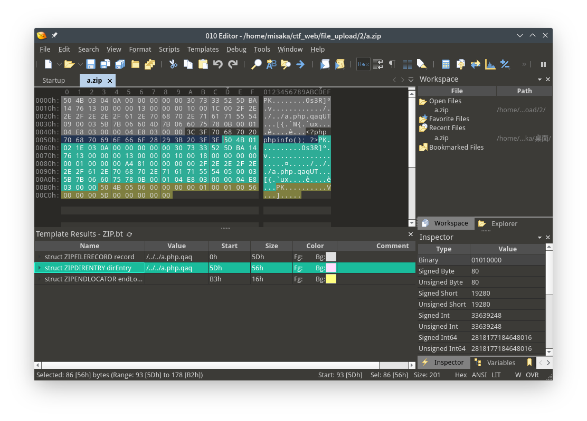

可以上传压缩包,尝试利用压缩包进行路径穿越

```php
if($ext == 'zip'){
	$archive = new PclZip($file['tmp_name']);
	foreach($archive->listContent() as $value){
		$filename = $value["filename"];
		if(preg_match('/\.php$/', $filename)){
			exit("压缩包内不允许含有php文件!");
		}
	}
	if ($archive->extract(PCLZIP_OPT_PATH, $temp_dir, PCLZIP_OPT_REPLACE_NEWER) == 0) {
		exit("解压失败");
		check_dir($dir);
	}
	check_dir($dir);
	exit('上传成功!');
}
```

由于压缩包中不能包含`.php`后缀的文件,尝试利用apache的解析漏洞来执行

构造文件名为`aaaaaaaa.php.qaq`的文件并将其压缩,将压缩包进行更改,更改文件名为`/../../a.php.qaq`来进行路径穿越



访问`/a.php.qaq`即可getflag`n1book{ThisIsUpLoadToPicfl4g}`